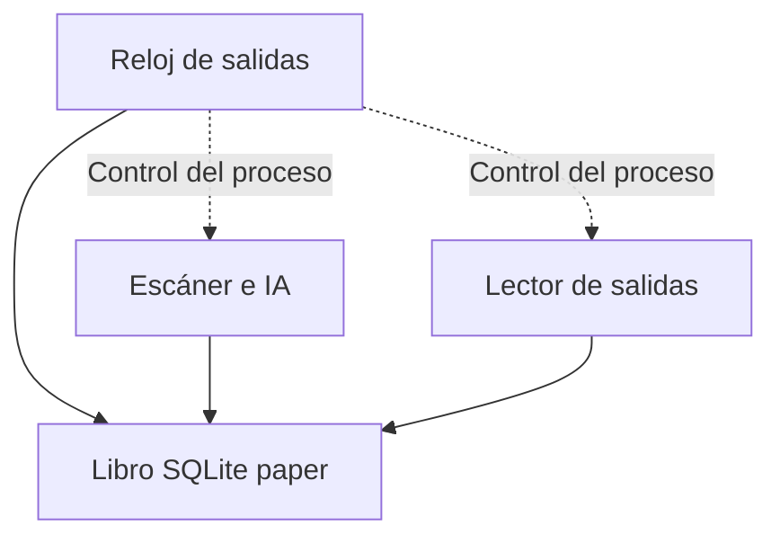

# Porota Trading v17 — auditoría y avances de implementación

Actualizado: 28/08/2026. Base entregada: v16.3.5, rama `testing`, commit
`612b0431a33909af3eeaaaa909db648c165a4ac9`.
Trabajo aislado en `feature/v17-convergencia`.

**Estado: desarrollo. No es una versión lista para producción.**
No se cambiaron imágenes desplegadas, servicios, modo operativo ni permisos del servidor.
El código del selector ahora inicia el runtime nuevo al solicitar simulación;
este selector actualizado todavía no se ejecutó en el Droplet.
No se enviaron órdenes reales. Los nuevos registros son `PRODUCTION_PAPER`.

## Decisiones del operador

- Incluir cauciones y todas las familias del sistema: acciones, CEDEARs,
  ETF, bonos, letras, ON, opciones, futuros y FCI.
- La instrucción posterior de incluir cauciones prevalece sobre la adenda
  que las dejaba como observación. Confirmación del operador del 28/08:
  **sólo cauciones colocadoras, invirtiendo saldo disponible**. Se excluyen
  tomadoras, financiación y uso de fondos comprometidos o aún sin liquidar.
- No incorporar las mejoras de ciberseguridad de las propuestas en esta etapa.
  No quitar las protecciones existentes. Los límites de riesgo, la liquidez,
  los vencimientos y la integridad contable sí forman parte del trabajo.
- Reducir acciones manuales: código a GitHub, archivos complejos por SFTP y
  comandos cortos con salida al portapapeles mediante OSC 52 en Termius.

## Material revisado

Fuente de `Porota-trading-testing.zip`; README, parches y ocho módulos propuestos
en `Porota_Trading_v17_Paquete_Completo.zip`; plan de convergencia y adenda;
PDF de fuentes históricas y PDF de arquitectura de velas/backtesting.
Los cuatro PDF suman 68 páginas. Las referencias al compendio de 127 páginas
no equivalen a haber recibido o revisado ese compendio completo.

Se realizó una revisión inicial dirigida a las rutas que afectan dinero,
ejecución, datos y resultados. No se afirma una auditoría exhaustiva de cada
línea del repositorio ni una validación de rentabilidad de las estrategias.

## Correcciones implementadas

| Hallazgo | Corrección y comprobación |
|---|---|
| La compra podía dejar caja negativa al omitir comisión en sizing | Cantidad máxima calculada con costos redondeados; caso de capital 1000 reproducido y corregido |
| Riesgo del stop omitía comisión de ambas puntas y slippage de salida | Presupuesto de riesgo incluye ambos costos y precio de salida modelado; no promete protección frente a gaps |
| Un cierre podía repetirse con una posición vieja | Actualización condicional y fill en una transacción; reintento sin segunda venta |
| Se podían cerrar posiciones usando otro plazo, clase o símbolo | Identidad y secuencia temporal verificadas; profundidad suficiente para cierre total |
| Se inventaba un cierre total con profundidad insuficiente | Queda pendiente; todavía falta implementar fills parciales |
| NaN e infinitos contaminaban cuentas y señales | Rechazo/normalización de valores no finitos; cotizaciones cruzadas no abren compras |
| Señales mezclaban muestras CI/24 h, clases y monedas | Series filtradas por símbolo, clase, plazo, moneda/plaza y mercado |
| Posiciones abiertas podían quedar fuera del universo rotativo | Todas las abiertas tienen prioridad, incluso fuera del catálogo o sobre el límite de muestreo |
| Una venta T+1 aparecía inmediatamente como caja | Recibos pendientes separados de efectivo; siguen siendo patrimonio |
| Dos operaciones podían gastar la misma caja | Revalidación dentro de transacción de compra; colocaciones serializadas y prueba concurrente |
| Renta fija podía usar precio por 100 VN como precio por unidad | Factor monetario y lote explícitos, conservados con la posición; sin esos datos no se abre una nueva posición de renta fija |
| El panel mezclaba precios de diferentes identidades | Última cotización por símbolo, clase, plazo, moneda/plaza y mercado |
| Una búsqueda de catálogo se confundía con un instrumento real | Historial de consultas separado de los instrumentos efectivamente devueltos; deduplicación por identidad completa |
| Precios MEP/CCL podían gastar pesos o mezclarse con USD genérico | Cuatro cajas separadas; identidad monetaria obligatoria en apertura, cierre, series, valuación e informes |
| Una actualización podía borrar el catálogo antes de terminar la red | Recolección previa y persistencia transaccional; registros no reconfirmados quedan STALE y no abren posiciones |
| Los informes atribuían PnL por fecha de apertura o incorporaban cierres futuros | PnL por fecha de cierre/acreditación y zona horaria; detalle histórico no muestra resultados posteriores al corte |
| Un PnL positivo se presentaba como prueba de superar inflación | Comparación bloqueada hasta tener rendimiento porcentual y benchmark del mismo período |
| CI construía 16.3.5 pero intentaba inspeccionar la imagen 16.2 | Resuelve la imagen exacta desde Compose; test ejecuta el paso con una etiqueta distinta |
| El reloj de salida se detenía junto con red, sincronizaciones o Gemini | Runtime con reloj padre sin red/IA, escáner y lector de salidas en procesos separados |
| El supervisor propuesto confundía devolución del callback con venta | Sólo declara CLOSED si existe cierre en el ledger; intento fallido conserva causa y estado pendiente |
| Stops/tiempo pendientes se olvidaban si el precio luego cambiaba | Intención durable por posición; no se borra al reiniciar ni por recuperar precio |
| Hora local de descarga rejuvenecía cotizaciones anteriores | book_at y trade_at vienen del campo date de cada respuesta PPI; recepción queda separada |
| Una aprobación lenta de Gemini terminaba usando un libro viejo | Revalidación de edad/sesión/salud al decidir y dentro de la transacción de apertura |
| Último negocio ausente se sustituía por midpoint | No se fabrica negocio; libro fresco puede permitir salida pero no crea una señal de entrada |
| Repetir el mismo último negocio producía ocho muestras ficticias | Series deduplicadas por fecha del proveedor, ventana temporal y disponibilidad al decidir |
| El aprendizaje mezclaba operaciones con contabilidad anterior | Versión nueva y filtro de versión/fecha de cierre en umbral; muestras antiguas se conservan |
| Perder la cotización devolvía la valuación al precio de compra | Última marca válida persistente y aviso STALE_MARKS; no desaparece una pérdida por perder el feed |
| Selector tenía capitales fijos que anulaban el archivo de configuración | Dashboard, escáner y reloj reciben la misma configuración monetaria explícita |
| Tests de login compartían estado entre ejecuciones | Aislamiento de base temporal en los tests; ningún cambio al límite operativo de login |

## Cauciones: lo que ya hace el código

`bt_caucion_paper.py`, integrado con `PaperBroker` y la misma caja simulada:

- Exige contrato, moneda, tasa como **fracción anual**, fecha de inicio,
  vencimiento con zona horaria, base anual, costos y profundidad.
- Cuenta días corridos para intereses a partir de las fechas contractuales;
  viernes a lunes no se confunde con un solo día de devengamiento.
- Inmoviliza principal. Respeta reserva de caja y participación en profundidad.
- Distingue costos pagados al inicio de costos descontados al vencimiento.
- Rechaza retorno neto no positivo, cotizaciones futuras/vencidas y costos
  presupuestados para un capital distinto.
- Rechaza usar otra moneda/plaza: ARS, USD, USD_MEP y USD_CCL tienen cajas
  independientes. Los tres saldos USD comienzan en cero salvo configuración
  explícita de su capital paper. No convierte ni consolida monedas.
- Usa el tarifario heredado sólo como modelo ARS; prorratea su comisión anual,
  sin cobrarla como si fuera por operación. En USD exige costos explícitos.
- Persiste colocaciones y claves idempotentes. Vencimiento y evento se registran
  una sola vez, aunque se reinicie el proceso o se repita la llamada.
- El observador procesa vencimientos antes del trabajo de red, incluso con
  mercado cerrado. No aplica stop ni una venta ficticia a la caución.
- El panel muestra capital, moneda, tasa, días, vencimiento, costos y estado.
  Informes PDF/JSON y Telegram separan resultados por moneda/plaza; una caución
  acreditada aporta interés menos costos, nunca la devolución del principal.

**Pendiente para la operación automática:** adaptador de cotizaciones/contratos
PPI con evidencia real de sus campos; política de plazo, capital y reserva;
comparación de alternativas netas; programación de colocaciones y conciliación.
`place_caucion()` es una operación explícita del simulador, no un planificador
de inversión automática ni una orden real.

El método heredado `c_ppi_client.get_caucion_rate()` todavía usa una selección
insegura de primer resultado/proxy; `place_caucion()` de ese cliente devuelve
un presupuesto y no acredita una colocación. **No se conectaron estos métodos
a la nueva contabilidad. Deben reemplazarse antes de habilitar ejecución real.**

## Estado por familia

| Familia | Implementado en este avance | Falta para completar v17 |
|---|---|---|
| Acciones, CEDEARs, ETF | Caja, costos, riesgo, fuente temporal y supervisor independiente en paper | Contrastar segmento/sesión por especie y validar nueva señal/backtest |
| Bonos, letras, ON | Compras/cierres paper con contrato explícito, factor VN y lote | Cargar factores desde metadatos contrastados; cashflows, amortizaciones, intereses corridos y monedas |
| Cauciones | Ciclo completo de colocadora simulada, capital y vencimiento | Cotización/adaptador PPI y política de asignación; tomadora excluida por instrucción |
| Opciones | Contrato y cálculos de prima/lote/pérdida máxima de opción comprada | Integración del ejecutor, liquidez, ejercicio, vencimiento y supervisor específico |
| Futuros | Separación de nocional, garantía, ajuste diario y déficit de margen | Libro persistente de ajustes, proveedor, conciliación y gestión de márgenes |
| FCI | Familia y unidades reconocidas; no pasa por ejecutor de acciones | Suscripción/rescate, valor de cuotaparte, corte y demora de rescate |

Los cálculos de opciones/futuros **no equivalen a un motor operativo integrado**.
Se bloquean en la ruta genérica de compra de acciones. Las nuevas búsquedas de
catálogo tampoco prueban cobertura total de PPI. No se inventan multiplicadores,
garantías, moneda ni fecha de vencimiento a partir de un ticker.

## Convenciones contables y migración

- Migración aditiva: tablas `paper_sale_receivables` y `paper_cauciones`.
  No se reescriben fills ni etiquetas de aprendizaje existentes.
- CI se modela disponible al ejecutar; T+1 se modela disponible **al final del
  siguiente día auditado**. Es una aproximación deliberadamente conservadora
  del simulador, **no un horario oficial de liquidación de PPI**. No permite
  netear crédito intradiario del broker.
- Plazo o calendario desconocido: el producido queda pendiente de confirmación.
  El calendario actual sólo cubre 2026; deberá actualizarse para operar 2027.
- Posiciones antiguas conservan su factor histórico 1. No se “corrigen” cantidades
  retrospectivamente. Sus muestras se deberán separar de las de v17.
- La migración de moneda conserva la contabilidad heredada en ARS con etiqueta
  `LEGACY_ASSUMED_ARS`; no convierte una compra histórica errónea de ALUAC/AAPLD
  en dólares por cambiar una columna. Un cierre con moneda distinta queda
  pendiente de conciliación. Snapshots antiguos quedan `UNKNOWN`, fuera de
  señales que requieran moneda confirmada. Migración probada dos veces sin
  duplicar fills ni alterar cantidades/precios/costos.
- `financial_instrument_catalog` guarda identidad, procedencia y capacidad;
  `catalog_query_results` guarda búsquedas. Catálogo legado se importa STALE.
  `paper_equity_by_currency` guarda patrimonio por moneda/plaza; `paper_equity`
  conserva sólo ARS por compatibilidad. El capital de cada caja sigue siendo
  configuración del simulador, no saldo obtenido de una cuenta real.
- Patrimonio incluye créditos pendientes y principal/interés devengado de caución;
  caja disponible los excluye hasta que corresponda. El resumen histórico principal
  sigue en ARS; no agrega USD sin una valuación de cambio explícita.
- Falta el libro integral de débitos, créditos, garantías y cashflows corporativos,
  conciliado por moneda y fecha valor. Esta migración no sustituye ese trabajo.

## Supervisor y calidad temporal: cuarto avance

`bv_paper_runtime.py` mantiene el reloj del supervisor en el padre, sin red ni
Gemini. Dos hijos separados ejecutan el escáner y la lectura de libros de abiertas.
El padre reinicia al hijo caído con cooldown, procesa vencimientos de cauciones
y revisa todas las abiertas cada 5 segundos; no es una garantía de tiempo real
frente a saturación de CPU/disco o bloqueos de SQLite.

- `paper_exit_intents`: causa, primera fecha debida, último control, bloqueo y
  contador de intentos. CLOSED se escribe en la misma transacción del fill.
  Se mantienen explícitas las salidas pendientes por falta de libro, liquidez,
  identidad, sesión o confirmación del ejecutor. La causa original no se relaja.
- `paper_supervisor_state` y `paper_exit_reader_state`: pulso independiente.
  El lector realiza preflight incluso sin posiciones, para no abrir primero y
  descubrir después que no tiene sesión. El silencio mayor a 20 segundos o un
  estado degradado bloquean admisión; no inventan una venta de las existentes.
- El hijo lector sólo pide Book por abierta, con pausa entre solicitudes.
  Tiene sesión PPI propia: **cuotas, latencia y coexistencia de sesiones aún
  deben validarse contra PPI antes de promover**. Las pruebas no usan una cuenta.
- Máximo de permanencia se decide sin cotización. Stop/target exigen libro
  fechado y compatible; un stop tocado con profundidad cero queda pendiente.
  Todavía no hay fills parciales ni barrido real de varios niveles del libro.
- Timestamps faltantes, sin zona horaria o futuros se rechazan; no se infiere
  UTC/Argentina ni se sustituye por recepción. Límite modelado de edad: 120 s.
  Para salir no se exige último negocio fresco; para entrar por señal sí.
- Fuente temporal contrastada: campos `date` de Current y Book en la
  documentación REST PPI. Sus payloads reales y precisión de reloj todavía
  necesitan comprobación en integración; no se presenta la documentación como
  una captura de la cuenta del operador.
- `paper-momentum-v17.1-source-time` identifica operaciones/muestras nuevas.
  La señal sigue siendo heurística; el filtro de versión no constituye una
  validación estadística ni completa embargo, holdout o backtest.
- Las valuaciones se toman bajo un bloqueo transaccional sin red. Conservan
  última marca válida; sin una marca previa muestran costo como aproximación,
  siempre con `STALE_MARKS`. No deben usarse como precios actuales ejecutables.

### Ventana de simulación, no horario universal

Modelo de contado regular BYMA CI/24 h: **11:00–16:55**, admisión hasta 16:25
y salida EOD desde 16:45. Se evita asumir que una punta de subasta es ejecutable.
El COM18782 enlazado por BYMA distingue cierre regular hasta 16:57 o 17:00 según
modalidad, además de otros segmentos y subastas. Por eso estos horarios son
una restricción del modelo paper, **no una afirmación de sesión de cada ticker**.
Falta confirmar segmento y sesión de cada especie; no se habilita ejecución real.
No se extrapolan a cauciones, opciones, futuros, FCI ni ruedas concentradas.

No se copió la supuesta regla de que una perdedora casi nunca recupera ni los
descuentos de salida arbitrarios de la propuesta. Tampoco se fuerza una venta
después del cierre: se conserva pendiente hasta tener sesión y libro utilizable.
El quinto checkpoint agrega límite diario persistente y outbox. Siguen pendientes
stops dinámicos netos y validación del modelo contra contratos/sesiones de PPI.

## Quinto checkpoint: corte diario y avisos transaccionales

### Corte de pérdidas PAPER (`bw_daily_risk`)

- Reutiliza `MAX_DAILY_LOSS_PCT=1.0` del ejemplo: **1 significa 1%**, no una
  fracción de 100%. Se transmite el valor configurado al runtime. No se leyó ni
  modificó el valor del servidor del operador. El broker usado directamente por
  tests conserva el control opcional; el runtime vivo siempre lo activa.
- Día civil de Buenos Aires; ARS, USD, USD_MEP y USD_CCL separados. La base se
  reconstruye al inicio del día con capital configurado, PnL de cierres anteriores
  y devengamiento contractual de cauciones. Nunca usa el patrimonio al reiniciar
  como nueva base. Principal colocado y ventas pendientes no son ganancias.
- Incluye PnL neto realizado y pérdidas/ganancias abiertas con libros vigentes,
  costo y deslizamiento de salida modelados. También corta si el realizado neto
  del día agota por sí solo el presupuesto, aunque haya otras posiciones sin
  libro válido: las ganancias abiertas no reponen ese presupuesto realizado.
- **Carry spot sin marca de cierre anterior conciliada:** base desconocida y
  bloqueo del día, incluso si el carry se cierra después. No se inventa una
  marca de medianoche ni se carga toda la pérdida histórica al día nuevo.
  El día siguiente puede reconstruirse sólo si ya no hay carry. La conciliación
  de una base con posiciones heredadas sigue siendo requisito de promoción.
- El disparo se guarda en `paper_daily_risk` y crea intenciones de salida para
  abiertas en esa moneda, conservando causas previas. No se borra por recuperación
  posterior, reinicio ni cambio de parámetros. Al día siguiente se evalúa otra
  base, sin cancelar las salidas decididas el día anterior.
- Capital distinto al persistido requiere conciliación; cambiar el porcentaje
  durante el mismo día bloquea nuevas entradas. Un reloj que retrocede no reinicia
  el control. No hay botón que borre silenciosamente el latch o la base.
- La admisión se revalida dentro del mismo bloqueo SQLite del fill o colocación.
  Cierres y disparo se registran juntos. Las cauciones colocadoras no se rompen:
  sigue la acreditación al vencimiento, sin financiación ni saldo no liquidado.
- Sin libros confiables se informa PnL actual desconocido y se bloquean entradas;
  el reloj de salida sigue activo. Un corte no garantiza una pérdida máxima:
  gaps, profundidad insuficiente, mercado cerrado y tiempo entre lecturas pueden
  dejar pérdidas mayores. No se simula una venta inexistente.
- Nueva versión de aprendizaje `paper-momentum-v17.2-daily-risk`, para no usar
  como calibración indistinta resultados anteriores a esta política de salida.

### Cola de Telegram (`bn_telegram_bus`)

- Se reemplazó la base separada de la propuesta por una outbox dentro de la misma
  SQLite. Un trigger sobre **eventos nuevos** de compra, venta, caución, corte y
  salida pendiente confirma aviso y cambio financiero en la misma transacción.
  Una falla al persistir el aviso revierte ese cambio. No reenvía el histórico.
- `PENDING`, `SENDING`, `SENT` y `DEAD` distinguen espera, envío en vuelo, ACK
  confirmado y revisión necesaria. Un lease y token de intento evitan reclamos
  simultáneos y que un ACK viejo sobrescriba otro intento. No se mantiene un
  bloqueo SQLite durante llamadas HTTP.
- 429 respeta `retry_after` y suspende **toda esta cola** incluso tras reiniciar;
  se mantiene separación de un segundo. Otros errores transitorios tienen
  backoff limitado y ocho intentos. Errores permanentes o intentos agotados
  conservan mensaje/error en `DEAD`, visible en el panel, sin eliminarlo ni
  declararlo entregado. Falta de configuración conserva pendientes sin consumir
  intentos. Revisión/reenvío de `DEAD` todavía requiere intervención explícita.
- El proceso de notificaciones es un tercer hijo independiente: una llamada lenta
  no detiene el reloj, PPI o Gemini. No comparte el interceptor HTTP del lector PPI.
  Las notificaciones del selector y otros motores fuera de PAPER no se migraron;
  su coordinación global con este mismo bot sigue pendiente de revisión.
- El resumen diario deja de hacer red desde el escáner. Se encola por fecha y
  sólo pasa a entregado cuando existe ACK de Telegram; un fallo previo del sistema
  viejo ya no consume la fecha como si hubiera sido un envío exitoso.
- **Entrega al menos una vez, no exactamente una vez:** un corte tras recepción
  remota y antes del commit local puede duplicar un mensaje, siempre identificado
  con el mismo ID. Lease vencido también puede producir duplicados si un worker
  antiguo quedó suspendido. Reintentar un aviso nunca reejecuta una operación.
- Se validó el contrato público de `sendMessage`/`retry_after` en la
  [documentación oficial de Telegram](https://core.telegram.org/bots/api#sendmessage).
  Se exige `ok=true` y `message_id`; HTTP 200 por sí solo no prueba entrega.
  **Las pruebas usan transportes ficticios: no se enviaron mensajes reales.**

Migraciones aditivas e idempotentes. El PR continúa en borrador; no se modificó
el Droplet, no se desplegó y no se habilitaron órdenes reales.

## Sexto checkpoint: archivo de barras y controles temporales

### Archivo nuevo (`bl_candle_engine`)

- Clave de serie por símbolo, familia, mercado, moneda/plaza, liquidación,
  resolución, fuente, ajuste y su procedencia, tipo de precio, unidad del volumen
  y factor monetario. Un precio por 100 nominales no se mezcla con uno por unidad.
  UNKNOWN se conserva explícito: no se infiere moneda, factor o ajuste del ticker.
- OHLC en Decimal serializado, validación de positivos/finitos, rango coherente,
  período alineado y zonas horarias obligatorias. Los conteos de muestras y
  negocios se mantienen separados. No se interpreta un volumen cuya unidad
  sea desconocida; el payload original queda en raw.
- Revisiones anexadas con `known_at`, sin sobreescribir apertura, extremos o
  cierre previos. `read(as_of=...)` devuelve sólo lo disponible entonces, de una
  única serie explícita y ya cerrada. Si una revisión informa conflicto o datos
  no verificados, el lector no rescata silenciosamente una versión vieja válida.
- Las barras de la propuesta sumaban acumulados como incrementos y usaban
  midpoint como negocio. Se rechazó esa implementación: midpoint no garantiza
  precio ejecutable y Current no identifica todos los negocios individuales.
- El materializador consume snapshots persistidos: usa `trade_at`/`last_kind`
  del normalizador, conserva recepción y referencia al snapshot original.
  Construye **muestras de 1m y 5m**, no un OHLCV completo del mercado. Volumen,
  VWAP y cantidad de negocios son **desconocidos**, no cero. No crea dollar bars,
  no rellena huecos ni reinventa fechas de datos inválidos. La semántica y
  precisión real del campo `date` de PPI aún requieren contraste de payloads.
- Dedupe por timestamp del proveedor y precio normalizados. Sin ID de negocio
  no puede contar trades: dos precios distintos con el mismo timestamp quedan
  en CONFLICT. Conserva muestras fuera de orden y corrige apertura/cierre según
  hora del dato, con nueva disponibilidad para el resultado recalculado.
- Cursor, muestras y agregados se confirman juntos. Lotes de hasta 100 snapshots
  por tick (máximo admitido 500), pendientes persistentes y cierre por reloj incluso
  sin nuevas lecturas. Un cuarto hijo `--candle-worker`, sin red, descarga este
  trabajo del reloj de salidas; caída o demora del archivo no detiene esa supervisión.

### Descargas de PPI y legado

- Contrato estructural contrastado contra la
  [documentación REST de PPI](https://itatppi.github.io/ppi-official-api-docs/api/documentacionRest/):
  fecha, apertura, máximo, mínimo, precio y volumen. No se cuentan listas de
  errores, fechas futuras/sin zona, precios inconsistentes o duplicados como
  filas válidas. Esto verifica estructura, **no** unidad de volumen, ajuste,
  sesión o disponibilidad original de toda la historia.
- Cada respuesta recibida se conserva en `historical_raw_archive` con petición,
  metadata de catálogo disponible al descargar, texto original del payload y
  fecha de recepción. Metadata actual no prueba el contrato histórico de la especie.
  Respuestas vacías/parciales no borran la última completa ni cuentan como éxito.
  Intentos fallidos rotan para no bloquear siempre al comienzo del universo.
- `migrate_legacy` abre el origen en modo sólo lectura, conserva filas en raw
  LEGACY_UNVERIFIED y concilia leídas/nuevas/ya archivadas al reintentar. No
  transforma una fecha sin zona en una vela confiable ni cambia el origen.
  Se probó con bases temporales; **no se ejecutó sobre el servidor**.
- El esquema nuevo evita las colisiones que permite `(symbol,date)`. No puede
  recuperar filas que ya se sobreescribieron ni demostrar que toda la historia
  vieja esté contaminada. La tabla antigua y sus productores/lectores de los
  motores heredados siguen pendientes de convergencia; esta copia no los corrige.
- El panel separa respuestas descargadas, raw, muestras, versiones y estado del
  proceso. Se retiró el porcentaje que confundía cantidad de descargas con
  cobertura validada para backtesting.

### Controles previos (`br_backtest_gate`)

- Reescrito como controles de datos, partición temporal y drawdown; **no es el
  backtester completo ni un portón que habilite dinero real**. Se dejó explícito
  `promotion_allowed=False`. No se copiaron las tasas fijas de caución, la
  anualización de un período supuesto ni la confianza basada en trades
  presuntamente independientes de la propuesta.
- La muestra y duración mínima se configuran explícitamente. Se mide el tramo
  real entre barras, no cuántos nombres de meses aparecen. Una grilla esperada
  debe provenir del calendario/sesión del instrumento; sin ella no aprueba
  integridad. No se presume que todas las especies comparten horario BYMA.
- Exige identidad/factor/unidades/ajuste conocidos; rechaza muestras, conflictos,
  sintéticos, volumen ausente, huecos e intervalos inesperados. Aprobar estos
  chequeos sólo acredita los requisitos expresados, no ausencia de sesgo de
  sobrevivientes, licencia adecuada o rentabilidad.
- La partición exige disponibilidad de features y etiquetas. Purga etiquetas
  que llegaron después del corte, operaciones que cruzan el período de prueba
  y el embargo definido. No mezcla monedas ni versiones. El llamador aún debe
  congelar el modelo y mantener holdout; dividir resultados optimizados a
  posteriori no constituye validación fuera de muestra.
- El drawdown usa una curva patrimonial marcada, una sola moneda y el máximo
  patrimonial alcanzado como denominador. Rechaza marcas vencidas, duplicados
  y flujos externos sin conciliar. No calcula pérdidas máximas sólo con cierres.

**Sin cambios de estrategia ni despliegue:** la señal vigente sigue usando su
serie anterior de muestras; no se conectó automáticamente a estas barras.
Faltan normalización histórica definitiva de PPI, ajustes y acciones societarias
con disponibilidad temporal, ejecución y costos del backtester, benchmark real
de caución y validación estadística. No hubo llamadas nuevas a PPI ni órdenes.

## Evaluación del código sugerido: decisiones y pendientes

| Módulo/propuesta | Problema identificado | Decisión |
|---|---|---|
| `bk_free_market_data` | El adaptador data912 espera campos/rutas que no corresponden a todos los activos | No copiar como feed universal; verificar payload, moneda y cobertura por clase |
| `bl_candle_engine` | Lectura mezcla series ajustadas/no ajustadas; upsert no actualiza apertura | Reescrito: identidad completa, revisiones con disponibilidad, muestras sin volumen ficticio; legado sólo en cuarentena |
| Velas desde snapshots | Midpoint no equivale a último negocio y volumen acumulado no equivale a volumen del intervalo | Separar cotizaciones y operaciones; no fabricar volumen, VWAP o dollar bars |
| Migración histórica | Ruta por defecto difiere de la base actual y cuenta filas ignoradas como migradas | Ruta explícita, origen read-only y conteos conciliados; no se ejecutó en servidor ni recupera datos sobreescritos |
| `bm_exit_supervisor` | Da un cierre por hecho aunque el callback devuelva False | Reescrito: ledger decide CLOSED, intención persistente y reloj sin red/IA; probado con hijos bloqueados |
| `bq_exit_policy` | Horario 17:00 uniforme; breakeven sin costo completo; bloqueo diario no persistente | Sesión paper acotada y bloqueo persistente implementados; sesión real por instrumento y stops dinámicos netos pendientes |
| Liquidación forzada al cierre | No existe fill ejecutable una vez cerrado el mercado o sin profundidad | Anticipar cierre; conservar salida pendiente si no se puede ejecutar |
| `bn_telegram_bus` | Fill y notificación en transacciones distintas; riesgo de perder evento; 429 mal coordinado | Reescrito: outbox transaccional, lease, ACK validado, cooldown de toda la cola y entrega al menos una vez |
| `bo_signal_core` | Reward/risk bruto, umbrales heurísticos y controles incompletos de datos | Evaluar neto, calidad y disponibilidad temporal; validar sin anticipación |
| `bp_dashboard_v17` | CSV ordena por `id` inexistente en muestras; consultas silenciosamente vacías | Reutilizar panel existente y corregir consultas; no reemplazo ciego |
| `br_backtest_gate` | Tres meses distintos pueden cubrir sólo ~32 días; drawdown y estrés incompletos | Implementados controles de span, datos, purga/embargo y drawdown marcado; backtester, estrés y aceptación de estrategia siguen pendientes |
| Comparación con caución | Tasa anual fija y período supuesto distorsionan Sharpe/benchmark | Tasa, plazo y período históricos observados, no constantes inventadas |
| Calibración/aprendizaje | Versiones viejas y nuevas comparten muestras; separación temporal insuficiente | Etiquetas/versiones, embargo, holdout y parámetros congelados |
| Producción | Dos motores divergentes, flags y versiones de imagen no alineados | Convergencia por etapas y rollback; no modificar despliegue hasta probar |

Los requisitos propuestos de cantidad de trades, meses, profit factor y drawdown
son criterios de evaluación a discutir, no evidencia de rentabilidad ni una
garantía de resultados. La hipótesis de que una pérdida no se recupera tampoco
se acepta como regla universal sin datos.

## Verificación

Primer checkpoint: 279 tests aprobados. Segundo: 329. Tercero: 354.
Cuarto: **386 tests aprobados**, sin fallas ni omisiones, con supervisor,
calidad temporal y runtime independiente. Cobertura local: 47,44% global;
86,5% supervisor, 86,5% política de sesión, 77,3% runtime y 86,2% motor paper.
Los cuatro mínimos de módulos financieros del CI también se cumplen localmente.
Quinto checkpoint: **418 tests aprobados**, sin fallas ni omisiones. Cobertura
global 49,77%; riesgo diario 95,5%, outbox 85,5%, motor paper 94,5% y cauciones
95,9%. Se mantiene la advertencia local de Starlette/httpx. Pruebas adicionales:
rollback compartido aviso/fill, dos workers y lease vencido, ACK viejo, 429 global,
falta de configuración, reintentos agotados, corte al umbral, reinicio, reloj,
monedas, carry, costos de caución y revalidación de riesgo dentro de la transacción.
El reloj también pasa la prueba con **tres** procesos hijos realmente bloqueados.
Smoke local real de `--notification-worker`: NOT_CONFIGURED, SIGTERM, STOPPED y
código 0; no se usaron credenciales ni se enviaron mensajes.
Comando usado: `python -m pytest -o addopts='' -q -m 'not red'`.

Sexto checkpoint: **495 tests aprobados**, 0 fallas, 0 errores y 0 omisiones.
Cobertura local: 51,17% global; archivo de velas 89,37%, controles de backtest
94,06% y motor paper 86,55%. Se cumplen los cuatro mínimos financieros del CI.
Incluye revisiones tardías, aislamiento de series, duplicados, reinicios,
rollback del cursor, cuarentena, históricos vacíos, purga/embargo y drawdown
sobre patrimonio valuado. El reloj continúa con **cuatro** hijos realmente
bloqueados. Smoke real de `--candle-worker`: RUNNING → SIGTERM → STOPPED,
código 0, sin credenciales ni llamadas externas. Una advertencia existente de
Starlette/httpx. Suite ejecutada con `python -m pytest -q --cov=.`, reportes
XML de tests/cobertura y mínimo global de 15%.

Entorno local Python 3.12; librerías instaladas para ejecutar la suite. No es
todavía una reproducción completa del contenedor objetivo Python 3.11 ni de
todos los pins de producción. Advertencia observada: deprecación del TestClient
Starlette/httpx del entorno local. En el CI remoto anterior (run 33128104915),
la suite Python 3.11 y el build Docker aprobaron; el job de arranque falló antes
de levantar servicios por buscar la imagen 16.2. El tercer checkpoint ya obtuvo
**CI completo aprobado**, run 33130775522, commit
`925a9eabee128a46bfd833467611c4a456a9a8b0`: tests, build, arranque, panel y apagado.
El cuarto avance también obtuvo CI completo aprobado, run 33132183073, commit
`5dac57af7f084273a2e5cfeb367bf6c54849074d`. El quinto obtuvo CI completo aprobado,
run 33133328514, commit `c113cff9497464a943ae73a4fb7eb29e419edd76`.
El resultado remoto del sexto se registra en el PR #3 después de subir y
verificar el contenido y el CI completo.
Los 12 payloads públicos aportados se usan como fixture; aún falta integración
con cotizaciones/contratos especializados y validación en el Droplet.

## Diagnóstico recibido: no repetir el comando

El operador entregó el resultado de `scripts/v17_diagnostico_instrumentos.py`
generado el 28/08/2026 a las 00:17:19 UTC sobre
`/opt/porota-trading/data/observer/observer_production.db`. Catálogo descargado
el 27/08 a las 13:45:03 UTC: **330 instrumentos** (55 acciones, 42 bonos,
188 CEDEARs, 45 futuros). La muestra contiene 12 registros, no el catálogo entero.

| Etiqueta real de PPI | Caja normalizada |
|---|---|
| Pesos | ARS |
| Dolares billete \| MEP | USD_MEP |
| Dolares divisa \| CCL | USD_CCL |

AE38 está cotizado en Pesos aunque su descripción diga USD. ALUAC/AAPLC son CCL;
AE38D/AAPLD, MEP. DLR/AGO26 figura en ROFEX/Pesos, sin multiplicador, margen ni
vencimiento estructurado. No se extrae vencimiento de su nombre/descripción.

Las familias ausentes y los resultados UNAVAILABLE/ERROR describen búsquedas
anteriores; no prueban falta de soporte del broker. Se amplían consultas de
letras, ON, opciones, cauciones y FCI y se conserva la configuración pública
devuelta por el SDK. Sus resultados reales todavía deben comprobarse.
Todos los registros observados pueden entrar al muestreo, pero catálogo no
equivale a ejecutor: futuros/opciones/FCI/cauciones siguen requiriendo su ruta
específica, y renta fija necesita factor nominal/lote contrastados.

## Fuentes externas contrastadas

- [PPI: documentación REST](https://itatppi.github.io/ppi-official-api-docs/api/documentacionRest/):
  instrumentos, cotizaciones, libros y distinción entre fecha de operación y liquidación.
- [BYMA: cauciones](https://www.byma.com.ar/productos/productos-financieros/caucion):
  colocadora/tomadora, monedas y devolución al vencimiento.
- [BYMA: opciones](https://www.byma.com.ar/productos/productos-financieros/opciones):
  prima T+0 y horarios/ejercicio específicos. No corresponde asumir T+1 y cierre
  uniforme de todas las familias.
- [BYMA: horarios y COM18782](https://www.byma.com.ar/mercado/horarios):
  PDF oficial enlazado descargado y leído el 28/08/2026; regular, subastas,
  negociación concentrada y derivados no tienen un horario universal.

Los aranceles heredados aún requieren conciliación con el presupuesto aplicable
a la cuenta. No se validaron aquí como tarifas comerciales vigentes del usuario.
