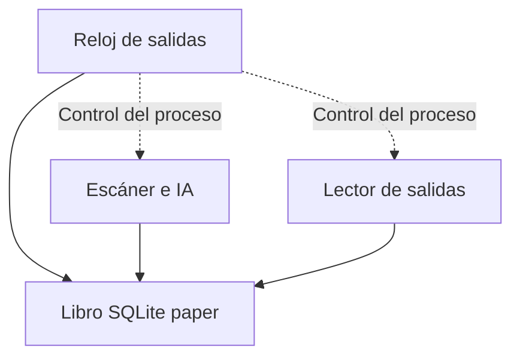

# Porota Trading v17 — auditoría y avances de implementación

Actualizado: 28/08/2026. Base entregada: v16.3.5, rama `testing`, commit
`612b0431a33909af3eeaaaa909db648c165a4ac9`.
Trabajo aislado en `feature/v17-convergencia`.

**Estado: desarrollo. No es una versión lista para producción.**
No se cambiaron imágenes desplegadas, servicios, modo operativo ni permisos del servidor.
El código del selector ahora inicia el runtime nuevo al solicitar simulación;
este selector actualizado todavía no se ejecutó en el Droplet.
No se enviaron órdenes reales. Los nuevos registros son `PRODUCTION_PAPER`.

## Decisiones del operador

- Incluir cauciones y todas las familias del sistema: acciones, CEDEARs,
  ETF, bonos, letras, ON, opciones, futuros y FCI.
- La instrucción posterior de incluir cauciones prevalece sobre la adenda
  que las dejaba como observación. Confirmación del operador del 28/08:
  **sólo cauciones colocadoras, invirtiendo saldo disponible**. Se excluyen
  tomadoras, financiación y uso de fondos comprometidos o aún sin liquidar.
- No incorporar las mejoras de ciberseguridad de las propuestas en esta etapa.
  No quitar las protecciones existentes. Los límites de riesgo, la liquidez,
  los vencimientos y la integridad contable sí forman parte del trabajo.
- Reducir acciones manuales: código a GitHub, archivos complejos por SFTP y
  comandos cortos con salida al portapapeles mediante OSC 52 en Termius.

## Material revisado

Fuente de `Porota-trading-testing.zip`; README, parches y ocho módulos propuestos
en `Porota_Trading_v17_Paquete_Completo.zip`; plan de convergencia y adenda;
PDF de fuentes históricas y PDF de arquitectura de velas/backtesting.
Los cuatro PDF suman 68 páginas. Las referencias al compendio de 127 páginas
no equivalen a haber recibido o revisado ese compendio completo.

Se realizó una revisión inicial dirigida a las rutas que afectan dinero,
ejecución, datos y resultados. No se afirma una auditoría exhaustiva de cada
línea del repositorio ni una validación de rentabilidad de las estrategias.

## Correcciones implementadas

| Hallazgo | Corrección y comprobación |
|---|---|
| La compra podía dejar caja negativa al omitir comisión en sizing | Cantidad máxima calculada con costos redondeados; caso de capital 1000 reproducido y corregido |
| Riesgo del stop omitía comisión de ambas puntas y slippage de salida | Presupuesto de riesgo incluye ambos costos y precio de salida modelado; no promete protección frente a gaps |
| Un cierre podía repetirse con una posición vieja | Actualización condicional y fill en una transacción; reintento sin segunda venta |
| Se podían cerrar posiciones usando otro plazo, clase o símbolo | Identidad y secuencia temporal verificadas; profundidad suficiente para cierre total |
| Se inventaba un cierre total con profundidad insuficiente | Queda pendiente; todavía falta implementar fills parciales |
| Reintentos podían consumir otra vez la misma profundidad spot | Consumo por fill, identidad, fotografía y lado; revalidación dentro del lock y persistencia tras reinicio |
| NaN e infinitos contaminaban cuentas y señales | Rechazo/normalización de valores no finitos; cotizaciones cruzadas no abren compras |
| Señales mezclaban muestras CI/24 h, clases y monedas | Series filtradas por símbolo, clase, plazo, moneda/plaza y mercado |
| Posiciones abiertas podían quedar fuera del universo rotativo | Todas las abiertas tienen prioridad, incluso fuera del catálogo o sobre el límite de muestreo |
| Una venta T+1 aparecía inmediatamente como caja | Recibos pendientes separados de efectivo; siguen siendo patrimonio |
| Dos operaciones podían gastar la misma caja | Revalidación dentro de transacción de compra; colocaciones serializadas y prueba concurrente |
| Renta fija podía usar precio por 100 VN como precio por unidad | Factor monetario y lote explícitos, conservados con la posición; sin esos datos no se abre una nueva posición de renta fija |
| El panel mezclaba precios de diferentes identidades | Última cotización por símbolo, clase, plazo, moneda/plaza y mercado |
| Una búsqueda de catálogo se confundía con un instrumento real | Historial de consultas separado de los instrumentos efectivamente devueltos; deduplicación por identidad completa |
| Precios MEP/CCL podían gastar pesos o mezclarse con USD genérico | Cuatro cajas separadas; identidad monetaria obligatoria en apertura, cierre, series, valuación e informes |
| Una actualización podía borrar el catálogo antes de terminar la red | Recolección previa y persistencia transaccional; registros no reconfirmados quedan STALE y no abren posiciones |
| Los informes atribuían PnL por fecha de apertura o incorporaban cierres futuros | PnL por fecha de cierre/acreditación y zona horaria; detalle histórico no muestra resultados posteriores al corte |
| Un PnL positivo se presentaba como prueba de superar inflación | Comparación bloqueada hasta tener rendimiento porcentual y benchmark del mismo período |
| CI construía 16.3.5 pero intentaba inspeccionar la imagen 16.2 | Resuelve la imagen exacta desde Compose; test ejecuta el paso con una etiqueta distinta |
| El reloj de salida se detenía junto con red, sincronizaciones o Gemini | Runtime con reloj padre sin red/IA, escáner y lector de salidas en procesos separados |
| El supervisor propuesto confundía devolución del callback con venta | Sólo declara CLOSED si existe cierre en el ledger; intento fallido conserva causa y estado pendiente |
| Stops/tiempo pendientes se olvidaban si el precio luego cambiaba | Intención durable por posición; no se borra al reiniciar ni por recuperar precio |
| Hora local de descarga rejuvenecía cotizaciones anteriores | book_at y trade_at vienen del campo date de cada respuesta PPI; recepción queda separada |
| Una aprobación lenta de Gemini terminaba usando un libro viejo | Revalidación de edad/sesión/salud al decidir y dentro de la transacción de apertura |
| Último negocio ausente se sustituía por midpoint | No se fabrica negocio; libro fresco puede permitir salida pero no crea una señal de entrada |
| Repetir el mismo último negocio producía ocho muestras ficticias | Series deduplicadas por fecha del proveedor, ventana temporal y disponibilidad al decidir |
| El aprendizaje mezclaba operaciones con contabilidad anterior | Versión nueva y filtro de versión/fecha de cierre en umbral; muestras antiguas se conservan |
| Perder la cotización devolvía la valuación al precio de compra | Última marca válida persistente y aviso STALE_MARKS; no desaparece una pérdida por perder el feed |
| Selector tenía capitales fijos que anulaban el archivo de configuración | Dashboard, escáner y reloj reciben la misma configuración monetaria explícita |
| Tests de login compartían estado entre ejecuciones | Aislamiento de base temporal en los tests; ningún cambio al límite operativo de login |

## Cauciones: lo que ya hace el código

`bt_caucion_paper.py`, integrado con `PaperBroker` y la misma caja simulada:

- Exige contrato, moneda, tasa como **fracción anual**, fecha de inicio,
  vencimiento con zona horaria, base anual, costos y profundidad.
- Cuenta días corridos para intereses a partir de las fechas contractuales;
  viernes a lunes no se confunde con un solo día de devengamiento.
- Inmoviliza principal. Respeta reserva de caja y participación en profundidad.
- Distingue costos pagados al inicio de costos descontados al vencimiento.
- Rechaza retorno neto no positivo, cotizaciones futuras/vencidas y costos
  presupuestados para un capital distinto.
- Rechaza usar otra moneda/plaza: ARS, USD, USD_MEP y USD_CCL tienen cajas
  independientes. Los tres saldos USD comienzan en cero salvo configuración
  explícita de su capital paper. No convierte ni consolida monedas.
- Usa el tarifario heredado sólo como modelo ARS; prorratea su comisión anual,
  sin cobrarla como si fuera por operación. En USD exige costos explícitos.
- Persiste colocaciones y claves idempotentes. Vencimiento y evento se registran
  una sola vez, aunque se reinicie el proceso o se repita la llamada.
- El observador procesa vencimientos antes del trabajo de red, incluso con
  mercado cerrado. No aplica stop ni una venta ficticia a la caución.
- El panel muestra capital, moneda, tasa, días, vencimiento, costos y estado.
  Informes PDF/JSON y Telegram separan resultados por moneda/plaza; una caución
  acreditada aporta interés menos costos, nunca la devolución del principal.

**Pendiente para la operación automática:** adaptador de cotizaciones/contratos
PPI con evidencia real de sus campos; confirmar parámetros de plazo, capital y
reserva; programación de colocaciones y conciliación. El undécimo checkpoint
agrega comparación/asignación paper con política explícita, sin conectarla al
escáner o a órdenes reales.
`place_caucion()` es una operación explícita del simulador, no un planificador
de inversión automática ni una orden real.

El proxy heredado `c_ppi_client.get_caucion_rate()` fue retirado: devuelve None
sin buscar el primer instrumento ni reinterpretar precio como tasa.
`place_caucion()` de ese cliente está bloqueado explícitamente incluso si se
activa el flag antiguo: un presupuesto no constituye colocación. Ninguno de
estos métodos se conecta a la nueva contabilidad paper.

## Estado por familia

| Familia | Implementado en este avance | Falta para completar v17 |
|---|---|---|
| Acciones, CEDEARs, ETF | Caja, costos, riesgo, fuente temporal y supervisor independiente en paper | Contrastar segmento/sesión por especie y validar nueva señal/backtest |
| Bonos, letras, ON | Compras/cierres paper con contrato explícito, factor VN y lote | Cargar factores desde metadatos contrastados; cashflows, amortizaciones, intereses corridos y monedas |
| Cauciones | Ciclo de colocadora, asignador paper explícito, caja/riesgo/profundidad y vencimiento | Cotización/adaptador PPI, parámetros confirmados, programación y conciliación; tomadora excluida |
| Opciones | Contrato y cálculos de prima/lote/pérdida máxima de opción comprada | Integración del ejecutor, liquidez, ejercicio, vencimiento y supervisor específico |
| Futuros | Separación de nocional, garantía, ajuste diario y déficit de margen | Libro persistente de ajustes, proveedor, conciliación y gestión de márgenes |
| FCI | Familia y unidades reconocidas; no pasa por ejecutor de acciones | Suscripción/rescate, valor de cuotaparte, corte y demora de rescate |

Los cálculos de opciones/futuros **no equivalen a un motor operativo integrado**.
Se bloquean en la ruta genérica de compra de acciones. Las nuevas búsquedas de
catálogo tampoco prueban cobertura total de PPI. No se inventan multiplicadores,
garantías, moneda ni fecha de vencimiento a partir de un ticker.

## Convenciones contables y migración

- Migración aditiva: tablas `paper_sale_receivables` y `paper_cauciones`.
  No se reescriben fills ni etiquetas de aprendizaje existentes.
- CI se modela disponible al ejecutar; T+1 se modela disponible **al final del
  siguiente día auditado**. Es una aproximación deliberadamente conservadora
  del simulador, **no un horario oficial de liquidación de PPI**. No permite
  netear crédito intradiario del broker.
- Plazo o calendario desconocido: el producido queda pendiente de confirmación.
  El calendario actual sólo cubre 2026; deberá actualizarse para operar 2027.
- Posiciones antiguas conservan su factor histórico 1. No se “corrigen” cantidades
  retrospectivamente. Sus muestras se deberán separar de las de v17.
- La migración de moneda conserva la contabilidad heredada en ARS con etiqueta
  `LEGACY_ASSUMED_ARS`; no convierte una compra histórica errónea de ALUAC/AAPLD
  en dólares por cambiar una columna. Un cierre con moneda distinta queda
  pendiente de conciliación. Snapshots antiguos quedan `UNKNOWN`, fuera de
  señales que requieran moneda confirmada. Migración probada dos veces sin
  duplicar fills ni alterar cantidades/precios/costos.
- `financial_instrument_catalog` guarda identidad, procedencia y capacidad;
  `catalog_query_results` guarda búsquedas. Catálogo legado se importa STALE.
  `paper_equity_by_currency` guarda patrimonio por moneda/plaza; `paper_equity`
  conserva sólo ARS por compatibilidad. El capital de cada caja sigue siendo
  configuración del simulador, no saldo obtenido de una cuenta real.
- Patrimonio incluye créditos pendientes y principal/interés devengado de caución;
  caja disponible los excluye hasta que corresponda. El resumen histórico principal
  sigue en ARS; no agrega USD sin una valuación de cambio explícita.
- Falta el libro integral de débitos, créditos, garantías y cashflows corporativos,
  conciliado por moneda y fecha valor. Esta migración no sustituye ese trabajo.

## Supervisor y calidad temporal: cuarto avance

`bv_paper_runtime.py` mantiene el reloj del supervisor en el padre, sin red ni
Gemini. Dos hijos separados ejecutan el escáner y la lectura de libros de abiertas.
El padre reinicia al hijo caído con cooldown, procesa vencimientos de cauciones
y revisa todas las abiertas cada 5 segundos; no es una garantía de tiempo real
frente a saturación de CPU/disco o bloqueos de SQLite.

- `paper_exit_intents`: causa, primera fecha debida, último control, bloqueo y
  contador de intentos. CLOSED se escribe en la misma transacción del fill.
  Se mantienen explícitas las salidas pendientes por falta de libro, liquidez,
  identidad, sesión o confirmación del ejecutor. La causa original no se relaja.
- `paper_supervisor_state` y `paper_exit_reader_state`: pulso independiente.
  El lector realiza preflight incluso sin posiciones, para no abrir primero y
  descubrir después que no tiene sesión. El silencio mayor a 20 segundos o un
  estado degradado bloquean admisión; no inventan una venta de las existentes.
- El hijo lector sólo pide Book por abierta, con pausa entre solicitudes.
  Tiene sesión PPI propia: **cuotas, latencia y coexistencia de sesiones aún
  deben validarse contra PPI antes de promover**. Las pruebas no usan una cuenta.
- Máximo de permanencia se decide sin cotización. Stop/target exigen libro
  fechado y compatible; un stop tocado con profundidad cero queda pendiente.
  Todavía no hay fills parciales ni barrido real de varios niveles del libro.
- Timestamps faltantes, sin zona horaria o futuros se rechazan; no se infiere
  UTC/Argentina ni se sustituye por recepción. Límite modelado de edad: 120 s.
  Para salir no se exige último negocio fresco; para entrar por señal sí.
- Fuente temporal contrastada: campos `date` de Current y Book en la
  documentación REST PPI. Sus payloads reales y precisión de reloj todavía
  necesitan comprobación en integración; no se presenta la documentación como
  una captura de la cuenta del operador.
- `paper-momentum-v17.1-source-time` identifica operaciones/muestras nuevas.
  La señal sigue siendo heurística; el filtro de versión no constituye una
  validación estadística ni completa embargo, holdout o backtest.
- Las valuaciones se toman bajo un bloqueo transaccional sin red. Conservan
  última marca válida; sin una marca previa muestran costo como aproximación,
  siempre con `STALE_MARKS`. No deben usarse como precios actuales ejecutables.

### Ventana de simulación, no horario universal

Modelo de contado regular BYMA CI/24 h: **11:00–16:55**, admisión hasta 16:25
y salida EOD desde 16:45. Se evita asumir que una punta de subasta es ejecutable.
El COM18782 enlazado por BYMA distingue cierre regular hasta 16:57 o 17:00 según
modalidad, además de otros segmentos y subastas. Por eso estos horarios son
una restricción del modelo paper, **no una afirmación de sesión de cada ticker**.
Falta confirmar segmento y sesión de cada especie; no se habilita ejecución real.
No se extrapolan a cauciones, opciones, futuros, FCI ni ruedas concentradas.

No se copió la supuesta regla de que una perdedora casi nunca recupera ni los
descuentos de salida arbitrarios de la propuesta. Tampoco se fuerza una venta
después del cierre: se conserva pendiente hasta tener sesión y libro utilizable.
El quinto checkpoint agrega límite diario persistente y outbox. Siguen pendientes
stops dinámicos netos y validación del modelo contra contratos/sesiones de PPI.

## Quinto checkpoint: corte diario y avisos transaccionales

### Corte de pérdidas PAPER (`bw_daily_risk`)

- Reutiliza `MAX_DAILY_LOSS_PCT=1.0` del ejemplo: **1 significa 1%**, no una
  fracción de 100%. Se transmite el valor configurado al runtime. No se leyó ni
  modificó el valor del servidor del operador. El broker usado directamente por
  tests conserva el control opcional; el runtime vivo siempre lo activa.
- Día civil de Buenos Aires; ARS, USD, USD_MEP y USD_CCL separados. La base se
  reconstruye al inicio del día con capital configurado, PnL de cierres anteriores
  y devengamiento contractual de cauciones. Nunca usa el patrimonio al reiniciar
  como nueva base. Principal colocado y ventas pendientes no son ganancias.
- Incluye PnL neto realizado y pérdidas/ganancias abiertas con libros vigentes,
  costo y deslizamiento de salida modelados. También corta si el realizado neto
  del día agota por sí solo el presupuesto, aunque haya otras posiciones sin
  libro válido: las ganancias abiertas no reponen ese presupuesto realizado.
- **Carry spot sin marca de cierre anterior conciliada:** base desconocida y
  bloqueo del día, incluso si el carry se cierra después. No se inventa una
  marca de medianoche ni se carga toda la pérdida histórica al día nuevo.
  El día siguiente puede reconstruirse sólo si ya no hay carry. La conciliación
  de una base con posiciones heredadas sigue siendo requisito de promoción.
- El disparo se guarda en `paper_daily_risk` y crea intenciones de salida para
  abiertas en esa moneda, conservando causas previas. No se borra por recuperación
  posterior, reinicio ni cambio de parámetros. Al día siguiente se evalúa otra
  base, sin cancelar las salidas decididas el día anterior.
- Capital distinto al persistido requiere conciliación; cambiar el porcentaje
  durante el mismo día bloquea nuevas entradas. Un reloj que retrocede no reinicia
  el control. No hay botón que borre silenciosamente el latch o la base.
- La admisión se revalida dentro del mismo bloqueo SQLite del fill o colocación.
  Cierres y disparo se registran juntos. Las cauciones colocadoras no se rompen:
  sigue la acreditación al vencimiento, sin financiación ni saldo no liquidado.
- Sin libros confiables se informa PnL actual desconocido y se bloquean entradas;
  el reloj de salida sigue activo. Un corte no garantiza una pérdida máxima:
  gaps, profundidad insuficiente, mercado cerrado y tiempo entre lecturas pueden
  dejar pérdidas mayores. No se simula una venta inexistente.
- Nueva versión de aprendizaje `paper-momentum-v17.2-daily-risk`, para no usar
  como calibración indistinta resultados anteriores a esta política de salida.

### Cola de Telegram (`bn_telegram_bus`)

- Se reemplazó la base separada de la propuesta por una outbox dentro de la misma
  SQLite. Un trigger sobre **eventos nuevos** de compra, venta, caución, corte y
  salida pendiente confirma aviso y cambio financiero en la misma transacción.
  Una falla al persistir el aviso revierte ese cambio. No reenvía el histórico.
- `PENDING`, `SENDING`, `SENT` y `DEAD` distinguen espera, envío en vuelo, ACK
  confirmado y revisión necesaria. Un lease y token de intento evitan reclamos
  simultáneos y que un ACK viejo sobrescriba otro intento. No se mantiene un
  bloqueo SQLite durante llamadas HTTP.
- 429 respeta `retry_after` y suspende **toda esta cola** incluso tras reiniciar;
  se mantiene separación de un segundo. Otros errores transitorios tienen
  backoff limitado y ocho intentos. Errores permanentes o intentos agotados
  conservan mensaje/error en `DEAD`, visible en el panel, sin eliminarlo ni
  declararlo entregado. Falta de configuración conserva pendientes sin consumir
  intentos. Revisión/reenvío de `DEAD` todavía requiere intervención explícita.
- El proceso de notificaciones es un tercer hijo independiente: una llamada lenta
  no detiene el reloj, PPI o Gemini. No comparte el interceptor HTTP del lector PPI.
  Las notificaciones del selector y otros motores fuera de PAPER no se migraron;
  su coordinación global con este mismo bot sigue pendiente de revisión.
- El resumen diario deja de hacer red desde el escáner. Se encola por fecha y
  sólo pasa a entregado cuando existe ACK de Telegram; un fallo previo del sistema
  viejo ya no consume la fecha como si hubiera sido un envío exitoso.
- **Entrega al menos una vez, no exactamente una vez:** un corte tras recepción
  remota y antes del commit local puede duplicar un mensaje, siempre identificado
  con el mismo ID. Lease vencido también puede producir duplicados si un worker
  antiguo quedó suspendido. Reintentar un aviso nunca reejecuta una operación.
- Se validó el contrato público de `sendMessage`/`retry_after` en la
  [documentación oficial de Telegram](https://core.telegram.org/bots/api#sendmessage).
  Se exige `ok=true` y `message_id`; HTTP 200 por sí solo no prueba entrega.
  **Las pruebas usan transportes ficticios: no se enviaron mensajes reales.**

Migraciones aditivas e idempotentes. El PR continúa en borrador; no se modificó
el Droplet, no se desplegó y no se habilitaron órdenes reales.

## Sexto checkpoint: archivo de barras y controles temporales

### Archivo nuevo (`bl_candle_engine`)

- Clave de serie por símbolo, familia, mercado, moneda/plaza, liquidación,
  resolución, fuente, ajuste y su procedencia, tipo de precio, unidad del volumen
  y factor monetario. Un precio por 100 nominales no se mezcla con uno por unidad.
  UNKNOWN se conserva explícito: no se infiere moneda, factor o ajuste del ticker.
- OHLC en Decimal serializado, validación de positivos/finitos, rango coherente,
  período alineado y zonas horarias obligatorias. Los conteos de muestras y
  negocios se mantienen separados. No se interpreta un volumen cuya unidad
  sea desconocida; el payload original queda en raw.
- Revisiones anexadas con `known_at`, sin sobreescribir apertura, extremos o
  cierre previos. `read(as_of=...)` devuelve sólo lo disponible entonces, de una
  única serie explícita y ya cerrada. Si una revisión informa conflicto o datos
  no verificados, el lector no rescata silenciosamente una versión vieja válida.
- Las barras de la propuesta sumaban acumulados como incrementos y usaban
  midpoint como negocio. Se rechazó esa implementación: midpoint no garantiza
  precio ejecutable y Current no identifica todos los negocios individuales.
- El materializador consume snapshots persistidos: usa `trade_at`/`last_kind`
  del normalizador, conserva recepción y referencia al snapshot original.
  Construye **muestras de 1m y 5m**, no un OHLCV completo del mercado. Volumen,
  VWAP y cantidad de negocios son **desconocidos**, no cero. No crea dollar bars,
  no rellena huecos ni reinventa fechas de datos inválidos. La semántica y
  precisión real del campo `date` de PPI aún requieren contraste de payloads.
- Dedupe por timestamp del proveedor y precio normalizados. Sin ID de negocio
  no puede contar trades: dos precios distintos con el mismo timestamp quedan
  en CONFLICT. Conserva muestras fuera de orden y corrige apertura/cierre según
  hora del dato, con nueva disponibilidad para el resultado recalculado.
- Cursor, muestras y agregados se confirman juntos. Lotes de hasta 100 snapshots
  por tick (máximo admitido 500), pendientes persistentes y cierre por reloj incluso
  sin nuevas lecturas. Un cuarto hijo `--candle-worker`, sin red, descarga este
  trabajo del reloj de salidas; caída o demora del archivo no detiene esa supervisión.

### Descargas de PPI y legado

- Contrato estructural contrastado contra la
  [documentación REST de PPI](https://itatppi.github.io/ppi-official-api-docs/api/documentacionRest/):
  fecha, apertura, máximo, mínimo, precio y volumen. No se cuentan listas de
  errores, fechas futuras/sin zona, precios inconsistentes o duplicados como
  filas válidas. Esto verifica estructura, **no** unidad de volumen, ajuste,
  sesión o disponibilidad original de toda la historia.
- Cada respuesta recibida se conserva en `historical_raw_archive` con petición,
  metadata de catálogo disponible al descargar, texto original del payload y
  fecha de recepción. Metadata actual no prueba el contrato histórico de la especie.
  Respuestas vacías/parciales no borran la última completa ni cuentan como éxito.
  Intentos fallidos rotan para no bloquear siempre al comienzo del universo.
- `migrate_legacy` abre el origen en modo sólo lectura, conserva filas en raw
  LEGACY_UNVERIFIED y concilia leídas/nuevas/ya archivadas al reintentar. No
  transforma una fecha sin zona en una vela confiable ni cambia el origen.
  Se probó con bases temporales; **no se ejecutó sobre el servidor**.
- El esquema nuevo evita las colisiones que permite `(symbol,date)`. No puede
  recuperar filas que ya se sobreescribieron ni demostrar que toda la historia
  vieja esté contaminada. La tabla antigua y sus productores/lectores de los
  motores heredados siguen pendientes de convergencia; esta copia no los corrige.
- El panel separa respuestas descargadas, raw, muestras, versiones y estado del
  proceso. Se retiró el porcentaje que confundía cantidad de descargas con
  cobertura validada para backtesting.

### Controles previos (`br_backtest_gate`)

- Reescrito como controles de datos, partición temporal y drawdown; **no es el
  backtester completo ni un portón que habilite dinero real**. Se dejó explícito
  `promotion_allowed=False`. No se copiaron las tasas fijas de caución, la
  anualización de un período supuesto ni la confianza basada en trades
  presuntamente independientes de la propuesta.
- La muestra y duración mínima se configuran explícitamente. Se mide el tramo
  real entre barras, no cuántos nombres de meses aparecen. Una grilla esperada
  debe provenir del calendario/sesión del instrumento; sin ella no aprueba
  integridad. No se presume que todas las especies comparten horario BYMA.
- Exige identidad/factor/unidades/ajuste conocidos; rechaza muestras, conflictos,
  sintéticos, volumen ausente, huecos e intervalos inesperados. Aprobar estos
  chequeos sólo acredita los requisitos expresados, no ausencia de sesgo de
  sobrevivientes, licencia adecuada o rentabilidad.
- La partición exige disponibilidad de features y etiquetas. Purga etiquetas
  que llegaron después del corte, operaciones que cruzan el período de prueba
  y el embargo definido. No mezcla monedas ni versiones. El llamador aún debe
  congelar el modelo y mantener holdout; dividir resultados optimizados a
  posteriori no constituye validación fuera de muestra.
- El drawdown usa una curva patrimonial marcada, una sola moneda y el máximo
  patrimonial alcanzado como denominador. Rechaza marcas vencidas, duplicados
  y flujos externos sin conciliar. No calcula pérdidas máximas sólo con cierres.

**Sin cambios de estrategia ni despliegue:** la señal vigente sigue usando su
serie anterior de muestras; no se conectó automáticamente a estas barras.
Faltan normalización histórica definitiva de PPI, ajustes y acciones societarias
con disponibilidad temporal, ejecución y costos del backtester, benchmark real
de caución y validación estadística. No hubo llamadas nuevas a PPI ni órdenes.

## Séptimo checkpoint: replay de ejecución y propuestas sin promoción

### Fallos retirados de la vía de validación

`q_backtest.run_backtest` usaba la serie del subyacente de Yahoo como si fuera
el CEDEAR local y una caja ARS; decidía con el cierre y entraba a ese mismo
precio. Aplicaba el costo redondo al nocional de entrada, sin presupuestar cada
punta sobre su propio importe, y valoraba sólo operaciones cerradas. Su supuesto
walk-forward cortaba resultados ya calculados, sin recalibración y congelación
independientes por ventana. **Las dos funciones públicas ahora bloquean antes
de descargar datos**. La CLI devuelve un diagnóstico de experimento retirado y
código 2. El cálculo privado antiguo queda rotulado no validado para auditoría;
no forma parte del runtime v17 ni de la validación del auto-tuner.

`i_auto_tuner` describía un control de deterioro que el código no hacía: sólo
agregaba una nota y escribía los parámetros nuevos incluso si fallaba el
backtest. Ahora conserva configuración e historial, registra la propuesta y
su candidata limitada, y **no escribe `auto_tune_config.json`**. Propuestas no
numéricas, NaN/infinito, booleanos o fuera del dominio se cancelan. El control
devuelve `PENDING_VALIDATION` y `promotion_allowed=False`, sin mutar globals ni
consultar el backtest antiguo. El aprendizaje puede generar recomendaciones,
pero la promoción automática de estos parámetros queda suspendida hasta contar
con validación temporal, estadística y de estrategia completa. No se modificó
el archivo activo del servidor ni se migró el resto de los motores de aprendizaje.

### Replay nuevo (`bx_execution_replay`)

- Función offline y CLI que leen una base existente en modo read-only. El
  manifiesto JSON exige serie, contrato, costos históricos, supuestos, órdenes,
  libros fechados, período y capital; no toma tarifas del entorno actual ni
  llama a PPI, IA o Telegram. Devuelve manifiesto, identidad reproducible de la
  corrida, fills, estados, caja, créditos pendientes y curva patrimonial.
- Cada orden referencia versiones concretas del archivo de velas: deben ser
  completas, nominales, no sintéticas y conocidas al decidir. No acepta una
  revisión futura o reemplazada, otra moneda/plazo ni otro factor monetario.
- Modela IOC sobre la siguiente mejor punta posterior a la decisión y a la
  latencia explícita. El libro debe ser vigente y de una sesión habilitada.
  Datos atrasados no reemplazan el libro más reciente; duplicados no reponen
  profundidad, contradicciones o recepción simultánea sin secuencia se rechazan.
- Participación compartida entre órdenes de la misma punta, lotes, ejecución
  parcial y cancelación del remanente. Compra a ask y venta a bid, slippage
  adverso y redondeo al tick; el spread no se cobra otra vez como arancel.
- Costos all-in explícitos por fill, con vigencia/disponibilidad, mínimo y fijo.
  Compra dimensionada con costos incluidos; ventas limitadas a la tenencia.
  Precio por 100 VN usa su factor y no una multiplicación de acciones.
- Caja pagada/comprometida en cada compra; producido neto de venta separado
  hasta la fecha de disponibilidad aportada. No hay crédito, conversión de
  moneda ni doble acreditación. Costo de tenencia por promedio ponderado y PnL
  proporcional en salidas parciales, conciliado al cerrar el remanente.
- No fuerza ventas al final de los datos. Marca tenencias al bid modelado menos
  costo de salida; con marca vencida o costo desconocido no publica patrimonio
  ni drawdown completo. El drawdown informado es **entre observaciones**, sin
  afirmar que reproduce mínimos intramuestra o liquidación íntegra de la cartera.

El ejecutor admite contado (acciones, CEDEARs, ETF, bonos, letras y ON) **con
contrato y datos normalizados explícitos**. Rechaza opciones, futuros, FCI y
cauciones como compraventa común; no elimina sus contratos ni el ciclo separado
de cauciones colocadoras implementado anteriormente. No se probaron aquí feeds
reales de esas familias ni se habilitaron para operar por aparecer en catálogo.
El modelo de costos es declarado por corrida, no un tarifario comercial verificado.

### Límites y uso técnico

Es un replay de **órdenes ya decididas**, no generación de señales, validación de
IA, calibración walk-forward ni backtest completo de cartera. El manifiesto
registra la evidencia declarada; no demuestra por sí solo cómo una estrategia
produjo la orden. Comparar costos distintos reproduce ejecuciones con esas
mismas órdenes: aún falta recalcular las decisiones de estrategia bajo estrés.
La sesión y liquidación son datos del adaptador, no reglas inventadas de lunes
a viernes. Faltan archivo real de profundidad, eventos corporativos, contratos
especializados y benchmark histórico de caución. Siempre `promotion_allowed=False`.

Entrada técnica: `python bx_execution_replay.py --database ARCHIVO_EXISTENTE
--input MANIFIESTO.json`. La salida JSON contiene `manifest`, que puede volver
a usarse como entrada para reproducir la misma corrida con las mismas versiones
de evidencia. Requiere las estructuras explícitas de `Series`,
`InstrumentContract`, `FeeTerms`, `ExecutionAssumptions`, `ReplayOrder` y
`BookEvent`; no se agrega un camino que tome cuentas o credenciales por defecto.
Las fixtures de prueba son sintéticas y están rotuladas TEST; no se presentan
como cotizaciones reales ni como evidencia de rentabilidad. El replay no se
conecta automáticamente al runtime de producción. No hay despliegue en este avance.

## Octavo checkpoint: decisiones del candidato conectadas a ejecución

### Señal temporal y costos netos

`bo_signal_core` se reescribe como **candidato offline**, sin importar perfiles
por defecto de acciones para otras familias. La propuesta original admitía
volumen faltante con puntos favorables, calculaba beneficio/riesgo bruto y
usaba historial sin disponibilidad temporal suficiente. No se copian esos
comportamientos ni se presentan sus umbrales como parámetros óptimos.

Se conserva la fórmula explícita de momentum del paper (media corta/larga,
penalización de spread y score acotado), pero sobre **cierres de velas completas**.
La ventana y el resto de los parámetros se aportan por corrida y quedan
congelados antes del test. La versión identifica esos parámetros normalizados.
No se toca el algoritmo de muestras, el umbral adaptativo ni Gemini del runtime
actual: el candidato y la estrategia productiva no se declaran equivalentes.

Cada evaluación lee la última versión conocida a su instante y compara la
ventana con una grilla explícita de sesiones, con cobertura y fuente. No usa
velas abiertas, futuras, sintéticas, sin volumen, inválidas o fuera de grilla;
no sustituye huecos por barras antiguas buenas. La antigüedad y el calentamiento
se controlan por separado. El ATR implementado es la media simple de rangos
verdaderos del período, explícitamente **no Wilder**, sin aceptar datos cero
como si demostraran una oportunidad.

Stop y objetivo se derivan del ATR y se redondean al tick. La cantidad respeta
lotes, profundidad, caja con costos y presupuesto de riesgo **modelado**. El
ratio usa beneficio neto y pérdida neta, incluyendo ambas puntas, mínimos,
fijos, slippage y un supuesto de gap configurable. No es un máximo garantizado
de pérdida. La compra tiene un límite de precio para no ejecutar por encima
del presupuesto usado al decidir; no se asume un fill al cierre de la señal.

### Estrategia y ledger (`by_strategy_backtest` / `bx_execution_replay`)

- Se generan decisiones durante el recorrido de los libros, después de
  procesar los fills anteriores. El callback recibe una copia del estado y
  sólo el prefijo ocurrido; no recibe libros futuros ni puede retrofechar una
  orden. No se mezclan órdenes preparadas con este modo de generación.
- La ejecución comparte el mismo ledger del séptimo avance. Nuevas órdenes
  necesitan un libro posterior; se conservan costos, liquidez, crédito pendiente,
  fills parciales y estado de caja. No existe otro cálculo de efectivo paralelo.
- Se conserva un plan de stop/objetivo por entrada y la evidencia que lo
  originó. Las salidas referencian ese plan: una revisión posterior no obliga
  a generar una nueva señal de compra para poder reducir el riesgo existente.
- Stop, objetivo y plazo generan intenciones; la venta depende del siguiente
  libro y puede ocurrir peor que el stop. El plazo corre desde el fill de
  entrada y se evalúa al llegar eventos, no desde la señal. Una salida parcial
  conserva su motivo y reintenta el remanente; sin libro usable queda pendiente.
- Los mínimos/fijos se reevalúan contra el fill realmente abierto. Si una
  cantidad parcial vuelve insuficiente la economía neta, se solicita salida.
  Se evita repetir entradas en cada snapshot de la misma vela.
- El estrés de costos vuelve a **generar decisiones**; puede cancelar una
  entrada, no sólo restar dinero a un listado fijo de operaciones ya elegidas.
- Se devuelve traza de decisiones con razones/evidencia, órdenes, fills,
  manifiesto y curva. La CLI existente reconoce `signal_config` y
  `session_grid`, los convierte a los contratos explícitos y reproduce la
  corrida leyendo SQLite en modo read-only. La salida declara
  `CANDIDATE_STRATEGY_BACKTEST` y siempre `promotion_allowed=False`.

### Qué aún no demuestra

Es una evaluación secuencial de un candidato con parámetros fijos, una serie
y posición larga de contado. **No es calibración walk-forward, holdout
independiente ni reproducción completa del paper con IA,
supervisión por reloj o selección de cartera.** Tampoco modela eventos
corporativos ni genera un benchmark histórico de cauciones. Se necesita un
archivo real normalizado de velas/libros y metadatos para ejecutar evaluaciones
de mercado: las fixtures sintéticas sólo verifican comportamiento del código.

Futuros, opciones, FCI y cauciones no pasan por esta ruta de compraventa. Se
mantienen sus contratos y el ciclo de cauciones colocadoras con saldo disponible;
sus estrategias/ejecutores especializados siguen pendientes. No se habilita
promoción automática del auto-tuner, no se cambian parámetros del servidor y
no se conecta automáticamente este candidato al runtime. Sin despliegue.

## Noveno checkpoint: pérdida diaria en decisiones y ejecución

El candidato requiere ahora `risk_config` explícito: `frozen_at` anterior o
igual al comienzo del período y `daily_loss_pct` en porcentaje (`1` significa
1%). No lee el límite del entorno ni impone un porcentaje a la cuenta. La
configuración normalizada integra la versión de estrategia, los IDs de entrada
y el manifiesto reproducible. Una corrida CLI del candidato sin ella se rechaza.
Los porcentajes de los tests son escenarios sintéticos, no recomendaciones.

### Política y base patrimonial

- `bw_daily_risk.loss_limit_crossed` concentra el mismo umbral inclusivo que ya
  utilizaba PAPER: pérdida realizada del día **o** PnL patrimonial diario menor
  o igual al presupuesto negativo. La extracción no cambia la política PAPER.
- `bz_replay_risk` evalúa esa política offline en la moneda de la serie, con
  fecha de Argentina. El corte queda activo aunque el precio se recupere y se
  reinicia sólo en otra fecha local con base válida. No existe conversión ni
  compensación entre ARS, MEP y CCL.
- El patrimonio incluye caja, créditos de ventas sin liquidar y posición a
  bid modelado menos costos de salida. El resultado realizado descuenta costo
  asignado de entrada y costo de cada fill de venta. Acreditar una venta no es
  otra ganancia ni cambia el presupuesto; su crédito no financia compras antes
  de la fecha de liquidación.
- Si cruza el día con tenencia y no hay marca conciliada del cierre previo,
  queda `BASELINE_UNAVAILABLE` todo ese día, aun después de cerrar. No se usa
  la primera cotización de la mañana como cierre ficticio. Con posición plana,
  la base es capital inicial más resultados realizados anteriores, incluidos
  sus créditos pendientes. Marcas vencidas/costos desconocidos bloquean entradas.

### Doble control y salidas

El replay valúa con el libro más reciente antes de procesar órdenes, y vuelve
a controlar entre fills. Una compra pendiente se cancela si el estado dejó
de ser `READY`, incluso durante su latencia. Cancelarla no la resucita cuando
vuelve un libro válido. Antes de debitar una compra se proyecta el patrimonio
con spread, slippage, entrada y salida: si alcanzaría el corte, se rechaza sin
inventar un fill, una pérdida ni un corte ocurrido.

La señal limita su riesgo modelado al menor entre presupuesto por operación y
remanente diario. El remanente no crece por ganancias, y las ganancias abiertas
no compensan pérdidas realizadas para aumentar el tamaño de una nueva entrada.
Las ventas siguen permitidas después del corte. El driver genera una intención
de salida, preserva el motivo y reintenta remanentes; requiere un libro posterior
ejecutable. Sin profundidad/sesión/libro válido no declara una liquidación.

La traza registra base, presupuesto, PnL, realizado, estado y momento del corte
antes/después de los fills, además de la decisión. El replay de órdenes preparadas
puede utilizar la misma configuración, pero **no genera salidas automáticamente**;
sin ella declara `daily_risk.configured=False`, no un control diario aprobado.

### Alcance pendiente

No es un límite garantizado de pérdida: gaps, costos adicionales de salidas
parciales o falta de liquidez pueden superarlo. Se evalúan eventos y cierre del
período; no se inventan observaciones ni un reloj entre libros. Sigue siendo una
serie de contado sin cartera, IA, carry conciliado, eventos corporativos,
calibración/holdout ni benchmark histórico de caución. No integra al runtime el
candidato ni habilita los ejecutores especializados que faltan. Se mantiene
`promotion_allowed=False`, PR en borrador, sin despliegue ni órdenes reales.

## Décimo checkpoint: caja temporal y admisión de cauciones

Se corrigen debilidades del ciclo existente de colocadoras antes de conectarlo
a una selección automática de ofertas. No se inventa un payload PPI, un plazo
preferido ni un porcentaje de efectivo a invertir.

### Caja y vencimientos con fecha

- `_cash(as_of=...)` reconstruye posiciones y resultados a ese instante: una
  posición hoy cerrada sigue inmovilizando capital si entonces estaba abierta.
  Compras/ventas posteriores no alteran una consulta anterior. El saldo sin
  fecha usa el reloj del broker o el actual; las pruebas aportan fechas explícitas.
- La caja ya no depende del reporte de los últimos 100.000 cierres. Lee el
  ledger completo en un snapshot SQLite, y la comprobación final de compra o
  caución comparte la transacción que registra el movimiento.
- Los recibos de ventas cuentan desde la operación, no antes. Si falta el
  recibo, pertenece a otra moneda o contiene un importe no finito, se bloquea
  el cálculo de caja. Un vencimiento desconocido conserva el crédito pendiente.
- El principal de caución sólo vuelve a caja a partir de su acreditación
  registrada. Una caución hoy vencida no aporta interés realizado ni capital
  libre en una consulta anterior. El devengamiento conserva costos completos
  y no transforma el principal en ganancia.
- Consultar una fecha anterior es distinto de colocar retroactivamente: una
  nueva operación se bloquea con `CASH_CLOCK_ROLLBACK` si existen movimientos
  posteriores en esa moneda. Un reintento de la misma clave sólo devuelve el
  resultado registrado. En el runtime, la colocación usa su reloj real, no una
  fecha suministrada para hacer parecer vigente una cotización vieja.
- La valuación histórica usa posiciones de ese instante y no adopta libros ni
  marcas conocidos después. Si no tiene una marca utilizable, conserva su
  indicación de calidad insuficiente; no reconstruye cotizaciones perdidas.

### Costos antes de aceptar la caución

El presupuesto diario considera el costo total comprometido antes de colocar,
tanto `UPFRONT` como `MATURITY`. Si ese gasto llevaría el PnL diario al límite
o por debajo, devuelve `DAILY_RISK_PROJECTED_LOSS` sin registrar colocación,
gasto ni aviso de fill. No activa un corte por una operación hipotética; un
corte ya ocurrido sí se conserva. La proyección no resta el principal del PnL
y no modifica el interés devengado de operaciones previas.

Se mantienen el retorno neto positivo, capital mínimo/paso, participación en
profundidad, reserva de efectivo, fechas y moneda/plaza. Se rechazan parámetros
no finitos de frescura y saldo. Los costos explícitos son presupuestos del
escenario; el tarifario heredado ARS sigue siendo un modelo sin validar como
tarifa comercial de la cuenta.

La automatización de cauciones permanece pendiente de ofertas/contratos reales
normalizados, asignación de capital/plazo/reserva y conciliación. No hay cambios
de esquema, migraciones ejecutadas en el servidor, órdenes reales ni nuevos
trabajos de ciberseguridad. PR en borrador; tampoco se habilitan futuros,
opciones o FCI como si fueran operaciones de contado.

## Undécimo checkpoint: selección y asignación paper de cauciones

`ca_caucion_allocator` incorpora una política explícita y un selector puro, más
`PaperBroker.allocate_caucion()` para registrar a lo sumo una colocación simulada
por solicitud. No hay llamadas a PPI, programación por reloj, toma de fondos ni
colocación real. La entrada son contratos normalizados y presupuestos completos,
no el primer ticker encontrado ni un proxy de tasa. `data_certified=False` deja
claro que validar el formato no certifica los datos del broker.

### Política y comparación

La política exige moneda/plaza, reserva de caja, fracción máxima del efectivo
libre de esa reserva, tope de principal, fecha límite para recuperar liquidez,
antigüedad de cotización, participación en profundidad, beneficio neto mínimo,
sesión explícita con fuente y configuración congelada antes de ella. No se
elige ninguno de esos parámetros para la cuenta del operador. La participación
efectiva nunca puede superar el límite del broker paper.

Hay dos criterios explícitos: mayor beneficio neto del contrato (`NET_PROFIT`)
o mayor retorno neto por día y por efectivo debitado (`NET_RETURN_PER_DAY`). El
segundo es `neto / débito inicial / días corridos`, no una TNA garantizada ni una
hipótesis de reinversión a la misma tasa. Importes y plazos diferentes pueden
producir ganadores distintos: el informe conserva los valores, la política y
el criterio. Se elige una oferta del conjunto aportado, no una cartera óptima.

Sólo se comparan presupuestos con costo total explícito **para el capital exacto**.
Si ese monto no cabe en caja/reserva/fracción, necesita otro presupuesto: no se
escala una comisión fija, mínima o desconocida. Tampoco se usa el tarifario ARS
heredado para habilitar esta asignación. Se incluyen días corridos, pago de gastos
inicial o al vencimiento, retorno neto y pérdida diaria proyectada.

### Decisión, liquidez e idempotencia

- Rechaza cotizaciones futuras/vencidas, fecha de inicio incorrecta, vencimiento
  posterior a la necesidad de liquidez, moneda distinta, sesión desconocida o
  cerrada, falta de riesgo diario y presupuestos incompatibles con mínimos/pasos.
- Ofertas duplicadas no agregan profundidad ni alteran el orden de selección.
  Dos versiones contradictorias de un libro/presupuesto no permiten escoger el
  número más favorable; se registra el conflicto. Los desempates son deterministas.
- `CaucionBook` contabiliza el principal ya usado de una misma fotografía
  (instrumento, moneda y hora normalizada). Un nuevo request no repone liquidez;
  tampoco se vuelve a consumir un libro anterior después de uno más reciente.
  Un snapshot posterior puede aportar otra profundidad como supuesto paper, no
  como prueba de que hubiera fills reales o liquidez propia disponible.
- Caja, riesgo, selección, colocación y registro de decisión comparten una
  transacción SQLite, sin red dentro del bloqueo. Se conservan los controles
  finales del ciclo de cauciones y sus avisos existentes. Un fallo al guardar
  la decisión revierte también colocación y aviso; no queda dinero sin registro.
- `paper_caucion_allocations` conserva la solicitud, huella de política/ofertas,
  momento, motivos de cada candidato y resultado. El mismo request devuelve su
  resultado al reiniciar, incluso si fue HOLD; parámetros distintos con esa
  clave se rechazan. Un evento nuevo requiere una clave nueva. No se ejecuta
  ciegamente un plan externo ni se reutiliza una clave de colocación manual.

La tabla nueva es una migración aditiva del código, **no ejecutada en el Droplet**.
Siguen pendientes el adaptador PPI contrastado, confirmar parámetros con el
operador, programación, conciliación y evaluación con datos reales. El plazo de
liquidez es contractual en el modelo; no garantiza una acreditación real puntual.
No se activa renovación automática ni se aplica esta ruta a futuros, opciones
o FCI. PR en borrador, `promotion_allowed=False`, sin despliegue.

## Duodécimo checkpoint: historial de decisiones de caución

`cb_caucion_audit` lee asignaciones y colocaciones en una sola transacción de
sólo lectura. No ejecuta el asignador, acredita vencimientos, escribe eventos,
crea tablas ni consulta PPI. El panel usa ahora conexiones SQLite de sólo
lectura cerradas explícitamente; consultar una ruta no crea una base vacía.

- Motor de trading muestra decisión, abstención, moneda, caja histórica,
  reserva, fracción por solicitud, tope por colocación, sesión/fuente, plazo
  de liquidez, costos y criterio. El registro más reciente se abre por defecto.
- Distingue la oferta elegida, elegibles que perdieron el ranking/desempate y
  motivos de rechazo. Un neto no calculado no se representa como beneficio cero.
  El retorno diario es una fracción, no porcentaje ni hipótesis de reinversión.
  En elegibles muestra los costos redondeados aplicados por el simulador; en
  descartadas, el presupuesto aportado sin confirmar una ejecución.
- Conserva la decisión original y muestra aparte el estado OPEN/MATURED del
  ledger leído. Caja al decidir no equivale al saldo actual; una acreditación
  simulada no confirma un movimiento en PPI.
- Verifica concordancia del manifiesto/plan, política, candidatos, aritmética
  de ofertas elegibles, ganador y vínculo con el ledger (contrato, moneda,
  capital, costos, fechas y estado). No reconstruye riesgo/libros históricos
  faltantes ni vuelve a ejecutar una decisión. CONSISTENT sólo describe
  concordancia interna, nunca certificación de datos o conciliación del broker.
- JSON roto, importes no finitos, colocación ausente o desacuerdos quedan como
  INCONSISTENT sin cifras parciales. Una falla de consulta no aparece como
  historial vacío. El estado de concordancia corresponde a la página leída.
  El manifiesto debe conservar la representación canónica del asignador: una
  oferta reformateada no puede pasar la validación y romper su detalle en HTML.
- `/api/paper/caucion-allocations?limit=25&offset=0` reutiliza la autenticación
  existente. Sólo GET, límite 1–100 y offset 0–100000; incluye total, has_more,
  manifiesto y motivos. Error de lectura devuelve 503; ausencia de base/tabla
  o registros son estados explícitos. Orden cronológico por instante, incluso
  si los timestamps usan distintas zonas. La página HTML muestra los últimos 25.

Sin cambios de esquema, ejecución, despliegue ni nuevos trabajos de
ciberseguridad. No activa la programación automática ni habilita otras
familias como contado. `promotion_allowed=False`, `data_certified=False`.

## Decimotercer checkpoint: caución heredada y piso de rentabilidad

- Se retira el proxy que tomaba el primer ticker y consideraba `price` una
  tasa anual. El método de compatibilidad devuelve None sin red; no declara
  falta de soporte del broker, sino falta de un adaptador contrastado.
- La antigua colocación no devuelve más un presupuesto como si fuera un
  fill. Falla explícitamente antes de buscar, presupuestar o confirmar,
  independientemente de CAUCIONES_AUTO_PLACEMENT. La descripción del flag
  aclara que no habilita la nueva asignación paper.
- Se retira TNA/12 como benchmark mensual realizable. Faltan costos, moneda,
  fechas y evidencia de inversión/reinversión para el horizonte comparado.
  El asignador paper compara contratos completos; no valida este benchmark.
- El piso dinámico conserva None para fuentes ausentes/no finitas y expone
  INCOMPLETE. El piso parcial queda sólo como diagnóstico, sin utilizarse
  para aprobar. Una estimación IA o prima inválidas también quedan señaladas.
- El motor legado se abstiene con REJECTED_HURDLE_DATA antes de entrar al
  cálculo de scalping u ordenar. Se ejecutó la función real con dependencias
  externas simuladas. El nuevo runtime PRODUCTION_PAPER no usa este filtro.

**Efecto deliberado:** las entradas del motor legado quedan detenidas mientras
su benchmark obligatorio siga sin validar. No se modifica el servicio
desplegado ni se presenta ese motor como listo para operar. El valor cero no
puede sustituir un dato desconocido. El presupuesto y la orden nueva son rutas
distintas en la [documentación REST de PPI](https://itatppi.github.io/ppi-official-api-docs/api/documentacionRest/).

## Decimocuarto checkpoint: identidad y tiempo del mercado heredado

- Caché de negocios por ticker, clase y plazo. Una consulta sin plazo no usa
  la caché. La lectura devuelve copia; no mezcla CI con 24 horas.
- Sólo Trade=True actualiza el último negocio. Date del proveedor y recepción
  permanecen separadas. Mensajes de libro, duplicados y atrasados no renuevan
  el precio; timestamps ausentes, ingenuos, futuros o vencidos se rechazan.
- Dos precios diferentes en el mismo instante invalidan esa entrada hasta un
  negocio posterior. Una desconexión vacía la caché de mercado.
- Si falta Type, sólo una suscripción inequívoca del mismo ticker/plazo aporta
  la clase; no se presupone CEDEAR. Se sigue el contrato del
  [ejemplo oficial de PPI](https://itatppi.github.io/ppi-official-api-docs/api/ejemploPython/)
  para Trade, Date y Settlement, sin afirmar prueba de un stream real.
- REST conserva la identidad solicitada, rechaza campos contradictorios y
  respuestas múltiples ambiguas. No muta la respuesta original ni marca como
  reciente un precio antiguo al recibirlo. Misma validación temporal para libro.
- get_book_with_fallback conserva el nombre pero sólo consulta el plazo pedido.
  Otro plazo requiere otra evaluación y presupuesto. El motor rechaza libro
  faltante, cruzado, inválido, vencido o de un plazo diferente.
- Las herramientas de contexto ya no convierten toda cotización en ARS ni
  marcan un precio aislado como apto para ordenar. Moneda ausente permanece
  desconocida; contrato, caja y liquidez requieren sus controles propios.

Estos cambios corrigen rutas heredadas adicionales; no conectan el stream al
nuevo runtime paper ni resuelven ejecutores especializados o cierres parciales.
No se ejecutaron llamadas reales a PPI, órdenes ni mensajes de Telegram.

## Evaluación del código sugerido: decisiones y pendientes

| Módulo/propuesta | Problema identificado | Decisión |
|---|---|---|
| `bk_free_market_data` | El adaptador data912 espera campos/rutas que no corresponden a todos los activos | No copiar como feed universal; verificar payload, moneda y cobertura por clase |
| `bl_candle_engine` | Lectura mezcla series ajustadas/no ajustadas; upsert no actualiza apertura | Reescrito: identidad completa, revisiones con disponibilidad, muestras sin volumen ficticio; legado sólo en cuarentena |
| Velas desde snapshots | Midpoint no equivale a último negocio y volumen acumulado no equivale a volumen del intervalo | Separar cotizaciones y operaciones; no fabricar volumen, VWAP o dollar bars |
| Migración histórica | Ruta por defecto difiere de la base actual y cuenta filas ignoradas como migradas | Ruta explícita, origen read-only y conteos conciliados; no se ejecutó en servidor ni recupera datos sobreescritos |
| `bm_exit_supervisor` | Da un cierre por hecho aunque el callback devuelva False | Reescrito: ledger decide CLOSED, intención persistente y reloj sin red/IA; probado con hijos bloqueados |
| `bq_exit_policy` | Horario 17:00 uniforme; breakeven sin costo completo; bloqueo diario no persistente | Sesión paper acotada y bloqueo persistente implementados; sesión real por instrumento y stops dinámicos netos pendientes |
| Liquidación forzada al cierre | No existe fill ejecutable una vez cerrado el mercado o sin profundidad | Anticipar cierre; conservar salida pendiente si no se puede ejecutar |
| `bn_telegram_bus` | Fill y notificación en transacciones distintas; riesgo de perder evento; 429 mal coordinado | Reescrito: outbox transaccional, lease, ACK validado, cooldown de toda la cola y entrega al menos una vez |
| `bo_signal_core` | Reward/risk bruto, umbrales heurísticos y datos faltantes favorables | Candidato offline reescrito: ventanas as-of, grilla, ATR simple, ratio neto, caja/riesgo y ejecución secuencial; runtime/IA todavía separados |
| `bp_dashboard_v17` | CSV ordena por `id` inexistente en muestras; consultas silenciosamente vacías | Reutilizar panel existente y corregir consultas; no reemplazo ciego |
| `br_backtest_gate` | Tres meses distintos pueden cubrir sólo ~32 días; drawdown y estrés incompletos | Implementados controles de span, datos, purga/embargo y drawdown marcado; backtester, estrés y aceptación de estrategia siguen pendientes |
| Comparación con caución | Tasa anual fija y período supuesto distorsionan Sharpe/benchmark | Tasa, plazo y período históricos observados, no constantes inventadas |
| Calibración/aprendizaje | Versiones mezcladas y auto-tuner aplicaba propuestas incluso sin backtest | Propuestas pendientes sin tocar parámetros vigentes; purga/embargo y evidencia temporal; calibración/holdout completo aún pendiente |
| Backtest legado y ejecución | Subyacente tratado como CEDEAR, mismo cierre y partición post hoc | Vía pública antigua bloqueada; replay IOC offline con caja, costos por fill y profundidad; no aprueba estrategia |
| Producción | Dos motores divergentes, flags y versiones de imagen no alineados | Convergencia por etapas y rollback; no modificar despliegue hasta probar |

Los requisitos propuestos de cantidad de trades, meses, profit factor y drawdown
son criterios de evaluación a discutir, no evidencia de rentabilidad ni una
garantía de resultados. La hipótesis de que una pérdida no se recupera tampoco
se acepta como regla universal sin datos.

## Verificación

Primer checkpoint: 279 tests aprobados. Segundo: 329. Tercero: 354.
Cuarto: **386 tests aprobados**, sin fallas ni omisiones, con supervisor,
calidad temporal y runtime independiente. Cobertura local: 47,44% global;
86,5% supervisor, 86,5% política de sesión, 77,3% runtime y 86,2% motor paper.
Los cuatro mínimos de módulos financieros del CI también se cumplen localmente.
Quinto checkpoint: **418 tests aprobados**, sin fallas ni omisiones. Cobertura
global 49,77%; riesgo diario 95,5%, outbox 85,5%, motor paper 94,5% y cauciones
95,9%. Se mantiene la advertencia local de Starlette/httpx. Pruebas adicionales:
rollback compartido aviso/fill, dos workers y lease vencido, ACK viejo, 429 global,
falta de configuración, reintentos agotados, corte al umbral, reinicio, reloj,
monedas, carry, costos de caución y revalidación de riesgo dentro de la transacción.
El reloj también pasa la prueba con **tres** procesos hijos realmente bloqueados.
Smoke local real de `--notification-worker`: NOT_CONFIGURED, SIGTERM, STOPPED y
código 0; no se usaron credenciales ni se enviaron mensajes.
Comando usado: `python -m pytest -o addopts='' -q -m 'not red'`.

Sexto checkpoint: **495 tests aprobados**, 0 fallas, 0 errores y 0 omisiones.
Cobertura local: 51,17% global; archivo de velas 89,37%, controles de backtest
94,06% y motor paper 86,55%. Se cumplen los cuatro mínimos financieros del CI.
Incluye revisiones tardías, aislamiento de series, duplicados, reinicios,
rollback del cursor, cuarentena, históricos vacíos, purga/embargo y drawdown
sobre patrimonio valuado. El reloj continúa con **cuatro** hijos realmente
bloqueados. Smoke real de `--candle-worker`: RUNNING → SIGTERM → STOPPED,
código 0, sin credenciales ni llamadas externas. Una advertencia existente de
Starlette/httpx. Suite ejecutada con `python -m pytest -q --cov=.`, reportes
XML de tests/cobertura y mínimo global de 15%.

Séptimo checkpoint: **556 tests aprobados**, 0 fallas, 0 errores, 0 omisiones.
Cobertura local 53,40%; replay 85,86% y auto-tuner 65,12%. Los cuatro mínimos
financieros existentes se cumplen. Verificados: costo de ambas puntas,
liquidación sin doble acreditación, profundidad compartida/duplicada, latencia,
libros atrasados, vencimiento, salidas parciales, nominales por 100, caja MEP,
rechazo de familias especializadas, datos/costos futuros, deterioro de marcas,
reproducción por CLI read-only y conservación del archivo activo del auto-tuner
con propuesta válida, fallas de IA o parámetros inválidos. Las llamadas a IA
de estos tests son dobles locales; no se enviaron consultas reales.
Se mantiene una advertencia existente Starlette/httpx. Verificación local con
`python -m pytest -q --cov=.` y reportes XML. No se probaron fills reales.

Octavo checkpoint: **602 tests aprobados**, 0 fallas, 0 errores y 0 omisiones.
Cobertura local 54,66%; núcleo candidato 98,08%, driver de estrategia 98,78% y
replay 84,20%. Cumple los cuatro mínimos financieros del CI. Incluye 96 pruebas
específicas de estrategia/replay: prefijos sin anticipación, correcciones
futuras, bloqueo de datos inválidos, salida con revisión de velas inválida,
gap de compra, gap de stop sin fill ficticio, latencia, timeout desde fill,
reintento parcial, efecto de costos sobre la decisión y reproducción por CLI.
La CLI se prueba en un proceso real con la base sin modificar; señales y fills
coinciden con la corrida original. No hubo consultas ni órdenes al broker.

Noveno checkpoint: **639 tests aprobados**, 0 fallas, 0 errores y 0 omisiones
(37 pruebas nuevas). Cobertura local global 55,39%; riesgo diario offline 98,53%,
riesgo PAPER 95,73%, driver 98,91% y replay 85,19%. Los cuatro mínimos financieros
siguen aprobados. Se verificaron corte inclusivo, latch con recuperación, cambio
de día argentino, base con créditos pendientes/carry desconocido, cancelación
durante latencia, revisión entre fills, proyección sin pérdidas ficticias,
dimensionamiento diario, salidas parciales y reproducción CLI con corte activo.
La CLI rechaza el candidato sin límite explícito y no modifica su base. Suite
local Python 3.12 con cobertura y XML; se conserva una advertencia existente de
Starlette/httpx. La comprobación remota del noveno se registra en el PR tras CI.

Décimo checkpoint: **661 tests aprobados**, 0 fallas, 0 errores y 0 omisiones
(22 pruebas nuevas). Cobertura local global 55,84%; motor PAPER 87,11%, cauciones
94,22% y riesgo diario 95,97%. Los cuatro mínimos financieros siguen aprobados.
Se verificaron caja histórica, acreditación posterior, bloqueo de colocaciones
retroactivas, reloj del runtime, recibos ausentes/inválidos, costos proyectados
en ambas formas de pago, moneda/plaza y rechazo sin pérdidas ni avisos ficticios.
La comparación de bytes del replay consolida ahora el WAL del fixture antes de
medir, evitando una falla intermitente por checkpoint SQLite; mantiene la
verificación del archivo sin cambios. Suite con XML y cobertura, sin broker ni
Telegram reales. El resultado remoto del décimo se registra en el PR tras CI.

Undécimo checkpoint: **703 tests aprobados**, 0 fallas, 0 errores y 0 omisiones
(42 pruebas nuevas). Cobertura local global 56,59%; asignador 97,50%, cauciones
94,88% y motor PAPER 87,18%. Cumple los cuatro mínimos financieros del CI.
Se verificaron ranking neto explícito, fracción/reserva con costos iniciales,
rechazo de presupuesto heredado o contradictorio, moneda/plaza, límite diario,
sesión, vencimiento, idempotencia al reiniciar, rollback conjunto de decisión,
colocación y aviso, y concurrencia sin duplicar caja ni profundidad. Reordenar
o duplicar ofertas no altera el plan. Fixtures sintéticas, sin feeds ni órdenes
reales. La comprobación remota del undécimo se registra en el PR después del CI.

Duodécimo checkpoint: **741 tests aprobados**, 0 fallas, 0 errores y 0 omisiones
(38 pruebas nuevas, más extensión de la prueba de rutas reales). Cobertura
local global 57,45%; lector de asignaciones 100% y dashboard 88,26%. Cumple
los cuatro mínimos financieros existentes. Se comprobaron cajas separadas,
costos iniciales/al vencimiento, HOLD, estado acreditado sin reescribir decisión,
JSON inválido, discrepancias con ledger, lectura concurrente consistente,
paginación por instante, ausencia de escrituras y rutas HTML/JSON reales.
Sin captura de navegador: estas verificaciones son funcionales, no una revisión
visual del diseño en la tablet. El resultado remoto se registra en el PR tras CI.

Checkpoints decimotercero y decimocuarto: **788 tests aprobados**, 0 fallas,
0 errores y 0 omisiones (47 nuevos). Cobertura local global 60,98%; cliente PPI
52,77%, economics 45,54%, motor legado 24,27%, stream 41,41% y herramientas de
mercado 38,71%. Cumple los cuatro mínimos financieros del CI. Incluye función
real de evaluación con dependencias externas simuladas, bloqueo por benchmark
ausente incluso en scalping, separación de plazos, negocios/libros, timestamps
inválidos, atrasos, contradicciones, desconexión, respuestas ambiguas y moneda
desconocida sin aprobación ficticia. Se instalaron en el entorno local los SDK
ya declarados en requirements que faltaban para importar el motor legado; no
se cambiaron requirements ni dependencias del servidor. CI remoto en la PR.

Decimoquinto checkpoint: **794 tests aprobados**, 0 fallas, 0 errores y
0 omisiones; 253 pruebas dirigidas. Cobertura local global 61,19%.
Nueva tabla aditiva `paper_book_consumption`: cada fill consume la participación
permitida de su lado del libro, compartida entre posiciones/reintentos/procesos.
Moneda, mercado y plazo separados. Una fotografía contradictoria o anterior
a la ya consumida se rechaza. Fills históricos sin fotografía registrada no
reciben una profundidad inventada: exigen un libro posterior.
Fill y consumo se confirman o revierten juntos. Tests de reinicio, concurrencia,
rollback, ambos lados e identidades. Se corrigieron siete fixtures que cambiaban
puntas sin cambiar la fecha del libro; no se debilitó la validación temporal.
Los cierres del runtime siguen siendo totales en este checkpoint. Una nueva
fotografía renueva el modelo de profundidad, no demuestra reposición o fill real.
Sin cambio de costos, caja inicial, modo, servidor ni límites de participación.
CI remoto y mínimos de cobertura se registran en la PR tras verificarlos.

Entorno local Python 3.12; librerías instaladas para ejecutar la suite. No es
todavía una reproducción completa del contenedor objetivo Python 3.11 ni de
todos los pins de producción. Advertencia observada: deprecación del TestClient
Starlette/httpx del entorno local. En el CI remoto anterior (run 33128104915),
la suite Python 3.11 y el build Docker aprobaron; el job de arranque falló antes
de levantar servicios por buscar la imagen 16.2. El tercer checkpoint ya obtuvo
**CI completo aprobado**, run 33130775522, commit
`925a9eabee128a46bfd833467611c4a456a9a8b0`: tests, build, arranque, panel y apagado.
El cuarto avance también obtuvo CI completo aprobado, run 33132183073, commit
`5dac57af7f084273a2e5cfeb367bf6c54849074d`. El quinto obtuvo CI completo aprobado,
run 33133328514, commit `c113cff9497464a943ae73a4fb7eb29e419edd76`.
El sexto obtuvo CI completo aprobado, run 33134835615, commit
`731475c8485ca7245a807ba31d70d871fddfaa51`, con cobertura global remota 51,18%.
El séptimo obtuvo CI completo aprobado, run 33135821052, commit
`6ab7b990c4937c7491fee5a1438101119454b3b9`, cobertura remota 53,40%.
El octavo obtuvo CI completo aprobado, run 33136743030, commit
`12a3b6bbcc93bdef05cfa9ff0017b8d006a49cbd`, cobertura remota 54,66%.
El noveno obtuvo CI completo aprobado, run 33137676458, commit
`a7cafc0a0454055df0bcb75a1583e266ee69150b`, cobertura remota 55,39%.
El décimo obtuvo CI completo aprobado, run 33165282504, commit
`b9156d40cd33e6b775b7754a89f18fd1a933d65c`, cobertura remota 55,85%.
Los 12 payloads públicos aportados se usan como fixture; aún falta integración
con cotizaciones/contratos especializados y validación en el Droplet.

## Diagnóstico recibido: no repetir el comando

El operador entregó el resultado de `scripts/v17_diagnostico_instrumentos.py`
generado el 28/08/2026 a las 00:17:19 UTC sobre
`/opt/porota-trading/data/observer/observer_production.db`. Catálogo descargado
el 27/08 a las 13:45:03 UTC: **330 instrumentos** (55 acciones, 42 bonos,
188 CEDEARs, 45 futuros). La muestra contiene 12 registros, no el catálogo entero.

| Etiqueta real de PPI | Caja normalizada |
|---|---|
| Pesos | ARS |
| Dolares billete \| MEP | USD_MEP |
| Dolares divisa \| CCL | USD_CCL |

AE38 está cotizado en Pesos aunque su descripción diga USD. ALUAC/AAPLC son CCL;
AE38D/AAPLD, MEP. DLR/AGO26 figura en ROFEX/Pesos, sin multiplicador, margen ni
vencimiento estructurado. No se extrae vencimiento de su nombre/descripción.

Las familias ausentes y los resultados UNAVAILABLE/ERROR describen búsquedas
anteriores; no prueban falta de soporte del broker. Se amplían consultas de
letras, ON, opciones, cauciones y FCI y se conserva la configuración pública
devuelta por el SDK. Sus resultados reales todavía deben comprobarse.
Todos los registros observados pueden entrar al muestreo, pero catálogo no
equivale a ejecutor: futuros/opciones/FCI/cauciones siguen requiriendo su ruta
específica, y renta fija necesita factor nominal/lote contrastados.

## Fuentes externas contrastadas

- [PPI: documentación REST](https://itatppi.github.io/ppi-official-api-docs/api/documentacionRest/):
  instrumentos, cotizaciones, libros y distinción entre fecha de operación y liquidación.
- [BYMA: cauciones](https://www.byma.com.ar/productos/productos-financieros/caucion):
  colocadora/tomadora, monedas y devolución al vencimiento.
- [BYMA: opciones](https://www.byma.com.ar/productos/productos-financieros/opciones):
  prima T+0 y horarios/ejercicio específicos. No corresponde asumir T+1 y cierre
  uniforme de todas las familias.
- [BYMA: horarios y COM18782](https://www.byma.com.ar/mercado/horarios):
  PDF oficial enlazado descargado y leído el 28/08/2026; regular, subastas,
  negociación concentrada y derivados no tienen un horario universal.

Los aranceles heredados aún requieren conciliación con el presupuesto aplicable
a la cuenta. No se validaron aquí como tarifas comerciales vigentes del usuario.
