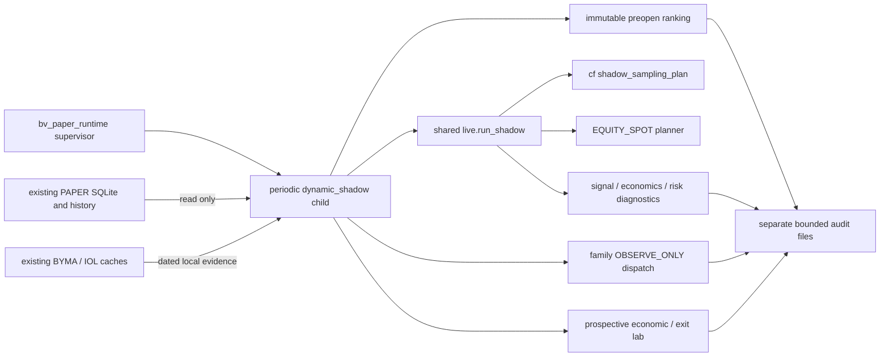

# WS-INTEG-PERF-04 — canonical runtime SHADOW candidate

Contract: [Issue #460](https://github.com/mbalbo2023/Porota-trading/issues/460), including the complete financial specification and A–N addendum of [#458](https://github.com/mbalbo2023/Porota-trading/issues/458).

**Mission state: BLOCKED_FOR_INDEPENDENT_AUDIT / BLOQUEADO_POR_453.**

The four released compatible workstreams and the runtime wiring are implemented in one new integration branch. This state does not authorize merge, deployment, a factual PAPER entry, or a claim of production execution. #453 still has a foreign WRITE_OWNER and four reproducible failures; its unfit HEAD is not included in the publishable candidate. The unchanged-head and offline combined diagnostics preserve all its tests.

## Candidate and reconciliation

Product base: `deploy/rc6-pr69-isolated-20260915@da697c6e6c2274579f9e4a112fabc4327475dd35`.

New branch: `integration/ws-integ-perf-04-runtime-shadow-20261003`.

The exact final HEAD, tree, Predeploy run, artifact, image ID, config digest, and tar digest are recorded in the final immutable PR evidence and GitHub's `porota-frozen-candidate.json`. A document inside its own commit cannot embed that commit's SHA. [Machine-readable provenance](WS_INTEG_PERF_04_PROVENANCE.json) records the input trees, complete input diffs, ownership, reconciliation, and factual protection comparisons.

| Input | Frozen HEAD | Compatibility |
|---|---|---|
| #456, includes #454 | `b8c95c10459cb8ede2925da491730f5988b29561` | Reconciled; owner released; no conflicts |
| #457, includes #450 | `77c4e13768b252a8e7a614a0653b0b0dabb1ed02` | Reconciled; owner released; no conflicts |
| #455 | `84528216cd85060075b63be25e71876e1b742b0c` | Reconciled; owner released; no conflicts |
| #459 | `c48960e105640c385d94ac03461b0c936ebf95a7` | Reconciled; owner released; no conflicts |
| #453 | `d738db79a452c699b50aed00ac539e57e1cc3b04` | BLOQUEADO_POR_453; foreign owner; not integrated |

The branch starts at the real product base. Input trees were reconciled with three-way tree comparison, preserving provenance in a single integration commit; no upstream PR was merged. #454 and #450 were not applied twice. Earlier open workstreams already incorporated into the base were not reapplied. The integration input commit is `80941d6b5e4479a0080b3ab26a8452697fb566ea`, tree `939946b119b75fce1ddfa60b1fb2a8024f933244`.

## Runtime wiring and authority

`bv_paper_runtime.main([])` now registers `dynamic_shadow` in the existing child supervisor. It uses the existing delayed startup, child restart, and stop protocol. Its `--dynamic-shadow-worker` entry branches before trading-store or broker initialization. The independent worker runs every 30 seconds with lower process priority; source reads use SQLite `mode=ro`, `query_only`, WAL, short lock waits, bounded rows, and query deadlines. It never runs DDL, writes a trading event, sends a fill, or initializes a market-data client.

Both the canonical worker and the existing offline CLI call the same `rc6_dynamic_universe.live.run_shadow`; there is no second implementation of the framework. Runtime telemetry includes:

`CATALOG_READY -> STRATEGY_ELIGIBLE -> TRADEABLE -> DISCOVERY/WARM/HOT -> SIGNAL_READY_SHADOW -> ECONOMICS_SHADOW -> RISK_SHADOW`.

HOT and signal readiness have `entry_authority=false`. Native scalping candidate scores/actions and daily risk states are read only when fresh. Scores remain native scores, not probabilities. Candidate economics reuses #456's costs/gate with an explicit unit diagnostic and no movement model; it stays NO_VERIFICADO when the model is missing. The separately connected economic lab can evaluate a model frozen from new prospective labels for subsequent factual-entry observations. It does not automatically promote that model into candidate sizing, PAPER admission, or factual parameter changes. Both diagnostics use the existing EOD buffer (16:50 ART), rather than extending their horizon to the 17:00 close.

No additional provider request is authorized by this worker: explicit budgets are `current=0`, `book=0`, `intraday=0`. The schedule is a SHADOW recommendation; `selected_at` is a planned selection. Achieved revisit, useful fraction, discovery age, and warmup use distinct native source/receipt clocks. Existing PPI readers retain their authority and budgets. The productive equity limit 20 and native Intraday limit 40 are unchanged. A measured OPEN capacity report can later be consumed as a planner input, with expiry and fingerprint validation; it cannot activate a new provider transport or change these productive limits.

## Preopen and prospective discovery

Before the next audited operational session, the worker automatically reads:

- append-only PPI historical raw archives with separate market and recorded clocks;
- production history only when availability and units can be demonstrated;
- versioned history only with an explicit native event clock and ingestion clock;
- dated market books and confirmed native intraday observations.

`HIST_DB_PATH`/the canonical `DATA_DIR/market_history.db` is reused if it exists. No manual evidence bundle or new history ingestion is required. Twenty prior audited sessions, 5/20 activity, supported turnover/volume units, quote quality, and prior-session intraday profiles feed the existing tradeability/Pareto implementation. Currency/market/family cohorts remain separate. The cutoff is the previous regular session close; records downloaded/published after that cutoff do not become retrospectively available. Missing units, timestamps, frequency, or depth remain NO_VERIFICADO.

Each engine's ranking has its own immutable preopen payload, digest, cutoff, version, session, source identity, and capacity fingerprint. The full READY catalog remains intact; the historical focus is not the runtime authority. Booting during OPEN without a preopen freeze produces `PREOPEN_SNAPSHOT_REQUIRED_DURING_SESSION`, never a backdated ranking. A changed policy or capacity invalidates warmup while preserving the audited prior ranking. A changed source identity cannot silently reuse the freeze.

The prospective radar retains a bounded ten-minute window of observations actually accepted after the worker's start and receipt watermark. Source snapshots preceding a restart/config reset remain visible as rejected source evidence and cannot fabricate a promotion. Distinct native PPI last-trade timestamps can support new-business discovery; the counter explicitly describes worker-observed timestamps, not total venue trades. Repeated timestamps do not create samples or businesses. Existing BYMA/IOL snapshots retain their native units and clocks; capture time never substitutes for market time. External observations support discovery only, and never satisfy native PPI Intraday scalping warmup.

Observed new businesses/spread compression demonstrate a real SQLite-to-runtime path for an instrument outside the preopen basket: DISCOVERY -> WARM -> three distinct native Intraday samples in the controlled acceptance fixture -> HOT. The default requirement remains fifteen native samples. No decision, position, candidate, or fill is written by the worker. Existing opened positions remain ahead of SHADOW selections even when capacity disappears or overflows. Scoped native PPI failures preserve the exact five-part identity in the existing error diagnostic; one unsupported instrument cannot contaminate another identity.

BYMA API is absent. The existing public scraper file is read OBSERVE_ONLY under the adapter's demonstrated timestamp/identity/unit rules. `POROTA_IOL_SHADOW_CACHE_PATH`, `POROTA_IOL_SHADOW_ROOT`, canonical market roots, and existing family reference caches are supported and protected as source inputs. No new login, browser, scraper, network path, or source job is started.

## Specialized family dispatch

`family_reports` executes each tick over the full catalog, including explicit exclusions for invalid/nonready identities. ACCIONES/CEDEARS/ETFS use equity observation infrastructure. CEDEAR's USA session calendar, ratio, CCL, and divergence are independently dated; missing/future features remain NO_VERIFICADO. Fixed income uses exact VN/price/multiplier/term/flow evidence and independently dated analytics. It never falls back to `paper-momentum`.

Options selection requires an explicit liquid underlying, structural expiry/strike evidence, moneyness/ATM neighbors, and usable bid/ask/depth. OI/volume/IV/Greeks require evidence and independent feature freshness; no blind rotation through series is installed. CAUCIONES remains event-driven treasury; FCI uses NAV/subscription/redemption/horizon evidence rather than an intraday scanner. FUTUROS is delegated to the reserved #453 lifecycle and explicitly reports its blocker. No FUTUROS engine, lifecycle, contract, cash ledger, evidence, admission, or DailyRisk handler is changed.

## Economic and exit lab

`evaluate_runtime_lab` is invoked by the real worker on every tick. Its first invocation starts at the existing source tail; it does not reconstruct old entries or train from the previous twenty wheels. Subsequent new equity entries require immutable #456 lineage, exact native clocks, decision evidence digest, actual entry costs, frozen factual stop/target/hold/EOD rules, and causal pre-entry history.

When the evidence is sufficient it preregisters six shared-replay policies: factual baseline, volatility, time-to-EOD, MaxHold, trailing, and break-even. It uses identical paths/costs and preserves incremental replay state, MFE/MAE, net outcomes, entry-hour cohorts, sampled level touches, and complete/censored labels. Truncated reads censor outcomes rather than silently inflating probability denominators. A future movement model can be frozen after thirty newly completed prospective labels and evaluated only for later entries. The controlled acceptance test demonstrates that automatic path; it does not claim real OOS calibration or edge. Scores are neither inverted nor calibrated, and no winning exit policy is automatically selected.

## Evidence, restart, and limits

The canonical output is `artifact_root(database)/dynamic-shadow/`:

- `preopen-YYYY-MM-DD.json.gz`: immutable preopen audit;
- `checkpoint.json.gz`: source/configuration fingerprint, watermark, engine/radar/lab state;
- `latest.json.gz`: full SHADOW report with payload digest;
- `status.json`: latest status, native clock, report digest, and preopen digests.

All files use digest-checked envelopes, exclusive local writer locking, symlink/hardlink checks, random exclusive staging names, fsync, and atomic rename. Source DB/history/caches/capacity files cannot alias outputs. Quotas bound staging-plus-old-file peak, not only final size: 128 MiB total, 64 MiB uncompressed payload, and at most 512 files including staging. Reads are bounded; there is no audit-history deletion to obtain space. Exhaustion fails closed and cannot block the PAPER exit process. Each file is atomic; a successful tick is identified by the status clock and matching report digest. A partial publication is not a successful current tick. Readers must validate freshness/digests rather than treating an old report as a current status.

The root checkpoint includes runtime configuration and source dataset/path/inode identity; engine checkpoints additionally include policy, capacity evidence, full READY catalog, session and preopen digest. The lab has its own settings/source/digest/cursor guards. Incompatible state starts prospectively at the current tail. Future checkpoints fail closed. A WAL writer holding `BEGIN IMMEDIATE` does not make the worker wait for a trading write lock.

## Acceptance and consolidated verification

Productive discovery remains repository-root automatic pytest, with only the pre-existing governed duplicate-module exclusion `test_a3_primary_readonly_hf6.py`. No added exclusion, skip, xfail, or deleted #453 test is used. Local pinned dependencies match `requirements.lock.txt`; local full-suite runs use CI's ordinary umask 0022 (this managed workspace defaults to 0077, which otherwise changes a directory-mode fixture's behavior).

| #460 acceptance | Evidence |
|---|---|
| 1, 2, 21 | Canonical supervisor/child, actual SQLite framework invocation, frozen digest, restart and config tests in `test_rc6_shadow_runtime_wiring.py`; actual history/preopen tests |
| 3–7 | Prospective outside-preopen promotion, mandatory native warmup, repeated timestamp, zero decision/position/fill tests |
| 8 | Canonical SQLite opened-priority/capacity-loss test plus shared-allocation overflow regression |
| 9 | Source watermark/config restart, independent feature clocks, preopen availability, future/late entry/quote and censored-label tests |
| 10 | Full READY catalog tests and full catalog family dispatch; bounded overflow fails closed rather than cutting rows |
| 11 | Eleven specialized family tests; structural options, fixed income, treasury, NAV, CEDEAR freshness, invalid catalog preservation |
| 12, 13 | BYMA source manifest/API absence and actual existing-scraper cache route with OBSERVE_ONLY/no native warmup authority |
| 14 | Canonical scoped native error fixture plus source/planner per-identity failure regressions |
| 15 | Actual CLOSED benchmark and runtime fixture: MARKET_NOT_OPEN, requests=0, no OPEN claim |
| 16, 17 | Byte/AST comparisons in provenance; existing factual exit/signal tests; lab frozen factual baseline tests |
| 18–20 | Zero routes/orders in worker/lab tests; no PPI Watch code/runtime mutation; no deployment |
| 22 | Source WAL writer concurrency, exclusive private writer, alias/quota/atomic replacement guards |
| 23 | Compatible published candidate full suite/Predeploy GREEN; all-five diagnostic RED solely on four reserved #453 tests; mission remains BLOCKED |

Exact counts and final run identities are attached to the PR after candidate freeze. Predeploy builds once, validates automatic runtime closure, and exports the immutable image/bundle. The downloaded exact image is additionally exercised locally with stdin explicitly attached and network disabled, because the current canonical import-smoke invocation omits `-i`. This supplementary check cannot mutate the droplet. No alternative build is substituted for the frozen image.

## Reserved #453 blocker and honest closure

The foreign WRITE_OWNER is recorded by #446 comments `5970813881`, `5970834126`, and `5971023410`, without a later release. Its unmodified HEAD reproduces 12 focused tests: 8 pass, 4 fail:

1. `test_future_open_mark_eod_close_uses_specialized_ledger_and_no_real_routes`;
2. `test_future_daily_risk_uses_marks_and_fails_stale`;
3. `test_future_contract_can_only_be_restored_for_exit_not_new_entry`;
4. `test_future_lifecycle_reserve_mark_variation_close_and_cash`.

The failure signature includes `sqlite3.OperationalError: no such table: paper_future_positions` in the reserved lifecycle path. The all-five offline combined diagnostic preserves the same tests and reserved FUTUROS implementation without fixes, exclusions, or remote mutation. Publishing the compatible four-workstream candidate with GREEN artifact checks does not make that unresolved fifth workstream GREEN or integrated.

ARTEFACTO_VALIDADO means the frozen candidate, runtime wiring, tests, and image were validated. Production SHADOW execution, actual OPEN capacity/latency/freshness, missed discovery, real sampling density, score calibration OOS, economic edge, and future profitability remain NO_VERIFICADO until an independently authorized deployment and new sessions. No deployment is recommended while #453 remains blocked.

READ_ONLY preceded the [WRITE_OWNER acquisition](https://github.com/mbalbo2023/Porota-trading/issues/460#issuecomment-5974758405). Final release is posted with the PR's exact frozen evidence. DEPLOY_OWNER was never acquired. PAPER/SHADOW ONLY, `real_orders_sent=0`, real routes `NOT_CALLED`. NO merge, deploy, production mutation, SSH, BYMA API, or PPI Watch mutation.
