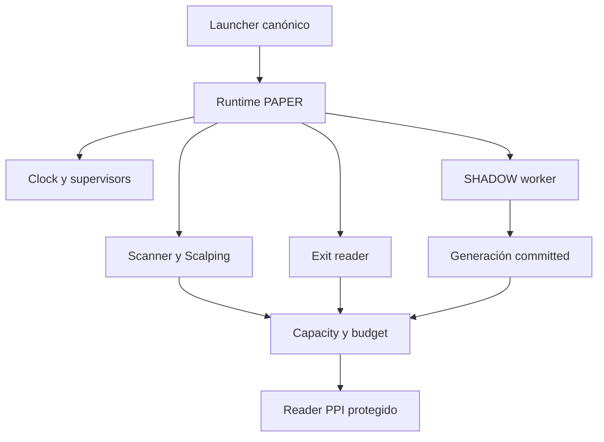
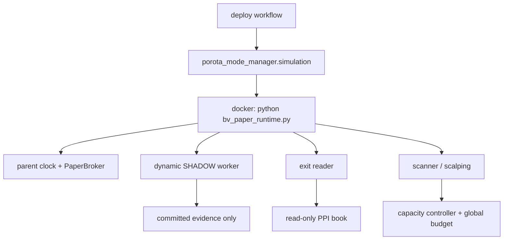

# Reauditoría adversarial independiente — POROTA TRADING RC6, Issue #469

Fecha de corte: 2026-10-04 UTC. Modo: `READ_ONLY`. Objeto exclusivo: PR [#466](https://github.com/mbalbo2023/Porota-trading/pull/466), commit `c27dfd963c4fe83465c0f2105347e974fbbe6356`, tree `bf3cf193434641aa89e4c746b26c77aec5d1d2b2`. Repositorio `mbalbo2023/Porota-trading`.

## 1. Executive verdict

**GO_TO_FIX_AND_REAUDIT. #466 no reúne las condiciones para GO_TO_DEPLOY_PREPARATION.** El objeto es exclusivamente `c27dfd963c4fe83465c0f2105347e974fbbe6356`; ningún resultado se extrapola al desarrollo UX ni a otros heads. No se demostró un incidente P0, una orden real ni una pérdida productiva. Sí se reprodujeron defectos P1 de salida, riesgo/economía, wiring y controles de promoción, además de P2 materiales de disponibilidad e integridad de evidencia.

Los casos originales F-01..F-05 tienen mejoras verificables, pero no sobrevivieron íntegramente al reataque. Entre los contraejemplos más relevantes: una lectura inferior ocupa el single-flight y bloquea EXIT; el sidecar de budget puede llenarse y no recuperarse; una recuperación intraday con rollback dentro del probe permite un fill PAPER sin el warmup posterior real; Scalping elude el gate económico BINDING; FUTUROS ACTIVE no se cuenta para reservar EXIT; una quote de otra moneda/mercado oculta el libro exacto que cruzó el stop; el SHADOW canónico deja de publicar a los 50,5 minutos bajo su cuota default.

**GREEN no equivale a aptitud.** Las suites focales reejecutadas y los controles positivos se conservan junto con los RED propios. El dictamen está sostenido por callers reales sobre fixtures locales y por inspección del SHA, no por los 3640 tests declarados por el autor. La procedencia de los bytes del artifact y la evidencia privada de 20 ruedas se califican por separado en §§13 y 15. Software más robusto tampoco demuestra edge: la aritmética del agregado histórico declarado sigue siendo negativa por moneda y no hay validación OOS independiente.

Se completan los veinte entregables mediante las secciones y anexos de este único informe. Los casos que requieren artifact privado, mercado OPEN, host o master histórico se identifican como `EXTERNAL_NO_VERIFICADO`; no se presentan como pruebas aprobadas. `real_orders_sent=0` para todas las actividades de esta auditoría; rutas reales `NOT_CALLED`.

## 2. Método, alcance, jerarquía y concurrencia

El contrato es [Issue #469](https://github.com/mbalbo2023/Porota-trading/issues/469), leído en su totalidad. Se leyeron #458 (A–N), #460, #462 (O–V), #464 y el informe adversarial previo, #465, PR #463 y #466, AGENTS.md, políticas RC6 y documentación/código del tree congelado. El informe anterior y las declaraciones de Codex se usaron como hipótesis a refutar, no como prueba. Se separan `PROBE` independiente local, `CODE` inspección, `NATIVE` tests/Actions ajenos, `METADATA` Git Hub y `EXTERNAL_NO_VERIFICADO`. Un test GREEN o un literal `real_orders_sent=0` no certifica el host.

Product branch `deploy/rc6-pr69-isolated-20260915` se observó en `da697c6e6c2274579f9e4a112fabc4327475dd35`. #466 sigue OPEN/DRAFT/no merged, base ese SHA, head/tree los arriba citados, 140 archivos cambiados y 25 commits. Predeploy [37234866451](https://github.com/mbalbo2023/Porota-trading/actions/runs/37234866451) sobre ese head terminó SUCCESS y sus 27 pasos reportaron éxito. **Se descargó y rehasheó independientemente el artifact exacto `11315198085`: `407679652` bytes; SHA256 `6514bfdef175d31044a0f204c799ebc2029722cce77f44724909a7069a2ed552`, coincidente con metadata.** Los intentos HTTP401 iniciales quedaron superados por acceso autorizado posterior desde el coordinador. §13 contiene verificación de bytes internos, layers, `/app` y clausura estática; no equivale a ejecución en host. La revalidación de cierre mantiene la identidad fijada.

Las otras dos líneas de trabajo declaradas por el usuario —UX del dashboard en otro Codex e históricos en una auditoría exclusivamente de lectura— no son parte del objeto ni se tocaron. El diff base→#466 no modifica un archivo con `dashboard` en el path; eso no descarta interacciones de API/estado. La integración futura exige inventariar los heads finales y cambios concurrentes, resolver contratos y tests, construir un único candidato reconciliado y auditar su SHA/artifact propios antes de un único deploy autorizado. Un dictamen sobre #466 no se transfiere automáticamente a esa combinación. No se adquirió WRITE_OWNER ni DEPLOY_OWNER.

Se permitieron sólo lecturas de Git Hub, inspección de clone detached y probes sintéticos/offline en directorios temporales. No se tocó la rama productiva, PR, issues, proveedor, DB/host productivos ni PPI Watch. Ninguna orden real fue emitida por esta auditoría. La observación de rutas/órdenes de un candidato no desplegado en un host es `EXTERNAL_NO_VERIFICADO`, no un cero empírico de trading.

## 3. Reproducción F-01..F-05

| Fix | Reproducción histórica y control #466 | Reataque propio / caller | Dictamen |
| --- | --- | --- | --- |
| F-01: piso EXIT | Caso book cap=5/reserve=5: #466 bloquea 5 OPENED y admite 5 EXIT; el fallo anterior se conserva como control RED histórico. Budget multiproceso también preserva el piso en el caso compatible. | U01 single-flight, U02 cuota irrecuperable, U05 demanda mayor que cap, U07 FUTUROS omitido. `ProductionMarketReader.book`, `collect_exit_books`, `RuntimePPIBudget`. | **FAIL de liveness**, aunque el robo original de la reserva está corregido. |
| F-02: negativa temporal | D→D+1, TTL/cooldown, scope y restart pasan en suites focales actuales; el comportamiento previo retenía la negativa. | U03 rollback entre probe-start y completion mueve la época de recuperación hacia atrás; worker/evaluator/broker real genera un fill PAPER con sólo una muestra posterior al inicio real. | **FAIL variante temporal**. No es un BUY inmediato ordinario tras TTL. |
| F-03: generación atómica | Replay #463 con ENOSPC vuelve a mezclar latest=t con checkpoint/status=t−30 s. En #466 siete fronteras propias y SIGKILL nativo preservan corte completo viejo/nuevo. | U17 rehash integral y safety contradictorio; U20 rollback CURRENT seguido de commit bifurca sequence. | Atomicidad accidental **PASS acotado**; integridad semántica/lineage **FAIL**. No se afirma mixed snapshot con hashes intactos. |
| F-04: source audit | Replay histórico: report recibido con cero snapshots. Caller #466 pasa reports/as_of y produce audit coherente con PPI/IOL/BYMA. | U16 texto libre de error comprometido; U21 audit vacío/ghost con digest de reports correcto es aceptado en frontera durable; U26 duplicado exacto cuenta dos. | Caller habitual corregido; guard/privacidad **FAIL**. |
| F-05: retención | Replay histórico vuelve a dar cuota sin métricas. #466 distingue presión, pins, CURRENT, ACK, bytes/files; no borra evidencia sin ACK. | U14 full tick soft +40,5 m/hard +50,5 m; U15 ACK ledger finito; U18 ACK autoafirmado; U19 unlink parcial no reanudable. | Safety local parcial; disponibilidad/recuperación **FAIL**. |

Las tablas completas de variantes F-01/F-02 y F-03..F-05 están en los anexos técnicos. Se distingue en cada caso prueba propia, test nativo reejecutado, inspección y variante no ejecutada. Ningún replay sobre #463 se mezcla con el resultado de #466.

## 4. Hallazgos nuevos P0–P3

Todos los findings siguientes pertenecen al SHA/tree de portada. Los anexos técnicos incorporados a este documento contienen reproducción, output, path/símbolo, RCA, gap de test y recomendación sin implementación. Los identificadores U son el índice único; las claves RA conservan trazabilidad con los probes. Una condición maliciosa con escritura total sobre evidencia se distingue de un fallo espontáneo del caller.

### P1 — bloqueos de programación

| ID | Hallazgo / condición reproducida | Path / símbolo exacto | Impacto y cierre necesario |
| --- | --- | --- | --- |
| U01 | Single-flight inferior retrasa EXIT: owner OPENED, follower EXIT espera 50 ms y es rechazado; tres ciclos faseados dan 3/3 denegaciones EXIT. | `rc6_ppi_global_budget.py:614–675`, `coalesced_book`; `bd_ppi_readonly_guard.py:390–400` | Prioridad de slots no garantiza prioridad de entrega. Reauditar ownership/espera/poll real sin duplicar ni preemptar una llamada ya emitida; tests con owner lento más allá de 50 ms. |
| U02 | Sidecar default alcanza 4.194.304 B; 6 scopes distintos/segundo agotan páginas a 2977 s/17.865 intentos. +4000 s no recupera EXIT. | `rc6_ppi_global_budget.py:257–270`, `_window_total`, y bootstrap `max_page_count` | Inserta bucket antes de podar; `SQLITE_FULL` impide llegar al delete. Reordenar/garantizar mantenimiento con espacio y límites de cardinalidad; prueba de horizonte largo/restart. No es WAL growth: usa DELETE journal. |
| U03 | Reloj retrocede dentro del reprobe; época se acepta 13 m 20 s antes del comienzo durable. Un fill PAPER usa 15 puntos posteriores a esa época pero sólo 1 posterior al comienzo real. | `cf_intraday_scalping.py:252–275,579–690,1043–1087` | Warmup posterior no garantizado. Ligar start/completion monotónicos, rechazar rollback/futuro y resetear evidencia; test caller real de rollback intra-read. |
| U04 | Launcher omite las seis variables de modo/policy/report/recommendation/approval/shadow. | `porota_mode_manager.py:253–269,318–359`; `promotion.py:218–242` | APPROVED no activable por vía canónica config-only exigida por #462 O/V. Contrato explícito de inputs y test desde launcher, sin activación manual alternativa. RA-B-01. |
| U05 | Policy aprobada declara demanda book=30 y acepta cap 15/global 10: sólo admite 15/30 o 10/30 EXIT. Con 10 identidades/cap 5, tres ventanas sirven siempre P00..P04. | `rc6_ppi_global_budget.py:45–100`, `budget_policy/validate_policy`; `promotion.py:121–167`; `be_paper_engine.py:536–554` | Envolvente incompatible y orden estable sin fairness. Reject preflight cuando la demanda crítica no cabe; probar deadline por identidad. No se propone exceder rate limit. RA-B-02 / RA-A-F01-03, un único finding. |
| U06 | Scalping abre pese a gate BINDING canónico `passed=false`, net R/R=0,670348 <1,20; persiste `passed=true`. | `cf_intraday_scalping.py:857–949`, `promote_paper_candidate`; `be_paper_engine.py:1108–1192` | La ruta directa `_open` elude el gate y reescribe evidencia. Unificar evaluación/admisión y preservar diagnóstico; prueba caller completo con economics adversos. |
| U07 | FUTUROS `ACTIVE` contados como cero por consulta `status='OPEN'`; tres DISCOVERY agotan book y EXIT es denegado. | `rc6_ppi_global_budget.py:840–855`, `_opened`; `rc6_paper_family_lifecycle.py:490` | Reserva de salida ausente en futuros. Contar estados canónicos por familia y probar mezcla spot/futuros, 5+5 y cap insuficiente. |
| U08 | Última quote del triple ticker/clase/plazo pertenece a otra moneda/mercado; spot queda OPEN y futuro ACTIVE pese a libro exacto cruzando stop. | `be_paper_engine.py:452–466,1671–1677`; `bv_paper_runtime.py:149–226`; `bu_instrument_catalog.py:594–635` | Lookup reduce identidad 5→3; guard rechaza dato ajeno pero no recupera exacto. Corregir contrato end-to-end/tombstone; tests stop/target/EOD/restart. Raíz spot heredada; #466 extiende a FUTUROS. RA-DE-01. |
| U09 | Fill DLR 1579,3158/1579,6840 fuera de tick 0,5; roundtrip sintético sobrestima gross 368,20 ARS/contrato. | `bs_instrument_contracts.py:74–149`, `rc6_ppi_future_contract_policy.py`; `be_paper_engine.py:1358–1361,1480–1489` | Contrato no lleva tick. Vincular especificación oficial y redondeo adverso por lado antes de cash/Pn L; no redondear sólo visualmente. |
| U10 | Close/variation t+1µs entra en snapshot al corte t por `julianday`: active 1→0 y libera 1,5 MARS antes del evento. | `rc6_paper_family_lifecycle.py:686–810`, `future_cash_effect/future_risk_snapshot` | Lookahead y caja/riesgo PIT incorrectos en frontera subms. Comparación exacta normalizada/postfiltro y tests ±1/100/499/500µs; restart. |
| U11 | Selector de artifact acepta nombre del candidato desde un run exitoso de otro head; fixture más nuevo gana. | `.github/workflows/porota-deploy-v2-promote.yml:58–94` | No liga run.head_sha/workflow/path/event/attempt a candidato. Luego sí comprueba SHA/tree autoafirmados del paquete; eso no autentica su origen. Guard estricto y ataque de reemplazo externo al ZIP. |
| U12 | Image ID esperado sólo se imprime; predicates actuales aceptan loaded ID distinto si tar hash coincide y tag existe. | `.github/workflows/porota-deploy-v2-promote.yml:388–404` | Falta igualdad antes de tag/promote. Assert esperado==loaded y referencias inmutables, prueba negativa del flujo. No se demostró sustitución real ni despliegue comprometido. |

### P2 — fiabilidad, evidencia y operación

| ID | Hallazgo / condición | Path / fuente técnica | RCA / guard / test recomendado |
| --- | --- | --- | --- |
| U13 | Spawn/tick SHADOW fallido no bloquea salud de deploy; heartbeat scanner puede seguir sano. | `bv_paper_runtime.py:101–138`; `worker.py:361–391`; workflow promote:561–598; RA-B-03 | Medir child health y generación committed fresca, no sólo PID/heartbeat. Probar crash loop y ausencia de CURRENT. |
| U14 | Sin archiver canónico: soft 40,5 m, hard 50,5 m a 30 s; 101 commits, 508 entradas, siguiente proyecta 514>512. | `worker.py:110–114,361–391`; `persistence.py:335–341`; RA-A-01 | Horizonte/cadencia/cuota no cierran. Resolver lifecycle durable de archivo o representación; full tick de al menos una rueda y restart. |
| U15 | Con archivador ideal, ACK por generación no compactable: ACK506 proyecta 513; límite favorable≤253 min. | `retention.py`, runbook ACK ledger; RA-A-02 | Ledger comparte cuota finita. Checkpoint/compactación con anclaje externo y prueba miles de ciclos sin pérdida. |
| U16 | Error IOL con marcador sintético de token llega al report committed en texto libre. | `iol_shadow_collector_rc6.py:294–308`; `sources.py:201–217,309–316`; RA-A-03 | Truncado no es sanitización. Taxonomía allowlisted/redacción antes de cache y evidencia; secret scan de fixtures sintéticos. No se exfiltró secreto real. |
| U17 | Writer adversarial rehashea raíz entera; reader acepta report.orders 7/status 0. | `persistence.py:189–246`; RA-A-04 | Hashes autocontenidos no autentican; safety cross-role incompleto. Definir trust boundary y anclaje independiente, invariantes cross-role. Condicionado a control de toda la raíz; promoción sí rechaza report.orders 7. |
| U18 | ACK local con URI inexistente/digest inventado autoriza borrar generación. | `retention.py:187–219`; RA-A-05 | Confía en `durable/verified` autoafirmados. Receipt del archiver ligado a objeto durable/identidad; negativos de ACK falso/replay. Condicionado a integración futura o writer comprometido. |
| U19 | EIO en segundo unlink deja generación parcial; restart no puede validar ACK ni terminar rotación. | `retention.py:168–219,328–347`; RA-A-06 | Deletion multistep sin estado de recuperación. Tombstone/rename+fsync y cleanup reanudable; fault injection por frontera. |
| U20 | Restituir CURRENT válido antiguo y luego commit duplica sequence 2 con distintos generation IDs. | `persistence.py:180–252,292–333`; RA-A-07 | Pointer es única autoridad mutable. High-water/lineage durable y recuperación explícita; test rollback reciente/fuera freshness. Es fork, no mixed snapshot. |
| U21 | Digest de reports coincide pero audit dice cero/NO_SOURCE_REPORTS, o audit ghost con lista vacía; commit/read aceptan. | `persistence.py:241–246,305–307`; `sources.py:audit_sources`; RA-A-08 | Binding de lista sin contrato semántico. Recomputar/validar audit canónico cero/N; count/status/asof/pointers/digests. Caller actual normal pasa. |
| U22 | `portfolio_capacity(at)` usa status FUT actual; mismo corte cambia riesgo 1.500.100→0 tras close posterior. | `dh_paper_dynamic_risk_gate_hf6.py:109–182`; RA-D-02 | Reconstruir al cutoff desde eventos. Test invariancia ante futuros eventos. No se probó admisión económica indebida por esta variante. |
| U23 | Mismo event_id FCI con monto 1000→2000 se acepta idempotente; durable sigue−1000. | `rc6_paper_family_lifecycle.py:529–597`; RA-D-03 | Comparar fingerprint de intención completo; variaciones monto/moneda/time/detail y carrera. Alcance limitado: no wiring runtime FCI demostrado. |
| U24 | Export `mode=ro/query_only` sobre main+WAL sin SHM crea source.sqlite-shm de 32768 B. | `rc6_audit_evidence/package.py`, conexión de export; probe histórico | DB principal inmutable no equivale a filesystem inmutable. Abrir snapshot copiado/immutable coherente o precondición explícita; test layout WAL incompleto en filesystem RO. |
| U25 | Bundle/image validators aceptan cambio de permisos 0644→0666 si no cambia ejecutabilidad y se rebindea hash externo. | `scripts/porota_artifact_provenance.py`, `porota_validate_deploy_artifact.py`; RA-F | Comparan bit ejecutable, no modo íntegro. Definir/enforzar permisos de owner/group/other y rechazar writable imprevisto; no es colisión SHA ni conserva digest externo original. |
| U29 | Actions `@v4` mutables y lock Python por versión sin hashes; build no hermético. | Predeploy:28,112,436; Promote:30; `scripts/porota_dependency_repro_audit.py`; RF-05 | P2 residual de supply chain/reproducibilidad; no explotación demostrada ni blocker autónomo. Pin de Actions por commit, hashes por plataforma o wheelhouse inmutable, y tests de drift del control plane. |

### P3 — deuda no bloqueante por sí sola

| ID | Hallazgo | Path / cierre recomendado |
| --- | --- | --- |
| U26 | Dos source reports idénticos cuentan 2; multiplicidad no declarada. | `rc6_dynamic_universe/sources.py:359–404`; RA-A-09. Clave/digest único o multiplicidad explícita; caller natural no reproducido. |
| U27 | BYMA-only/IOL-only pueden publicar `shadow_promotion=true` aunque selection/entry/live=false. | `rc6_source_consolidation.py:227–242`; RA-E-04. Derivar flag de autoridad o renombrar su semántica; sin consumer de código hallado, no bypass de entrada. |
| U28 | YAML aún dice piso 6 GiB mientras JSON usa fórmula dinámica+reserva 2 GiB autorizada explícitamente el 2026-10-01. | `ops/policy/porota-policy.yaml:54`, `rc6-disk-housekeeping-v1.json:8,20–27`; RF-04. Unificar documentación/precedencia. **Adjudicación final P3:** la autorización documentada impide afirmar que usar la fórmula sea una violación operativa o exigir arbitrariamente 6 GiB. |

U01–U12 y los P2 de liveness/evidencia bastan para el dictamen. Los P2 condicionados U17/U18 no se usan para afirmar una intrusión real ni para exigir que hashes locales resistan a un atacante omnipotente sin un trust model explícito. La severidad de este registro prevalece sobre las propuestas de los frentes incorporadas en anexos; se consolidó la duplicación RA-B-02/RA-A-F01-03 en U05 y se recalificó RF-04 por su autorización explícita.

## 5. Matriz independiente de requisitos

`PROBE` = ejecución local propia; `CODE` = lectura independiente del tree; `NATIVE` = test del candidato examinado/re-ejecutado, nunca por sí solo certificación; `HOST` = candidato no desplegado. Abreviaturas: `B` = `test_issue465_budget_adversarial.py`; `C` = `test_issue465_capability_cache.py`; `G` = `test_issue465_generations.py`; `R` = `test_issue465_source_retention_policy.py`; `W` = `test_rc6_shadow_runtime_wiring.py`; `F` = `test_rc6_final_family_source_policy.py`; `T` = `test_rc6_future_programming_complete.py`; `E` = `test_rc6_shadow_entry_signals.py`; `U` = `test_rc6_shadow_operational_funnel.py`; `H` = `test_issue465_historical_package.py`. Run nativo 37234866451 sobre SHA exacto, pero HOST ausente para todas las filas salvo indicación. No importamos la calificación de la matriz del desarrollador.

| Requirement | Source | Code | Runtime caller | Independent probe | Native test | Artifact/runtime evidence | Verdict | Severity |
| --- | --- | --- | --- | --- | --- | --- | --- | --- |
| Visibilidad amplia ≠ límite deep | #458 A | `orchestrator.py`, `live.py` | `worker.tick` | CODE catálogo separado | W, orchestrator | Run; HOST no | PARTIAL: cobertura OPEN externa | EXTERNAL |
| Discovery contemporáneo, no BUY | #458 B | `live.py`, planner | worker SHADOW | CODE clocks/promoción | W | Run; OPEN no | PARTIAL | EXTERNAL |
| Foco fijo baseline; preopen congelado | #458 C | `tradeability.py`, `worker.py` | worker | CODE freeze | W,G | Run; HOST no | PARTIAL: OFF conserva foco | EXTERNAL |
| Tradeability/señal/economía/riesgo separados | #458 D | `stages.py`, `orchestrator.py` | worker→labs | CODE stages | W,E | Run; HOST no | PASS_CODE | — |
| Score no probabilidad; calibración OOS | #458 E | `be_paper_engine.py`, `entry_signals.py` | broker/lab | CODE heurística | E | Labels OOS no | EXTERNAL_NO_VERIFICADO | EXTERNAL |
| Costos netos/spread/movimiento | #458 F | `rc6_performance/costs.py`, `cf_intraday_scalping.py` | broker/scalping | PROBE bypass económico | cost/C | Run; fees live no | FAIL gate Scalping | P1 |
| Exit lab sin cambiar factual | #458 G | `lab.py`, broker | worker | CODE aislamiento | W | Run; OOS no | PASS_CODE; eficacia externa | — |
| Cadencia por familia y estrategia | #458 H | `families.py`, planner | worker | CODE perfiles | F,W | Achieved OPEN no | PARTIAL | EXTERNAL |
| CEDEAR ratio/USA/CCL clocks | #458 I | `families.py`, `tradeability.py` | family report | CODE missing→NO_VERIFICADO | F | Fuentes vivas no | PARTIAL | EXTERNAL |
| Opciones: selección estructural | #458 J | `families.py` | family report | CODE OBSERVE_ONLY | F | OI/Greeks no | PARTIAL | EXTERNAL |
| HOT/WARM/DISCOVERY ≠ 24→40 | #458 K | `cf_intraday_scalping.py`, `rc6_dynamic_universe/orchestrator.py` | worker/factual 40 | CODE prioridad y baseline; NATIVE wiring | W, orchestrator | Density OPEN no | PASS_CODE; cobertura EXTERNAL | EXTERNAL |
| Métricas coverage/revisit/age | #458 L | `orchestrator.py`, `funnel.py` | worker | CODE planned/achieved | U,W | Rueda no | PARTIAL | EXTERNAL |
| Reason codes mínimos | #458 M | `families.py`, planner | worker | CODE rutas; sin contraejemplo independiente de código mínimo ausente | F,W | HOST no | PARTIAL / EXTERNAL | — |
| Compleción no sólo helpers/tests | #458 N | varios | factual+SHADOW | PROBE §4 | múltiples | GREEN no refuta | FAIL | P1 |
| Benchmark endpoint OPEN y no inventar 20 | #458 obj.1; #460 G | `benchmark.py`, `capacity.py` | workflow RO | CODE mercado gate | capacity tests | OPEN no | EXTERNAL_NO_VERIFICADO | EXTERNAL |
| SHADOW periódico, DB RO separada | #460 A | `worker.py`, `bv_paper_runtime.py` | Child Processes | CODE call graph | W | HOST no | PARTIAL: retención §12 | P2 |
| Preopen PIT e inmutable | #460 B | `worker.py:245–262` | worker | CODE freeze | W,G | HOST no | PASS_CODE | — |
| Discovery intradía prospectivo | #460 C | `worker.py:287–318`, `live.py` | worker | CODE watermark | W | OPEN no | PARTIAL | EXTERNAL |
| Scalping HOT/WARM/DISCOVERY sin BUY por plan | #460 D | planner, `cf_intraday_scalping.py` | worker/scalping | PROBE recuperación reloj | C,W | HOST no | FAIL reloj intra-probe | P1 |
| Routing especializado | #460 E | `families.py`, `routing.py` | worker/factual | CODE familias | F,T | HOST no | PARTIAL live semantics | EXTERNAL |
| Labs económico/exit causal | #460 F | `lab.py`, `entry_signals.py` | worker | CODE separación | E,W | OOS no | PARTIAL | EXTERNAL |
| Integración #461/#453, tests | #460 H–I; #462 §6–9 | `bv`, FUT lifecycle | runtime | CODE y probes | W,T | Run GREEN; HOST no | PARTIAL por hallazgos | P1 |
| Candidato único congelado/no deploy | #460 J; #462 §9 | PR #466 | ninguno | METADATA SHA/tree | Predeploy | OPEN/DRAFT | PASS_METADATA | — |
| FUTUROS DLR/schema/lifecycle | #462 §3–5 | `rc6_ppi_future_contract_policy.py`, lifecycle | broker/clock | PROBE sintético | T | Broker live no | PARTIAL | EXTERNAL |
| FUTUROS DailyRisk/variation/restore | #462 blockers A–D | `bw_daily_risk.py`, lifecycle | clock/broker | PROBE ledger/cut | T, shared risk | HOST no | FAIL t+1µs/quote/budget | P1 |
| OFF/SHADOW/APPROVED sin nuevo código | #462 O | `promotion.py`, `porota_mode_manager.py` | `simulation()` | PROBE env whitelist | capacity promotion | HOST no | FAIL launch canónico | P1 |
| HOT sin quota igualitaria | #462 P | `orchestrator.py` | worker | CODE priority | orchestrator | HOST no | PASS_CODE | — |
| Budget global y EXIT | #462 Q | `rc6_ppi_global_budget.py` | reader/scanner/exit | PROBE floor/single-flight/sidecar/FUT | B | OPEN capacity no | FAIL liveness | P1 |
| Entry lab same-snapshot | #462 R | `entry_signals.py` | worker | CODE | E | Labels no | PARTIAL | EXTERNAL |
| Diez familias explícitas | #462 S | `families.py` | worker | CODE report | F | HOST no | PARTIAL, no 10 BUY | EXTERNAL |
| PPI > IOL > BYMA, conflictos | #462 T | `source_authority.py` | family report | PROBE source | F | Provider OPEN no | PARTIAL | EXTERNAL |
| Funnel/monedas | #462 U | `funnel.py` | worker | CODE tail/watermark | U | Fills candidato no | PARTIAL | EXTERNAL |
| 100% programación antes auditoría | #462 V | todos | runtime/deploy | PROBE §4/13 | GREEN nativo | Fallas programables | FAIL | P1 |
| F-01 EXIT indelegable | #464 F-01; #465 §4 | `rc6_ppi_global_budget.py` | `ProductionMarketReader.book` | PROBE original PASS, variantes FAIL | B | HOST no | FAIL reataque | P1 |
| F-02 negativa temporal, 15 muestras | #464 F-02; #465 §5 | `cf_intraday_scalping.py` | worker | PROBE rollback/fill | C | HOST no | FAIL variante | P1 |
| F-03 generation commit y lector | #464 F-03; #465 §6 | `persistence.py` | worker→reader | PROBE fault injection | G | HOST no | PARTIAL antirollback/semantic | P2 |
| F-04 audit de fuente no vacío/coherente | #464 F-04; #465 §7 | `sources.py`, `worker.py` | worker | PROBE report manipulado | source retention audit | HOST no | PARTIAL integridad semántica | P2/P3 |
| F-05 retención sin bloqueo sorpresa | #464 F-05; #465 §8 | `retention.py`, `persistence.py` | worker 30 s | PROBE 101 commits/50,5 min | R | HOST no | FAIL disponibilidad | P2 material |
| Byte provenance Git→bundle→image | #465 §9; #469 §12 | validators, workflows | Predeploy→promote | PROBE exact ZIP/layers/app y mutation/gates | provenance | ZIP/bundle/image/static closure PASS; runtime no | PASS bytes exactos / FAIL guards promoción | P1 |
| Paquete histórico READ_ONLY 20 ruedas | #465 §10; #469 §18 | `rc6_audit_evidence` | CLI explícita | PROBE sintético/WAL sidecar | H | Master real no | PARTIAL | P2/external |
| Stress 10×/5× sin bloquear exits | #465 §11; #469 §11 | stress harness | offline | PROBE independiente | stress | Host SLO no | PARTIAL | EXTERNAL/P2 |
| PAPER sin rutas reales/PPI Watch | #458–469 | `bd_ppi_readonly_guard.py`, broker | runtime | CODE/negativas locales | B/safety | HOST no | PASS_CODE / HOST EXTERNAL | EXTERNAL |

## 6. Wiring y runtime

El recorrido inspeccionado es workflow promote → `porota_mode_manager.simulation()` → `python bv_paper_runtime.py`. El parent toma lock, ejecuta reloj/supervisores PAPER y lanza scanner, Scalping condicionado, exit reader, performance, notificaciones, candles y SHADOW. `bf_production_paper_observer.py` es el observer real; no existe un caller canónico llamado `bk_production_observer.py` (errata del anexo RA-B).



| Modo | Comportamiento de código | Riesgo verificado |
| --- | --- | --- |
| OFF | Baseline 20 observer/40 Scalping; abiertas primero; no nueva autoridad dinámica; coalescer deriva a fetch baseline. | No soluciona bugs factuales U06/U08/U09/U10. No se atribuyen los defectos exclusivamente dinámicos al host OFF. |
| SHADOW | Produce evidencia desde DB RO; selección factual sigue baseline; no broker de órdenes/callback de fill en worker. | Retención U14/U15 y salud U13; no prueba cobertura útil en rueda. |
| APPROVED / APPROVED_DYNAMIC | Requiere policy, report, recommendation y approval válidos/frescos; su ausencia vuelve a baseline. | U04 impide configuración por launcher; U01/U02/U05/U07 limitan liveness cuando se prueba su vía interna. No autoactivación observada. |

Se inventariaron y contrastaron los bytes de los 140 paths cambiados; se identificaron 107 Python y se hizo scan AST de imports/calls/rutas/subprocess de 66 módulos no-test/no-doc, más lectura semántica por cada frente en los paths y callers documentados. Eso no significa revisión línea por línea de los 140 archivos. El anexo RA-B conserva el grafo y 355 tests focales reejecutados. No se declaró wiring por encontrar un helper: U04 se probó generando el env real del launcher; U13 inyectó fallo de spawn. La hipótesis de perder abiertas por telemetría SHADOW incompleta fue descartada en su caso probado: `CAPACITY_DYNAMIC_IDENTITY_INVALID` provoca fallback y mantiene abiertas; el exit reader es independiente.

Restart: supervisor relanza hijos con backoff, pero proceso vivo no prueba generación fresca. Hay protección de lease/restart y locks de evidencia en casos probados; rotación parcial no recupera (U19). La activación efectiva en host, variables reales y liveness después de reboot quedan externas.

## 7. Finanzas, trader, quant y contrafácticos

El agregado documental previo declara 20 ruedas 2026-09-07..2026-10-02, 68 posiciones, 151 fills y 10 posiciones con parciales. Se recalculó su aritmética, **no su procedencia ni cada fill**:

| Moneda | Cierres declarados | Gross declarado | Costos declarados | Neto aritmético | Neto/cierre |
| --- | ---: | ---: | ---: | ---: | ---: |
| ARS | 62 | −10.954,5809 | 23.445,66 | −34.400,2409 | −554,8426 |
| USD_MEP | 6 | −1,4439 | 2,64 | −4,0839 | −0,68065 |

Con gross fijo, costos +25%/+50%/+100% producen ARS −40.261,6559/−46.123,0709/−57.845,9009; USD_MEP −4,7439/−5,4039/−6,7239. A costo cero el gross declarado ya es negativo. No-trade nominal da 0 por moneda y supera esa muestra declarada; faltan tasas/caja/inflación/precios para caución, buy-and-hold y costo de oportunidad. No se suman ARS y USD_MEP.

Score 0..1 es heurístico, no probabilidad calibrada: saturación 1 en un probe no implica certeza. El AUC~0,389 previo no es validación propia ni licencia para invertir señal. Faltan labels OOS, denominador de decisiones independientes, Brier/reliability, bootstrap agrupado por rueda, incertidumbre de expectancy y robustez entre símbolos/familias/horas/regímenes. Seleccionar thresholds con la cohorte conocida agrega sesgo de selección.

El probe U06 compara el mismo candidato con el gate económico: rango pasado 3,49127% supera hurdle 2,16119%, pero RR neto 0,670348 viola mínimo 1,20 y aun así abre 100 unidades. Breakeven de esa estructura:59,86776%. Bajo la **hipótesis ilustrativa**, no estimada, de probabilidades 50/50 target/stop, EV=−28,515075 ARS para 100 unidades. Max Hold 30 min con book constante cierra gross−9,16/costos 87,93/net−97,09. Esto prueba incoherencia de política, no una expectativa empírica de todas las señales.

TP/SL/EOD/Max Hold requieren precio ejecutable; un stop no acota gaps ni garantiza liquidez. Los contrafácticos de entry/exit lab son infraestructura para comparaciones prospectivas same-snapshot: baseline, tradeability-only, alternativas preregistradas, trailing/breakeven, latencia y costos. Sin labels ni books/fills de rechazo/HOLD no se estima ganancia evitada, fill probability o MFE/MAE realizable. No se modificó estrategia ni se recomienda retuning con esta auditoría. **EDGE_NO_DEMOSTRADO**.

## 8. Scalping, discovery y capacidad

El fix nominal de negative cache vuelve a reprobar D+1/TTL sin reiniciar y retorna warmup pendiente. Scope completo, fingerprints semánticos y cooldown limitado reducen contaminación/hammer en casos focales. Sus 20 variantes obligatorias están discriminadas en anexo F01/F02. U03 rompe el epoch causal entre `begin_probe` y `outcome`; U06 rompe la admisión económica posterior. Son fallas distintas, ambas en caller real.

HOT/WARM/DISCOVERY planifican observación; no son BUY. Visibilidad/catalog coverage tampoco equivale a número de instrumentos analizados profundamente. OFF conserva el baseline; la capacidad aprobada sólo puede derivarse de benchmark OPEN, freshness y demanda crítica compatibles. U04/U05 impiden certificar esa preparación config-only. Los bursts multiproceso probados preservan reserva spot compatible; U07 descubre que FUTUROS no integra la misma autoridad de demanda.

Matemática independiente de admission: para cada autoridad viva, receipts dentro de su ventana deben satisfacer límite global y de endpoint; antes de admitir prioridad inferior se resta el remanente reservado a prioridades superiores. Se presta hacia arriba, no desde EXIT hacia abajo. `requested=allowed+dropped` en transacciones completadas; `used` nace al start. Una transacción SQLITE_FULL revertida no entra en los contadores. Con 5 abiertas/30 s/5 s, demanda 30; cap 15 no puede servir 30. Con 10 abiertas/cap 5 el orden `opened_at,paper_id` perpetúa exclusión de las últimas 5 en las tres ventanas probadas. La reserva no crea capacidad física.

Pruebas de latencia/denials locales no miden PPI OPEN. Quedan pendientes tasas achieved/revisit/data-age por tier y familia, cobertura prospectiva del universo, 429/5xx reales y servicio justo por posición con el endpoint disponible. No se aceptaría un benchmark cerrado o un score alto como sustituto.

## 9. FUTUROS y familias

FUTUROS factual está acotado a LONG DLR estándar 2026, A3/ARS/INMEDIATA, multiplier 1000 y lote entero. Reserva 100%notional PAPER más costos es conservadora, no margen del broker. Un lote a 1500 demanda 1,5 MARS: defaults capital 1 M/cap individual 25%/total 60% lo bloquean legítimamente. BINDING futures falla cerrado por falta de costos exactos; SHADOW estimado no acredita tarifas/clearing.

Control positivo: open 1500→settlement 1510 realiza 10000; close 1520 agrega 10000; menos 100+100 fees deja 19800; restart/retry no duplica. Los contraejemplos U07/U08/U09/U10/U22 impiden certificar reservas, acceso al book y fidelidad financiera. Libro stale/no-depth no autoriza precio inventado; la posición puede quedar abierta/carry hasta evidencia válida y requiere alarma independiente.

Se consultó la [guía oficial vigente A3 de futuros y opciones sobre dólar](https://a3mercados.com.ar/api/site-docs/guia-fyo-dolar): PDF8 p, SHA256 `11c8a2ac9cc2b050bee36c70c8c5f95e8007bc21ec1d6d41984bbdf99ee0c506`, p 4§2.b y apéndicep 8. Confirma USD1000 y tick ARS0,5/USD. Se comprobó públicamente el 2026-10-04; sin fecha editorial en PDF, no se infiere vigencia histórica ni existencia de una serie particular en PPI. No se consultó BYMA API.

| Familia | Alcance observado en #466 | Qué no queda certificado |
| --- | --- | --- |
| ACCIONES | PAPER spot, tradeability, book/depth, costos, supervisor | Edge, costos de cuenta, fill OPEN; U06/U08. |
| CEDEARS | Infra spot más observación ratio/subyacente US/CCL/sesión | Corporate actions, ratio vigente, feriado US, FX y clocks independientes. |
| BONOS | Routing/ranking y campos específicos de renta fija | Precio dirty/clean, accrued, TIR/duration, calendario y liquidez operable. |
| LETRAS | Observación de vencimiento/rendimiento/plazo | Tasa efectiva/base de días/rescate/liquidación verificados por especie. |
| ON | Reportes especializados de crédito/plazo | Default/restructuración, accrued, amortización y liquidez ejecutable. |
| OPCIONES | Selección estructural/OBSERVE_ONLY | Greeks/IV/OI, moneyness, assignment/ejercicio/vencimiento y lifecycle de ejecución. |
| FUTUROS | DLR LONG especializado, cash/variation/restore PAPER | Short/otras series, tick correcto, feriados/fees/margen real y blockers citados. |
| CAUCIONES | Tesorería/caja y tasa/plazo por eventos, separada de momentum | Free settled cash, tarifa individual, opportunity cost y ejecución del candidato. |
| FCI | NAV/suscripción/rescate observacional y lifecycle modelado | Hora de corte, NAV forward, plazo real y wiring factual; U23. |
| INDICES | Contexto/benchmark de observación | Instrumento directamente comprable, ETF/proxy o señales operables. |

Diez rutas/reportes explícitos no significan diez familias listas para operar. La UI futura debe conservar esa distinción, los estados de evidencia y la moneda sin heredar claims de operabilidad.

## 10. Riesgo, accounting y caja

Se revisaron sizing, cash libre/reservado, costos, exposición por moneda, DailyRisk y snapshots de FUTUROS. ARS/USD/MEP/CCL se tratan en ledgers separados; no se agregó nominal sin FX. La reserva futura y variation positiva del control conciliaron y los guards finales vuelven a comprobar capacidad bajo lock.

| Probe propio | Resultado |
| --- | --- |
| Dos procesos, lifecycle distinto, mismo futuro | Un OPENED y un FUTURES_POSITION_ALREADY_OPEN;1 activa; cash ARS−1500100. |
| Dos procesos, mismo lifecycle/event | Una creación y un retry idempotente;1 activa; mismo cash. |
| Writer lock 0,5 s y release | Apertura única completó en 0,433 s; no doble reserva. |
| Restart y variation retry | Cash ARS−1490100/ USD0 sin duplicar; snapshot idéntico en corte normal. |
| DailyRisk multimoneda | ARS baseline 100 M/Pn L−10100 y USD baseline 1000/Pn L0, ambos READY en fixture. |

Estos controles no refutan U08 (quote lookup), U10 (precisión temporal), U22 (estado actual usado para corte pasado) ni U23 (idempotencia no equivalente). U22 afecta explicación/backtest y API de admisión/sizing, pero no se demostró en ese probe una apertura que el guard final debiera bloquear; por eso es P2. U23 acepta éxito para intención distinta, sin duplicar el monto almacenado; no se afirma doble débito.

DailyRisk/stop son controles de admisión/intención, no garantía de pérdida máxima durante gap, outage, halt o ausencia de bid. Stress, stale marks, carry EOD, expiry y exposición conjunta deben medirse con costo y book conservadores. No hubo reconciliación del ledger productivo ni autorización para obtenerlo por SSH.

## 11. Autoridad de datos y clocks

La precedencia PPI>IOL>BYMA scraper resistió los probes del resolver SHADOW: PPI stale/missing con IOLfresh puede conservar observación complementaria, siempre sin entry/live authority; discrepancia PPI/IOL genera review; missing provider timestamp rechaza; duplicados conflictivos no deciden; currency/market/settlement conflictivos bloquean. IOL parcial retiene evidencia útil y declara PARTIAL_SOURCE_ERRORS. Un nuevo stale no se rescata silenciosamente con LKG viejo.

La captura local no sustituye el clock del proveedor, y una fila fresca no acredita unidades de volumen/nominal ni cobertura de sesión. Los clocks de features CEDEAR/US/CCL deben ser propios de cada fuente. Fuente ausente se publica como desconocida, no precio 0.

Tres fronteras fallan pese a esos controles: U08 reduce identidad 5→3 aguas abajo de la consolidación; U16 copia texto arbitrario de error a evidencia durable; U21 liga digest de lista sin validar significado del audit. U27 es una contradicción de etiqueta de promoción, sin consumidor ejecutable hallado. Se preserva el límite: no se detectó autoridad de entrada accidental de IOL/BYMA en los probes ejecutados.

## 12. Persistencia, concurrencia, retención y stress

Generaciones usan member-fsync→staging-dir-fsync→rename→root-fsync→CURRENT temp/replace→root-fsync. Los tests focales (115) y siete fault points propios mantienen corte anterior o nuevo íntegro; writer exclusivo y reader compartido no bloqueantes rechazan concurrencia incompatible. Symlink/hardlink/FIFO/traversal, gzip truncado/expansión y colisiones se rechazan en casos ejecutados. Power-loss físico/FS host no se simuló.

U17/U20 son autenticidad/lineage, no negación del control crash-atomic. U19 muestra que la **rotación** tiene una ventana destructiva distinta del commit. U14/U15 demuestran que cuota y cadencia no sostienen una rueda, incluso con ACK ideal sin compactación. El worker puede degradar sin tocar hechos PAPER, pero U13 permite que esa degradación se presente como salud suficiente. La retención no se arregla eliminando pruebas no archivadas.

### Mediciones de stress independientes

| Escenario | Elapsed / CPU / peak RSS | Evidencia / ciclos / salidas |
| --- | --- | --- |
| Catálogo 12000 (×10), observations 60000 (×5), HOT/discovery/families/funnel/entry/exitlabs,5 abiertas | 19,166 s /19,155 CPU-s /935.989.248 B | 434.454 B/2 files; SHADOW_FAIL_CLOSED por FUNNEL_CHECKPOINT_CAPACITY_EXCEEDED; **ciclo no completado**;5/5 exits en 0,0518 s. |
| Mismo volumen con flag slowdisk | 19,908 s /19,654 CPU-s /935.915.520 B | Mismo fallo antes de persistir;5/5 exits 0,0494 s. **No llegó a fsync**, no prueba ese conflicto. |
| Pipeline 120/600 con fsync efectivamente lento | 2,661 s /2,421 CPU-s /89.939.968 B | 378.488 B/11 files; BOUNDED_READ, PREOPEN_COMMITTED, OPEN_CYCLE_COMPLETED;5/5 exits 0,0588 s. |
| Cuota 1024 B | 0,152 s /0,150 CPU-s /31.285.248 B | Projected 6920, RETENTION_HARD_BYTES_CAPACITY_REACHED;5/5 exits 0,0528 s. |
| WAL reader con writer y límite 100 | 0,00376 s | 101 catalog+101 observations; CATALOG_READ_TRUNCATED; DB principal sin cambio. |
| Budget book 4 procesos | 0,570 s | requested 35/allowed 5/used 5/dropped 30;30 lower denied,5 EXIT complete. |
| Budget intraday 4 procesos | 0,354 s | requested 35/allowed 10/used 10/dropped 25;5 lower+5 EXIT complete. |
| BEGIN IMMEDIATE contención budget | 0,295 s total;0,153 s tres esperas | 3 lower denied STATE_UNAVAILABLE; tras release 5/5 EXIT complete; timeout 50 ms. |

Cinco repeticiones adicionales de 5 closes PAPER:25 cierres, mínimo 0,0480 s, mediana 0,0509 s, máximo 0,0759 s. Hubo procesos independientes con SHADOW nice 10; no demora material de exits en esta máquina. Eso **no** prueba SLO del host: ~893 MiB y 19 CPU-s son materialmente relevantes con memoria/cgroups/IO desconocidos, y el caso grande no completa pipeline. Sin runtime mutation no se midió Droplet, OOM, p99 ni disco real. La falla explícita por techo de checkpoint no se cuenta como éxito del stress grande ni como corrupción financiera.

## 13. Artifact y provenance byte a byte

**PASS de los bytes del artifact exacto y de la clausura estática offline. FAIL de los guards de promoción U11/U12 y de los validadores de modo U25 ante mutación.** No hay evidencia de que este ZIP real haya sido sustituido ni de que sus permisos actuales sean incorrectos. No se ejecutó `docker load`, import smoke dentro de la imagen ni servicio/host.

Los HTTP401 de REST y de intentos desde un frente fueron obstáculos iniciales. La descarga posterior autorizada del coordinador sí obtuvo el ZIP; se conserva esa secuencia para no convertir un límite de acceso transitorio en un gap final inexistente.

| Binding / verificación independiente | Resultado |
| --- | --- |
| Run / artifact |37234866451 / 11315198085; head c27dfd9; workflow exacto; attempt1; 27/27 steps SUCCESS como metadata. |
| ZIP |407.679.652 B; SHA256 `6514bfdef175d31044a0f204c799ebc2029722cce77f44724909a7069a2ed552`; 30 entries; CRC completo correcto; cero duplicados, traversal, symlink o miembros cifrados. |
| Frozen |SHA/tree de portada; PAPER_REQUIRED, rutas bloqueadas, orders0 y build_once declarados. El código del workflow tiene una build final y promoción mediante load; la auditoría no reconstruyó la imagen. |
| Source manifest → Git |1.109 archivos;440.640 B; SHA256 `9f9e4b4a60ca49cd745742b658a5016f223ebfd224fa79e80a0cfae11ccec95c`; checkout verificado; extras0. |
| Bundle real |605 archivos fuente;1.692.445 B; SHA256 `f55c2a7afe5595e6e719ef8c746de35b04e13d7a7d9e1e3d4ae464007deebc2e`; reconstrucción local byte-idéntica;607 miembros incluidos los2metadatos; modos completos sin mismatch. |
| Bundle manifest externo |SHA256 `d71ba200a61fe60cac427ad55bcad51a1b2bec099ac30be8ee14e3553fe5a166`. |
| Image tar gzip real |406.867.910 B; SHA256 `ba3d14a34d23df0095d939ed7e2cd5a8c477925cede3fd22b5da35648a3f25aa`. |
| Raw config / ImageID |`sha256:a431766aabb9c898c83c03a7e40945b1e3962b34df074f159b711a55a2956b1a`; config y labels de SHA/tree/source coinciden. |
| Inspect Config digest |`5ce44b643bc30ab243b49fa9d3e93593debe6f20ee6aa93b4b001ee7615371e9`; se distingue de raw config/ImageID. Tamaño image declarado1.152.582.716 coincide. |
| Layers / DiffIDs |23 referencias lógicas,11 blobs físicos,11 descriptors válidos;13 referencias a un único blob vacío. Orden, digest, tamaño, mediaType, CRC/EOF validados; no se confundió repetición lógica con duplicate physical path. |
| Reconstrucción `/app` |Aplicación offline ordenada de layers con manejo de whiteouts;41.945 entradas examinadas;2.133 aplicadas a app;1.044 archivos/8.800.485 B finales. 1.043 tracked verificadas;66 excluidas por dockerignore versionado;1manifest generado. Cero missing/extra/bytes/mode/unsafe mismatch. |
| Runtime files / imports estáticos |464/464 archivos; missing local imports0; parse errors0;16/16 módulos de smoke presentes. Manifest y receipts subidos comparados con los recomputados, byte por byte. |
| Imports ejecutados en imagen exacta |**NO_VERIFICADO_INDEPENDIENTE**. Presencia y clausura AST no prueban ejecución del intérprete/dependencias dentro de la imagen. |

Ataques independientes:20transformaciones/controles;16sostuvieron y4aceptaron desvío (wrong run, loaded/expected mismatch en predicates, permisos en bundle y `/app`). One-byte con hash externo rebindeado, source manifest rehasheado, layer/config mutados, orden, descriptor digest/size/mediaType, physical duplicate y gzip truncado fueron rechazados. No se reutilizó el receipt de Codex como prueba: se recomputó y luego se comparó. Que los modos reales estén correctos no elimina U25, que es un defecto del validador frente a otro input.

Histórico #463: se descargó su artifact11293625514 del run37175265248,411.094.537 B; SHA256 propio `c2b4a12d53245fe6a8e57ebf179358249f1db2834fe9afbc8823582a192df767`, CRC correcto,14miembros, JSON/manifests leídos y frozen ligado a `caf9bc94b4a1f436ad01a84a9e9e9e7a4a9e9423`/tree `f1712a72cb49435c4403145bb38d98c4006f8f07`. Sólo se usa para contexto/replay histórico: no se promociona ni se transfiere su validación a #466. No se ejecutó su imagen.

U11 requiere binding externo run/head/workflow/attempt/repositorio; self-binding del ZIP por sí solo no autentica qué run lo produjo. U12 requiere comprobar identidad cargada o equivalencia formal autorizada antes del tag; sólo imprimir IDs diferentes no la prueba. U29 conserva la limitación de Actions mutables/lock sin hashes; U28 es únicamente documentación divergente respecto de fórmula de disco explícitamente autorizada.

## 14. PAPER safety y security boundary

Se revisaron imports, SDK/HTTP, switches de entorno, subprocess, workflows, collector y extractor. El guard de transporte de `bd_ppi_readonly_guard.py` aplica allowlist antes de red; los negativos locales rechazaron `/Order/New`, Confirm, Cancel, Budget, `/Account/Movements` y Balance. El broker de los probes produjo sólo BUY_SIMULATED/SELL_SIMULATED; no se conectó a PPI ni a cuenta. SHADOW no tiene entry authority ni broker de ejecución.

Hay métodos de órdenes reales en el módulo legacy `c_ppi_client.py`. No se halló caller desde el entrypoint canónico auditado; sería falso afirmar que todo el repositorio carece de métodos de órdenes. La conclusión es sobre reachability y barreras del camino inspeccionado. Futuras imports/flags deben mantener esa frontera.

No hubo fixes, commits, PRs, comentarios Git Hub, merge, deploy, SSH, cambios systemd/Docker, secretos/config productivos, DB productiva ni PPI Watch. Sólo copias, SQLite sintéticas, reportes y artifacts descargados para inspección. El literal runtime `real_orders_sent=0` no autentica por sí solo la ausencia de rutas; se contrastó con call graph y negativas locales. Estado del host para este candidato no desplegado: `EXTERNAL_NO_VERIFICADO`.

## 15. Tooling de paquete histórico de 20 ruedas

Se generó una cohorte sintética de 20 sesiones con 1 posición y 3 fills (entrada y 2 salidas parciales). Export/recompute conservó gross 6/costos 3/net 3, separó monedas, omitió marcadores crudos de posición/cuenta/token/chat y produjo los mismos bytes con sesiones en orden inverso. Los identificadores pseudónimos usan compromiso HMAC/semilla: su estabilidad se evalúa dentro de la misma semilla; sin custodiarla no se promete linkage universal. No se incluyó clave ni ID de cuenta real.

| Corrupción propia | Resultado |
| --- | --- |
| Un byte de fill, sin rehash | FILE_DIGEST_MISMATCH |
| Costo cambiado con rehash | LEDGER_COST_RECONCILIATION |
| Qty de apertura cambiada con rehash | OPENING_QUANTITY_MISMATCH |
| Fill duplicado con rehash | DUPLICATE_OR_INVALID_FILL |
| Fill 1µs previo a entry con rehash | FILL_CLOCK_ORDER |
| Manifest count modificado, pin original | MANIFEST_DIGEST_MISMATCH |
| Manifest count modificado, pin nuevo | ROW_COUNT_MISMATCH |
| Exceder límite de posiciones/fills | POSITION_ROW_BUDGET_EXHAUSTED / FILL_ROW_BUDGET_EXHAUSTED |
| ARS→USD_MEP, pin original | MANIFEST_DIGEST_MISMATCH |
| ARS→USD_MEP, todos hashes y pin entregado rebindeados | Aceptado: demuestra límite de autenticación de fuente, no evasión del pin original. |

U24 rompe READ_ONLY estricto del árbol fuente WAL: main DB inmutable pero SHM creado. La auditoría lo probó sólo en una copia temporal. El extractor no debe usarse sobre la fuente forense original hasta resolver esa condición o materializar una snapshot coherente fuera de ella.

El paquete privado real sigue **NOT_ACQUIRED / EXTERNAL_NO_VERIFICADO**. Para una reproducción futura se requiere snapshot autorizada y coherente, exactamente 20 sesiones declaradas, posiciones/fills/parciales/cash/fees por moneda, clocks/identidad/lineage, commitment de fuente, manifest y digest retenido independientemente. No se pidió acceso al host ni se duplicó la auditoría histórica paralela; su entrega podrá aportar esa evidencia en una integración posterior, sin modificar retroactivamente este dictamen.

## 16. Buyer / acquisition due diligence

La calificación responde al claim concreto, no certifica el producto entero. No asigno una valuación inventada ni confundo software safety con edge.

| Pregunta de CIO/CTO/comprador | Respuesta y soporte |
| --- | --- |
| ¿Qué se adquiere hoy? | **PARTIAL.** Código de motor PAPER spot/Scalping, FUTUROS DLR exacto, lifecycle de caja, SHADOW y tooling; #466 sigue draft y no fue ejecutado en el host. `bv_paper_runtime.py`, `rc6_shadow_runtime/worker.py`, PR #466. |
| ¿Todas las diez familias generan señales operables? | **UNSUPPORTED.** El routing OBSERVE_ONLY por familia no equivale a autoridad de entrada ni a lifecycle operativo/económico certificado. `rc6_shadow_runtime/families.py:487+`; §9. |
| ¿Tiene edge neto, OOS y capacidad ejecutable? | **UNSUPPORTED.** La historia granular real y etiquetas OOS no están disponibles; benchmark PPI OPEN, fill/slippage/fees de cuenta y cohorts no fueron comprobados. §7, §18. |
| ¿El score 0,62/0,68 es una probabilidad calibrada? | **UNSUPPORTED.** Es una heurística; el AUC ~0,389 de la muestra previa es una alerta, no justifica invertir/reentrenar sobre ella. `be_paper_engine.py`, `cf_intraday_scalping.py`, #458 E. |
| ¿Mejora contra no operar? | **UNSUPPORTED como inferencia.** Sobre el agregado histórico *declarado* de pérdidas netas, caja nominal cero vence esa muestra por moneda, pero falta master reproducible, saldos y costo de oportunidad; ninguna variante es OOS. §7, §15. |
| ¿Las órdenes reales están técnicamente fuera de alcance? | **PARTIAL.** Allowlist de transporte de mercado, broker PAPER y pruebas negativas locales respaldan la barrera de código; ninguna observación de host del candidato certifica credenciales/rutas efectivas. `bd_ppi_readonly_guard.py`, §14. |
| ¿Una abierta recibe libro y salida puntual bajo carga? | **UNSUPPORTED.** Los probes de single-flight, sidecar y selección de quote exacto muestran contraejemplos; límite proveedor/book/429 puede además impedir una salida ejecutable. `rc6_ppi_global_budget.py`, `be_paper_engine.py:452–466`, §4. |
| ¿La pérdida máxima está acotada por stop/DailyRisk? | **UNSUPPORTED.** Gaps, depth cero, outage y mark stale impiden garantizar fill; controles PAPER no son garantía de Va R o riesgo real. `bm_exit_supervisor.py`, `bw_daily_risk.py`. |
| ¿Puede activarse capacidad dinámica aprobada sólo mediante la configuración canónica? | **UNSUPPORTED en el lanzamiento #466.** `porota_mode_manager.observer_runtime_env()` omite los paths y modo que consume `RuntimeCapacityController`; §6. No recomendar activación para compensarlo. |
| ¿Puede reconstruirse íntegramente una decisión y su ledger? | **PARTIAL.** Generaciones, clocks, razones y digests existen; el SHADOW agota cuota sin archive ACK y el paquete privado 20 ruedas sigue ausente. `rc6_shadow_runtime/persistence.py`, `retention.py`, §12/15. |
| ¿Procedencia byte a byte de la imagen promovida? | **PARTIAL.** ZIP exacto, source/bundle/tar/config/layers/labels, `/app` y clausura estática fueron verificados independientemente (§13). La promoción tiene guards run/head e imageID incompletos; load/import smoke/host del candidato no fueron ejecutados. No confundir bytes verificados con runtime certificado. |
| ¿Quién es autoridad de identidad? | **PARTIAL.** PPI primaria, IOL/BYMA scraper complementarios con conflictos explícitos en el resolver SHADOW; faltan coverage/frescura reales y el `latest_quote` factual pierde moneda/mercado en búsqueda. `source_authority.py`, `be_paper_engine.py:452–466`. |
| ¿RTO/RPO/SLO institucionales y continuidad operativa? | **UNSUPPORTED.** No hay restauración/disaster drill del host ni SLO de proveedor, salida, archivo, p99 SQLite/disco y monitoreo firmado. Tests sintéticos no sustituyen rueda/host. |
| ¿Hay dependencia de vendedor/autor único? | **PARTIAL.** PPI y contratos exactos son dependencias centrales; un host/DB/sidecar y muchos workers/configs elevan bus factor, aun con módulos, tests y runbooks. §6/12. |
| ¿Cuál sería el hito de compra? | **SUPPORTED como condición de diligencia, no como claim de producto:** resolver y reauditar P1/P2 material, probar hash ZIP→imagen→host, cotejar paquete histórico por moneda/fills, medir OPEN/OOS y restauración de incidentes antes de pagar por alpha/SLA. |

Fortalezas: separación PAPER/SHADOW, identidad/clocks de fuentes modelados, pruebas negativas de rutas, bytes del artifact exacto verificados offline, FUTUROS full-notional PAPER conservador y suite amplia. Debilidades/riesgos: fallas de liveness, quote lookup incompleto, guards de deploy, retención finita, fuente/proveedor único y ausencia de evidencia económica/live del candidato. El descuento de incertidumbre frente a un motor institucional validado sería sustancial, pero no cuantificable con esta evidencia. Claims seguros: **candidato PAPER/SHADOW bajo auditoría, bytes y clausura estática del artifact exacto comprobados offline, con pruebas sintéticas y restricciones explícitas**. Claims prohibidos: rentabilidad/edge, radar realtime completo,10familias operables, capacidad OPEN certificada, stop con pérdida máxima garantizada, promoción segura sin cerrar blockers o runtime candidato validado.

## 17. Red team — 60+ escenarios

**80 escenarios de ataque**, con los 45 temas de la auditoría anterior preservados como R01–R45 y revalorados aquí. No se cuentan las parametrizaciones de una misma mutación como ataques adicionales. Los anexos agregan las 35 variantes F01, 20 F02, 35 casos F03–F05, 66 casos financieros y 20 de artifact como detalle de cobertura, **sin sumar esos totales ni afirmar independencia estadística**.

`P`=probe propio ejecutado; `N`=test nativo reejecutado; `C`=código inspeccionado; `X`=no ejecutado/external. `PASS_C` prueba presencia de una condición de código, no éxito de runtime. `FAIL` se liga al finding. Abreviaturas de paths: BE=`be_paper_engine.py`; CF=`cf_intraday_scalping.py`; BD=`bd_ppi_readonly_guard.py`; BV=`bv_paper_runtime.py`; BUD=`rc6_ppi_global_budget.py`; LIFE=`rc6_paper_family_lifecycle.py`; SR=`rc6_shadow_runtime/`; DU=`rc6_dynamic_universe/`; PKG=`rc6_audit_evidence/`; PROV=`scripts/porota_artifact_provenance.py`; DEPLOY=`.github/workflows/porota-deploy-v2-promote.yml`.

| ID / ataque | EXPECTED | OBSERVED | CODE PATH | TEST | GAP | VERDICT |
| --- | --- | --- | --- | --- | --- | --- |
| R01 quote stale | No entrar/salir con precio vencido | Guards freshness; marca stale | BE, `bm_exit_supervisor.py` | C/N RA-B exit suite | Latencia proveedor real | PASS acotado |
| R02 timestamp intraday repetido | No contar refresh como muestra nueva | Warmup/interval contract conserva unicidad | CF `persist_payload` | N F02 repeat-time | Rollback intra-read aparte | PASS nominal |
| R03 volumen nominal vs shares | No inferir participación desde unidad desconocida | Desconocido bloquea tradeability; fuente real ausente | DU/tradeability, SR/families | C/N family-source; P interval | Unidad real PPI | PARTIAL |
| R04 sumar ARS/USD | Ledgers separados | DailyRisk ARS−10100/USD0; recompute por moneda | `bw_daily_risk.py`, PKG | P risk/finance | FX/fees reales | PASS local |
| R05 book faltante | No inventar fill | Missing book impide autoridad/fill | BE; BD | C/N exit suite | Carry/outage live | PASS_C / X live |
| R06 book cruzado | Rechazar puntas inválidas | Branch de book inválido; sin ejecución propia de toda familia | BE quote validation | C/N focal | Proveedor actual | PARTIAL |
| R07 depth cero | No fill por last | Depth ejecutable requerido | BE `_close/_open_future` | C/N exit/future | Cola/partial OPEN | PASS_C |
| R08 spread extremo | Rechazo/admisión económica conservadora | CF spread cap; range no demuestra edge | CF evaluate_candidate | C; P economics | Umbral OOS | PASS_C / X edge |
| R09 gap a través del stop | Fill en bid real peor; no pérdida garantizada | Stop es trigger sujeto a book | BE `_maybe_close` | C; sin gap OPEN | Tail distribution | X / riesgo explícito |
| R10 flash move entre polls | No atribuir touch como fill cierto | No se midió cola/latencia intrapoll | exit reader/replay | C; NO EJEC. mercado | Fill probability | X |
| R11 halt/suspensión | Bloquear entradas; exposición/alarma explícita | Sin autoridad de halt vivo probada | session/family/BE | C; NO EJEC. halt real | Feed/horario excepcional | X |
| R12 preopen→open | Freeze PIT, no futura reescritura | Freeze y OPEN handlers verificados | SR/preopen,worker | N RA-B; P stress chico | Cohorte real OPEN | PASS local |
| R13 EOD sin libro | No fabricar cierre ni ocultar carry | Fresh executable book requerido; no garantía de flat | BE/BV/session | C/N boundary | Outage cierre real | PARTIAL |
| R14 fin de semana/feriado | Calendario autorizado | Weekday/time estático no certifica feriado | future policy/session | C | Calendario primario live | X |
| R15 feriado USA CEDEAR | Clock/subyacente no sustituido por captura local | Feature/sesión separadas; live no ejecutado | SR/families, DU/tradeability | C | US calendar/CCL/ratio | X |
| R16 expiry futuro | Serie/contrato/restauración exactos | Contrato alterado tras restart rechazado | future policy/LIFE | P/N finance | Holiday/serie PPI | PASS local / X externo |
| R17 opción expiry/assignment | Modelo especializado, sin fallback spot | OBSERVE_ONLY; no lifecycle operable demostrado | SR/families | C | Assignment/Greeks/OI | X operación |
| R18 contrato futuro ausente | No apertura sin contrato exacto | Guard fail-closed | BE `_open_future` | C/N future | Broker series | PASS_C |
| R19 multiplier incorrecto | Rechazo antes de cash | DLR 1000 y lote 1 exigidos | LIFE/contract policy | P/N finance | Contrato externo por serie | PASS local |
| R20 outage PPI | Retries/breaker acotados; no price 0 | Falla lectura, no book inventado | BD/BUD | N retries | Liveness y RTO proveedor | PARTIAL |
| R21 IOL parcial | Useful separado de error, no autoridad | PARTIAL_SOURCE_ERRORS y entry false | DU/sources, SR/source_authority | P RA-D/E | Texto libre U16 | PASS parcial |
| R22 HTTP429 | Preservar status/global breaker | Guard/estado durable pasan tests | BD/BUD | N F01 before/during EXIT | Provider real | PASS nativo |
| R23 HTTP408/5xx | Retry bounded/threshold/cooldown | Breaker endpoint/global observado | BD/BUD | N repeated 408/5xx | Service recovery real | PASS nativo |
| R24 JSON malformado | Fallar sin convertir a precio válido | Native malformed/pending cases pasan | BD/CF | N F02 | Payload real adverso | PASS nativo |
| R25 LKG stale | No rescatar last viejo silencioso | Nueva evidencia stale invalida rescue | SR/source_authority | P source matrix | Frescura real | PASS local |
| R26 PPI/IOL conflicto | PPI preferida, review, no entry complementaria | PPI elegido/review/entry false | SR/source_authority | P source matrix | Feed actual | PASS local |
| R27 alias/moneda/mercado | Identidad 5 partes end-to-end | Resolver separa; latest_quote 3 partes oculta stop exacto | BE452–466/BV/catalog | P spot+future stop | Raíz heredada | FAIL U08 |
| R28 Instrument not found temporal | Reprobe D+1/TTL sin BUY inmediato | #463 no reintenta; #466 warmup pendiente 0 fills | CF worker/cache | P OLD y actual; N: 20 variantes | U03 variante | PASS nominal |
| R29 cinco OPENED consumen EXIT | lower 0/5; EXIT 5/5 | Contadores 10/5/5/5; reserva intacta | BUD acquire/start | P OLD/actual | Sólo cap compatible | PASS fix original |
| R30 current stale/book fresh | Exit depende de book nativo | Cinco posiciones salieron en caso nativo | BV collect_exit_books | N F01 stale-scanner | U08 lookup downstream | PASS acotado |
| R31 engines/discovery burst | Reserva global no robada | 4 procesos:lower 30 denied,EXIT 5 complete | BUD | P stress | U07 future/U01 flight | PASS caso spot |
| R32 retries adicionales | Cada send consume/respeta lease | Retry scanner no evade floor; backpressure no retry | BD148–158,267–321 | N F01 | Slow-owner EXIT | PASS parcial |
| R33 rollback reloj budget | No extender autoridad/enviar incierto | Rechazo off-wire en tests | BUD clock/authority | N F01 | CF rollback distinto | PASS nativo |
| R34 fingerprint/policy expiry | No liberar promesa viva ni usar expiry | Unión conservadora, denial mid-window | BUD/DU promotion | N F01 replacement/expiry | Activo real desconocido | PASS nativo |
| R35 lease huérfano/restart | No duplicar wire ni borrar deuda | Kill antes/después start conservador | BUD lease/wire | N F01 process kill | Crash host físico | PASS nativo |
| R36 SQLite BUSY | Espera bounded/failclosed/recovery | 3 denials≈0,153 s;release→5 EXIT | BUD/LIFE | P lock; N BUSY | p99 host | PASS local |
| R37 dos SHADOW writers/reader | No cortes mezclados | DENIED_NONBLOCKING para conflicto | SR/persistence | P atomic_faults | Hostile lock inode | PASS local |
| R38 disco lleno entre writes | Sólo corte viejo/nuevo completo | 7/7 fronteras coherentes; ENOSPC test | SR/persistence | P/N generation | Power-cut FS real | PASS atomicidad |
| R39 symlink/hardlink/traversal | No escapar raíz ni usar alias | Rechazo member/generation/FIFO/path | SR/persistence/retention | N: suite 115 | Races inode no exhaustivas | PASS acotado |
| R40 SHA/tree artifact | Binding externo exacto | ZIP/source/bundle/tar/config/layers/app coinciden con SHA/tree | PROV/DEPLOY | P sobre artifact11315198085; §13 | Imports ejecutados/host no | PASS bytes/estático |
| R41 image mismatch | Expected==loaded antes de tag | Predicados aceptan IDs distintos | DEPLOY388–404 | P RF-02 fixture | No mismatch real desplegado | FAIL U12 |
| R42 rutas reales POST/SDK | Bloquear Order/Confirm/Cancel/Budget/Movements | Allowlist rechaza antes de red | BD/call graph | P negativas; C AST | Host no probado | PASS código |
| R43 fills parciales+restart | Ledger/cash idempotente | 3 fills conservados; variation/close retry iguales | PKG/LIFE | P finance/risk | Master 151 fills no | PASS sintético |
| R44 futuros mark stale / carry | No usar dato no ejecutable para cerrar | Guard stale mantiene ACTIVE/carry | BE/LIFE/DailyRisk | C/N future | Alarma/SLO real | PARTIAL |
| R45 stress 10×/5× | Degradar explícito; exits vivos | 12 k/60 k,~893 MiB,SHADOW fail;5 exits 0,0518 s | SR full pipeline | P stress propio | Host SLO; ciclo grande incompleto | PARTIAL |
| R46 rollback dentro de reprobe | Epoch ≥ start durable; 15 muestras posteriores reales | Retrofecha 13 m 20 s; 1 fill con sólo 1 punto posterior al start | CF outcome/worker | P RA-A-F02-01 | Clock / PPI sustituidos | FAIL U03 |
| R47 gate económico por ruta privada | BINDING false no abre ni se reescribe | RR 0,6703 < 1,2; _open; passed true | CF857–949/BE diagnostics | P broker real | Una estructura sintética | FAIL U06 |
| R48 estado FUT distinto de spot | ACTIVE suma demanda EXIT | Cuenta 0; discovery 3 admitido; EXIT denegado | BUD `_opened` | P futuro durable | Capacidad real aparte | FAIL U07 |
| R49 slippage sobre tick DLR | Grid 0,5 y rounding adverso | Precio 4 decimales; gross +368,20 ARS ficticio | BE future / contract | P + guía A3 | No fill real | FAIL U09 |
| R50 evento posterior subms | Snapshot t excluye t+1µs | Close/variation incluidas;garantía liberada | LIFE cash/risk | P SQLite | No clock real | FAIL U10 |
| R51 estado actual altera pasado | Capacity(t) inmutable ante close futuro | Riesgo 1500100→0 mismo cutoff | `dh_paper_dynamic_risk_gate_hf6.py` | P risk | Sin bypass del guard final probado | FAIL U22 |
| R52 idempotency key / monto distinto | Rechazo colisión semántica | 1000 → 2000 retorna idempotent; durable −1000 | LIFE apply_paper_event | P FCI | Sin wiring FCI runtime demostrado | FAIL U23 limitado |
| R53 config aprobada desde launcher | Inputs llegan a envfile / container | Faltan 6 claves | mode_manager/DU promotion | P RA-B env | In-process tests no ven frontera | FAIL U04 |
| R54 child SHADOW caído | Gate de salud detecta ausencia / falta CURRENT | Spawn falla, parent/scanner continúan sanos | BV/worker/DEPLOY | P spawn+C gate | No deploy real | FAIL U13 |
| R55 rollback de CURRENT + commit | Lineage monotónico o reject | Dos sequence 2 distintas | SR/persistence | P rollback_fork | Corte viejo completo permitido | FAIL U20 |
| R56 rehash integral malicioso | Contrato cross-role consistente/autenticado | Report orders 7 / status 0 aceptado | SR/persistence | P full forgery | Write sobre raíz completa requerido | FAIL U17 condicionado |
| R57 audit ghost / vacío falso | Recompute semántico ligado | Digest de lista correcto basta para aceptar audit falso | SR/persistence/DU sources | P source_audit | Caller actual correcto | FAIL U21 |
| R58 report duplicado exacto | Dedupe / reject o multiplicidad explícita | Count 2 para mismo report | DU/sources | P duplicate | Caller natural no visto | FAIL U26 P3 |
| R59 contexto de error con marcador | No texto libre sensible durable | Marcador sintético persistido por full tick | IOL collector/DU sources | P secret full tick | No secreto real | FAIL U16 |
| R60 ACK sin archivo | No borrar sin receipt durable | URI inexistente / hash inventado autoriza borrado | SR/retention | P ACK autoafirmado | Writer/archiver trust | FAIL U18 condicionado |
| R61 crash de rotación tras unlink | Recuperación convergente | EIO deja generación parcial; restart alcanza hard quota | SR/retention | P EIO en segundo unlink | Sin SIGKILL en ese punto exacto | FAIL U19 |
| R62 horizonte SHADOW sin archivo | Evidencia por una rueda | 101 commits;soft 40,5 m / hard 50,5 m | SR tick / persistence | P fulltick | Fixture, sin host | FAIL U14 |
| R63 ledger ACK sin compactación | Rotación no agota su propia metadata | ACK 506 proyecta 513 > 512 | SR/retention | P retained ACK | Estado favorable ideal | FAIL U15 |
| R64 sidecar lleno + aging | Poda permite EXIT sin operador | SQLITE_FULL; +4000 s denegado; poda en copia recupera | BUD `_window_total` | P mínimo / default | 6 denegaciones/s sintético | FAIL U02 |
| R65 owner inferior de single-flight lento | EXIT recibe book con espera acotada y prioridad preservada | Owner 120 ms; follower 50 ms; EXIT denegado 3/3 | BUD coalesced_book | P en 3 TTL | Sin estimación de latencia real | FAIL U01 |
| R66 cap menor a demanda / fairness | Rechazar aprobación incompatible o probar servicio justo | 10 identidades, cap 5; últimas 5 sin servicio durante 3 ventanas | BUD / BV orden de posiciones | P/C; RA-B: 30 llamadas | Posiciones/config del host desconocidas | FAIL U05 |
| R67 source byte + outer rehash | Manifiesto Git detecta cambio de byte | BUNDLE_SOURCE_BYTE_MISMATCH | PROV validate_bundle | P RF attack | Artifact subido se verifica por separado | PASS |
| R68 source manifest rehasheado | Git independiente ancla manifest | SOURCE_MANIFEST_GIT_MISMATCH | PROV verify_source_manifest | P RF attack | Se asume confianza en Git | PASS |
| R69 layers repetidas / orden | Blob único reutilizable; orden / DiffID exactos | Referencia lógica repetida PASS; mutación / orden RED | validador de imagen | P RF fixtures | Runtime Docker externo | PASS fixtures |
| R70 duplicate physical archive | Rechazar ambigüedad de path físico | DUPLICATE/UNSAFE_IMAGE_ARCHIVE_PATH | validadores de archivos | P RF fixtures | Sin extracción en host | PASS |
| R71 contrato descriptor / CRC | Digest / size / mediaType / envelope exactos | Cada corrupción rechazada | validadores image / gzip | P RF fixtures agrupadas | No se cuenta por parámetro | PASS |
| R72 permisos no ejecutables writable | Modos canonizados | 0644 → 0666 aceptado en bundle e imagen | PROV mode check | P RF03 | Hash externo rebindeado | FAIL U25 |
| R73 artifact homónimo de otro run | Head / workflow autorizados vinculantes | Elegido el más nuevo, con head incorrecto | DEPLOY locator | P RF01 | Self-binding posterior existe | FAIL U11 |
| R74 paquete con costo/qty rehasheado | Contabilidad rechaza inconsistencia | Ledger cost / qty mismatch | PKG recompute | P paquete histórico | Tarifa real no comprobada | PASS sintético |
| R75 fill duplicado en paquete | IDs únicos y reconciliación | DUPLICATE_OR_INVALID_FILL | PKG verifier | P duplicate+rehash | Master real ausente | PASS |
| R76 lookahead de clocks en paquete | Fill ≥ entry exacto | Entry −1 µs rechazado | PKG verifier | P timestamp+rehash | Clock proveedor externo | PASS |
| R77 pseudónimo/determinismo | Orden del input no altera bytes; sin IDs crudos | Sesiones invertidas: iguales; marcadores ausentes | PKG export | P bytescan | Seed/custodia de fuente | PASS acotado |
| R78 moneda del paquete / pin rebindeado | Pin externo detecta; pin autoafirmado no autentica | Pin original RED; pin rebindeado permite relabel | PKG trust boundary | P mutación coordinada | Autenticación de fuente externa | PARTIAL explícito |
| R79 fuente WAL READ_ONLY | Inventario de fuente inmutable | Se crea SHM 32768 B; main hash igual | PKG readonly_snapshot | P WAL sin SHM | Sólo copia temporal | FAIL U24 |
| R80 bounds de lectura / paquete | Fail-closed, sin truncación silenciosa | Lectura 101 > 100 rechazada; row budgets RED | SR worker/PKG export | P stress/export | No extrae 20 ruedas reales | PASS bounded |

Los casos conceptuales R09–R17/R20/R44 no se venden como ejecuciones de mercado. El universo de ataques no agota todas las intercalaciones, estados de cuenta o vulnerabilidades; cumple el mínimo y muestra con precisión qué fue observado.

## 18. EXTERNAL_NO_VERIFICADO restante

| Evidencia faltante | Afirmación que permanece vedada | Condición concreta de cierre |
| --- | --- | --- |
| Import smoke ejecutado en la imagen exacta | Compatibilidad efectiva del intérprete, dependencias y entrypoints | Ejecución efímera offline autorizada sobre la imagen ya verificada, sin mounts/credenciales/runtime. Bytes y clausura estática **ya verificados** (§13). |
| Runtime del candidato en host | Env efectivo, children sanos, clocks/identidad/real-routes y salud SHADOW reales | Sólo en etapa futura expresamente autorizada; esta misión no habilita deploy ni SSH. |
| PPI OPEN por endpoint/familia/tier | Capacidad, latency/freshness/revisit y tasa 429; liveness con cuotas reales | Benchmark READ_ONLY autorizado en mercado abierto, deadline por posición y bounds conservadores. |
| Master 20 ruedas | 68 posiciones/151 fills, parciales, PF/drawdown/fees/Pn L reales | Paquete privado sanitario con source commitment y pin externo; recompute independiente. |
| Labels prospectivos/OOS | Edge, calibración, hit rate/expectancy, superioridad a no-trade | Cohortes preregistradas, mismos snapshots, fills ejecutables/costos y análisis por moneda/régimen. |
| Microestructura/contratos/cuentas | Liquidez, ticks/series efectivas, tarifa/IVA/derechos/margen/clearing reales | Autoridad vigente por serie/cuenta, sin inferir de guía general ni paper notional. |
| Datos especializados | CCL/ratio/corporate actions/US holidays/Greeks/OI/NAV | Fuente primaria, clocks independientes y evidencia de cobertura/frescura. |
| Host SRE | SLO/p99 exits, OOM, IO, SQLite waits, RTO/RPO/restore | Prueba representativa autorizada de recursos/recovery con evidencia, sin extrapolar el runner. |
| Archivo durable | ACK auténtico, disponibilidad/WORM, retención de una rueda+recovery | Contrato/custodia de archivo, receipt verificable y rotación/restart prolongados. |

Una fuente externa ausente no es automáticamente bug. U01–U25 describen fallas programables o guardas incompletas comprobadas; no se esconden bajo esta etiqueta. Tampoco un test sintético cierra una falta de evidencia externa.

## 19. Bloqueos exactos antes de preparación de deploy

1. **Salir con identidad y presupuesto correctos:** cerrar U01/U02/U05/U07/U08; servicio bounded por cada posición, spot+futuros, múltiples policies/procesos, sidecar lleno/restart, libro exacto/no LKG y cuotas físicamente compatibles.
2. **Admisión/caja causal:** cerrar U03/U06/U09/U10/U22; warmup posterior real, un único gate económico, tick contractual y snapshots as-of sin eventos futuros.
3. **Wiring canónico:** cerrar U04/U13 desde el launcher y gate reales; OFF/SHADOW/APPROVED sin autoactivación, con child/generación sana observable.
4. **Evidencia durante una rueda y recuperación:** cerrar U14/U15/U16/U19/U20/U21; definir y probar trust boundary de U17/U18. No borrar evidencia no archivada para hacer pasar cuotas.
5. **Promoción inequívoca:** cerrar U11/U12/U25 y verificar artifact por bytes, no por nombre/attestation. Rechazo previo a cualquier tag/mutación ante mismatch.
6. **Tooling financiero:** cerrar U24 y colisiones semánticas U23 antes de reclamar soporte institucional del lifecycle genérico; revalidar paquete real cuando lo aporte la auditoría histórica.
7. **Riesgo residual documentado:** U26/U27/U28 son P3; U29 es P2 residual sin explotación demostrada. Resolver o aceptar explícitamente su alcance en una decisión de release futura; no compensan ni reducen los P1.
8. **Integración única posterior:** inventariar SHA/tree/scopes del trabajo UX y resultados de históricos, resolver interfaces de datos/estados/clocks, congelar un nuevo candidato combinado, construir una vez y reauditar. No mezclar ramas ni evidencia de aquel candidato con #466. El único deploy que se considere después requiere su propia autorización.

No se implementó ninguna de estas recomendaciones. Son condiciones concretas de reparación y verificación para el siguiente ciclo; cumplir sólo el nombre de un test o modificar una attestation no las satisface.

## 20. Dictamen final y condiciones de reauditoría

**GO_TO_FIX_AND_REAUDIT** sobre **#466@c27dfd963c4fe83465c0f2105347e974fbbe6356**. Hay blockers programables P1 y P2 materiales; por la regla §23 de #469 no procede GO_TO_DEPLOY_PREPARATION. No se demostró P0 en las actividades ejecutadas; eso no equivale a ausencia universal de P0.

La reauditoría deberá repetir los RED propios como regresiones, ejecutar guards/callers end-to-end bajo el nuevo SHA/tree, comprobar que la solución no desplaza el fallo de capa y verificar artifact exacto. OPEN capacity, host y edge/OOS seguirán requiriendo su evidencia separada aunque el código supere las pruebas. No se autoriza merge, deploy, promoción de capacidad, tuning ni tocar PPI Watch.

La revalidación final conserva el objeto; sus datos y checksums se documentan en el apéndice. La auditoría produce un solo dictamen coordinado y respeta las líneas UX/históricos paralelas. **READ_ONLY; PAPER/SHADOW ONLY; real_orders_sent=0; real routes NOT_CALLED.**

## Apéndice — evidencia y límites de reproducibilidad

Revalidación de cierre: **2026-10-04T23:34:18.960Z**. PR466 OPEN/DRAFT/NOT_MERGED; head `c27dfd963c4fe83465c0f2105347e974fbbe6356`, tree `bf3cf193434641aa89e4c746b26c77aec5d1d2b2`; product ref/base `da697c6e6c2274579f9e4a112fabc4327475dd35`; 140 changed files;25commits. Auto-merge observado null; mergeable true y mergeable_state pasó de clean a blocked sin cambio de head. **CANDIDATE_MOVED=false.** Checkout `/workspace/scratch/10843fa5dbba/porota-audit` terminó con `git status --short` vacío. No se adquirió ownership ni se modificó GitHub.

Los seis informes se incorporan íntegros a continuación como anexos A–F, junto con sus secuencias, outputs y gaps de pruebas. El registro U01–U29 y el dictamen coordinado prevalecen sobre la nomenclatura de cada frente. Sus fechas de fixtures (incluido2026-10-05) son datos sintéticos; el corte coordinado es2026-10-04UTC. La errata `bk_production_observer.py` de RA-B debe leerse `bf_production_paper_observer.py`, como en §6.

### Índice de entregables de #469

| # | Entregable | Sección / evidencia | Estado del entregable |
| --- | --- | --- | --- |
|1|Executive verdict|§1 y§20|Entregado: GO_TO_FIX_AND_REAUDIT|
|2|F01–F05 reproduction status|§3; anexosA/B; probes|Entregado: controles históricos/actuales/variantes separados|
|3|New findings register|§4;29IDsU|Entregado: reproducción/RCA/impacto/guard/test en anexos|
|4|Independent requirement matrix|§5|Entregado: autoridades,caller,evidencia/verdict/severidad|
|5|Wiring report|§6; anexoC|Entregado|
|6|Financial/trader report|§7; anexoD|Entregado; master/edge externos|
|7|Scalping/discovery|§8; anexosA/C/D|Entregado|
|8|FUTUROS|§9; anexosD/E|Entregado|
|9|Risk/accounting|§10; anexoE|Entregado|
|10|Source authority|§11; anexosB/E|Entregado|
|11|Persistence/concurrency|§12; anexosA/B/E|Entregado|
|12|Stress/resources|§12; anexoF; stress_results_summary.json|Entregado; sin hostSLO|
|13|Artifact/provenance|§13; anexoF; exact_artifact_verification.json|Entregado: bytes/clausura estáticaPASS; ejecuciónimagenno|
|14|PAPER safety|§14; anexoC|Entregado: código/probes, sin host|
|15|Historical tooling|§15; anexoD|Entregado: paquete sintético/mutaciones; masterrealexterno|
|16|Buyer due diligence|§16|Entregado; claims por nivel de soporte|
|17|60+ redteam|§17:80escenarios con45temasprevios; anexos|Entregado; no se cuentan parametrizaciones como independientes|
|18|Remaining external|§18|Entregado; artifactbytes ya resuelto|
|19|Exact blockers|§19|Entregado; ninguna recomendación implementada|
|20|Final GO/NO-GO|§20|Entregado; no autoriza deploy|

### Lecturas, tests y reproducibilidad

Autoridades: [#458](https://github.com/mbalbo2023/Porota-trading/issues/458), [#460](https://github.com/mbalbo2023/Porota-trading/issues/460), [#462](https://github.com/mbalbo2023/Porota-trading/issues/462), [#464](https://github.com/mbalbo2023/Porota-trading/issues/464), [#465](https://github.com/mbalbo2023/Porota-trading/issues/465), [#469](https://github.com/mbalbo2023/Porota-trading/issues/469); PRs463/466; informe original, docs ISSUE465_F01/F02/F03/F04_F05/PROVENANCE/20SESSION_PACKAGE/STRESS/REAUDIT y receipts RED/focales; AGENTS/policies y fuentes del [commit congelado](https://github.com/mbalbo2023/Porota-trading/tree/c27dfd963c4fe83465c0f2105347e974fbbe6356). Se leyeron las autoridades completas para fijar requisitos; los receipts del autor no se adoptan como prueba propia.

En §5, filenames breves `orchestrator/live/benchmark/capacity/promotion/tradeability/routing/sources/economics.py` pertenecen a `rc6_dynamic_universe/`; `worker/persistence/retention/preopen/families/funnel/entry_signals/lab/stages/source_authority.py` a `rc6_shadow_runtime/`. Los módulos BE/CF/BD/BV/BUD/LIFE son los paths de §17 en la raíz del repositorio. Esto fija la resolución de paths abreviados de las matrices.

| Reejecución nativa local | Cantidad / resultado | Recibo / límite |
| --- | --- | --- |
|F01/F02|223PASS;0fail/error/skipped|native_focal.xml;contraejemplosP1 fuera de esa suite|
|F03/F04/F05|115PASS|execution_log.md;48+18+49;probes nuevos fallan|
|Wiring/PAPER|355PASS en grupos86+129+140|RA_B_TEST_RUNS.md|
|Dos casos bloqueados por requests|2PASS al reejecutar en entornoRA-B|root_targeted.xml; no reclasifica suites completas no ejecutadas|
|Otros risk/source|Casos ejecutables pasaron; suites/imports no ejecutados declarados|test_execution.md; no total global inventado|
|Actions exacto|3640declarados por productor;27stepsSUCCESS metadata|No es un total de reejecución independiente|

Los conjuntos se superponen. No se suma un total de tests únicos, ni se infiere porcentaje de corrección. La evidencia propia que determina NO-GO son los contraejemplos con resultados reproducibles y callers documentados.

### Manifest de informes de los frentes

Paths originales bajo `/workspace/scratch/10843fa5dbba/audit_outputs/`; se incluyen dentro del paquete de evidencia y también íntegros debajo.

| Informe | Bytes | SHA256 |
| --- | ---: | --- |
| RA_A_F01_F02.md | 27241 | `74d2d852c9c62754cd185dfb41e86b144c450c31b155d955348e16dce47c84c9` |
| RA_A_F03_F05.md | 26432 | `289f7a89ce48e56a7c3770ece9195d9c58f9d1ea9d23a2004552621c2d7bd87b` |
| RA_B_WIRING_PAPER.md | 23986 | `bac2210ef29bb9475647783f32da7a8706fda28efafe89426399af822a8d3d08` |
| RA_C_FINANCE_FUTURES_HISTORY.md | 19771 | `639931a75ebd4317991ae7c7a3dc385dea5a6d622151cc5c6e8d86e8e90c53a8` |
| RA_D_E_RISK_DATA.md | 21259 | `961391b9e1c055a4267329300ab78727e2a8a5522ed7127725f1ee8c02b8e08a` |
| RA_F_ARTIFACT_SRE_STRESS.md | 22912 | `7886eddae8b47ced790390f03e0831d5d51edf44c3ed611b52bff0ad52b111b5` |

### Correspondencia de findings y evidencia

- U01/U02/U03/U05: anexoA, `audit_evidence/f01_f02/`.
- U14–U21/U26: anexoB, `audit_evidence/f03_f05/`.
- U04/U05/U13 y frontera PAPER: anexoC, `audit_evidence/wiring_safety/`.
- U06/U07/U09/U10/U24: anexoD, `audit_evidence/finance/`.
- U08/U22/U23/U27: anexoE, `audit_evidence/risk_data/`.
- U11/U12/U25/U28/U29 y stress/artifact: anexoF, `audit_evidence/artifact_sre/`.

`audit_evidence/REPRODUCIBILIDAD.md` describe entorno, paths absolutos, límites y replays seguros. Drivers y JSON conservados no usan credenciales ni proveedores. **Riesgo/fuentes no conserva driver standalone:** las invocaciones Python fueron efímeras; se conservan fixtures/secuencia/output en JSON e informe, y no se inventó un harness posterior. Otros drivers sí se entregan. El archivo `SHA256SUMS` del paquete permite comprobar todos sus miembros; no autentica por sí mismo al autor.

No se incluyen bases temporales de pytest, caches, repositorio ni ZIPs de imagen en el paquete compacto. Los ZIPs exactos fueron descargados e inspeccionados en scratch; sus hashes/inventarios/receipts se entregan. Los informes y evidencia son los únicos artefactos generados de esta misión; ningún cambio de producto se hizo.


---

## Anexo A — F01/F02: presupuesto y recuperación Scalping

Fuente técnica: `RA_A_F01_F02.md`. El registro y dictamen coordinados de §§4/20 prevalecen.

# RA-A independiente — Issue #469 — F-01/F-02 de #466

Fecha de corte: 2026-10-04/05 UTC  
Objeto inmutable: `c27dfd963c4fe83465c0f2105347e974fbbe6356`  
Tree: `bf3cf193434641aa89e4c746b26c77aec5d1d2b2`  
Base productiva de la orden: `da697c6e6c2274579f9e4a112fabc4327475dd35`  
Modo: `READ_ONLY`; pruebas sólo en copias/SQLite efímeros; PAPER/SHADOW; PPI real no contactado; `real_orders_sent=0` en el harness.

## 1. Dictamen ejecutivo

**`GO_TO_FIX_AND_REAUDIT` / NO-GO para preparación de deploy de este candidato.** F-01 y F-02 no sobreviven el reataque. No encontré P0 en este frente, pero sí **cuatro P1 bloqueantes**:

| ID | Severidad | Resultado |
| --- | --- | --- |
| RA-A-F01-01 | P1 | Un scanner `OPENED_CRITICAL` puede ser dueño del single-flight de la misma identidad y hacer fallar al follower `EXIT_CRITICAL` a los 50 ms; repetible aun con reserva EXIT intacta. |
| RA-A-F01-02 | P1 | El sidecar escribe telemetría antes de podar; al llenar su cuota, niega también EXIT y ya no puede ejecutar la poda que lo recuperaría. Reproducido con el mínimo válido y con el default. |
| RA-A-F01-03 | P1 | Una política válida/activa puede tener capacidad EXIT menor que demanda; sólo lo informa. El orden estable del caller hace que las mismas primeras posiciones monopolicen todos los slots entre ventanas. Safety PASS, liveness FAIL. |
| RA-A-F02-01 | P1 | Rollback del reloj dentro de una lectura, después de `begin_probe` y antes de `outcome`, retrofecha el epoch causal; el worker llegó a `BUY_CANDIDATE` y un fill PAPER con un solo punto genuinamente posterior al comienzo real del reprobe. |

La suite focal nativa terminó **223 passed, 0 failed/error/skipped**, pero no cubre estos contraejemplos. JUnit: `native_focal.xml`, SHA-256 `9bded4473d4f199689a91193aa62ecbee6cb5bb70fc4d1a80fb4ffd0764b6d59`.

## 2. Identidad, autoridad y método

- `git rev-parse HEAD^{commit} HEAD^{tree}` en el checkout auditado devolvió exactamente el commit/tree fijados. `git status --short` quedó vacío antes y después de la inspección.
- `origin/deploy/rc6-pr69-isolated-20260915` resolvió localmente a la base `da697c6…`; el diff base→candidato comprende 140 archivos, `63260 insertions, 472 deletions`.
- Issue #469 se leyó íntegro desde el HTML público de GitHub. `articleBody`: 19.088 caracteres, SHA-256 `0f9c776c353440dbcb934585bf80ca866bdac85e2cd231e7d5fe4721567340a3`.
- Se leyeron las autoridades relevantes #458, #460, #462, #464 y #465; `AGENTS.md`; `ops/policy/porota-policy.yaml`; `docs/audits/ISSUE465_F01.md`; `docs/audits/ISSUE465_F02.md`; código, tests y callers F-01/F-02. No se heredó ninguna conclusión.
- Hashes clave: `AGENTS.md ec4ead8c…`; policy `dd88c6f0…`; F01 doc `adf4f187…`; F02 doc `284f3574…`; `rc6_ppi_global_budget.py a8e99292…`; `cf_intraday_scalping.py 54c8733d…`.
- Fixture histórico #463: commit `caf9bc94b4a1f436ad01a84a9e9e9e7a4a9e9423`, tree `f1712a72cb49435c4403145bb38d98c4006f8f07`. Se mutó únicamente una copia temporal para incorporar el harness preservado.
- Evidencia propia: `audit_evidence/f01_f02/ra_a_f01_f02_probes.py`, SHA-256 `dd3c1efeb06133cea6aad69b70de6120597bf063d67fe1cbecc1d2b6500f4bf5`. El script afirma el SHA antes de ejecutar y usa `TemporaryDirectory`.

Leyenda de evidencia usada más abajo:

- `PROBE`: escenario adversarial propio, ejecutado offline.
- `NATIVE`: test del candidato ejecutado por este auditor; GREEN no equivale a prueba independiente.
- `CODE`: inspección/reconstrucción matemática del caller real.
- `OLD`: reproducción en #463/fixture preservado.
- `NO_VERIFICADO`: requiere PPI/host/runtime externo y no se infiere.

## 3. Reproducción del bug viejo y fix nominal

### F-01

En #463, `book cap=5`, global 15, reserva EXIT 5: cinco `OPENED_CRITICAL` fueron admitidos/iniciados/terminados y los cinco `EXIT_CRITICAL` posteriores quedaron sin capacidad. Contadores: `requested=6, allowed=5, used=5, dropped=1` al primer EXIT; proveedor real 0; órdenes reales 0. **OLD BUG REPRODUCIDO**.

En #466, el caso original directo sí cambia: los cinco OPENED devolvieron `PPI_HIGH_PRIORITY_RESERVE_BACKPRESSURE`; los cinco EXIT fueron admitidos. Contadores exactos:

```text
book requested=10 allowed=5 used=5 dropped=5
window admitted=5 used=5 dropped=5 borrowed_in=0 borrowed_out=0
reserved_total=5 reserved_remaining=0 exit_demand=5 open_positions_count=5
```

Esto prueba el fix estrecho de reserva, no la liveness extremo a extremo.

### F-02

En #463, mismo worker, negative D y válido D+1: llamadas sólo en ciclo `[0]`; no hubo read D+1 ni fills. **OLD BUG REPRODUCIDO**.

En #466, el escenario nominal llamó en ciclos `[0,2]`, conservó un solo reader, reprobó D+1 y quedó en `INTRADAY_CAPABILITY_WARMUP_PENDING`, 0 fills. El fix nominal funciona, pero el epoch de recuperación acepta un reloj que retroceda durante la propia lectura.

## 4. Matemática independiente de F-01

Para cada autoridad viva `a`, sean:

- `R_a = {receipts | receipt.at > now - window_a}`;
- `S_a,e` = receipts consumidos por endpoint `e`;
- `U_a,p,e` = receipts propios de prioridad `p`, endpoint `e`;
- `L_a,e` = límite del endpoint y `G_a` = límite global;
- `Q_a,p,e` = reserva asignada por `_allocate_reserves`, primero por prioridad y dentro de ella en orden `book,current,intraday`.

El remanente `M_a,p,e` se recalcula contra límites residuales, no contra contadores redondeados. Para una solicitud `(e,p)`, `H_a,e,p` es la suma de remanentes de prioridades superiores. La admisión se niega si:

```text
|R_a| >= G_a  OR  S_a,e >= L_a,e                           => EXHAUSTED
S_a,e + H_a,e,p >= L_a,e  OR  |R_a| + sum(H_a,*,p) >= G_a => RESERVE_BACKPRESSURE
```

El préstamo va sólo hacia arriba: primero common; luego reservas de prioridades inferiores, incluso de otro endpoint si la escasez es sólo global. Un lower no toma la reserva EXIT. `requested` incrementa por acquire; `allowed` al crear lease; `used` en `start`; `dropped` en denegación. El intento que choca con `SQLITE_FULL` revierte entero y queda fuera de contadores.

`budget_policy` calcula demanda de book como:

```text
ceil(open_positions × window_seconds / critical_book_seconds)
```

Con 10 abiertas, ventana 30 s y cadence 5 s, demanda declarada = 60. Si `book cap=5`, sólo reserva 5 y expone 55 como no reservadas, pero no bloquea la activación.

## 5. Hallazgos

### RA-A-F01-01 — P1 — inversión de prioridad en single-flight

**Reproducción.** Política con `book cap=6`, reserva EXIT=5 y una unidad common. Un thread scanner entró primero con identidad completa `("GGAL","ACCIONES","BYMA","ARS","A-24HS")`; su fetch duró 120 ms. Un EXIT de idéntica identidad llegó mientras el scanner era owner. Se repitió tres veces, avanzando 6 s entre ciclos para vencer TTL 5 s:

| Ciclo | EXIT observado | Espera | Llamadas provider simuladas |
| --- | --- | ---: | --- |
| 0 | `PPI_BOOK_SINGLE_FLIGHT_BACKPRESSURE` | 0,052753 s | sólo scanner |
| 1 | `PPI_BOOK_SINGLE_FLIGHT_BACKPRESSURE` | 0,053054 s | sólo scanner |
| 2 | `PPI_BOOK_SINGLE_FLIGHT_BACKPRESSURE` | 0,057061 s | sólo scanner |

`coalesced=0`; la reserva EXIT nunca fue consumida. El problema se trasladó desde el bucket de capacidad al ownership off-wire.

**Path.** `ProductionMarketReader.book`, `bd_ppi_readonly_guard.py:390-400`, envía ambos rangos al mismo `coalesced_book` por la identidad completa. `GlobalPPIBudget.coalesced_book`, `rc6_ppi_global_budget.py:614-675`, asigna dueño por llegada y fija `deadline = monotonic()+0.05`, sin comparar prioridades. El provider del owner sí pasa después por `acquire/start/wire_scope/finish` en `bd_ppi_readonly_guard.py:267-321`; el probe atacó directamente el coalescer y la inspección cerró el wiring. `collect_exit_books`, `bv_paper_runtime.py:172-226`, registra el error y continúa; `retry_read` no reintenta `BudgetBackpressure` (`bd_ppi_readonly_guard.py:148-158`).

**Por qué GREEN no lo vio.** `test_shared_book_single_flight_has_no_duplicate_fetch_across_real_processes`, líneas 1578-1602, libera al owner tras 15 ms, dentro del límite fijo de 50 ms. No prueba owner inferior + follower EXIT con latencia >50 ms ni repetición alineada a TTL/cadence.

**Impacto.** Una lectura menor puede negar el único book de salida de esa vuelta aunque haya reserva. La ocurrencia real depende de que login/guard/provider/body excedan 50 ms: latencia PPI/SDK en OPEN es **NO_VERIFICADO**. No se afirma frecuencia productiva. Bajo factual OFF, `RuntimePPIBudget.coalesced_book` deriva a `fetch()` (`rc6_ppi_global_budget.py:920-926`); el defecto corresponde al camino dinámico aprobado que debe quedar listo sin nuevo código.

**RCA/FIX/GUARD/TEST recomendado, no implementado.** Ownership consciente de rango: EXIT debe adjuntarse al resultado hasta un límite coherente con SLA o promover/tomar ownership sin duplicar wire. Guardar rango del owner, garantizar que lower no haga expirar EXIT y no resolverlo sólo ampliando 50 ms. Test real caller con 120 ms, misma identidad, orden lower→EXIT, tres TTL, y assert de book EXIT o degradación que suspenda lower.

### RA-A-F01-02 — P1 — cuota llena impide la poda y bloquea EXIT indefinidamente

**RCA.** `_window_total`, `rc6_ppi_global_budget.py:257-270`, hace `_put(window:<second>)` antes del `DELETE` de buckets >3600 s. `_limit_pages`, líneas 220-225, limita páginas a `maximum_bytes // (2*page_size)`. Cuando el INSERT/REPLACE necesita la siguiente página, la transacción falla antes de alcanzar el DELETE; cada reapertura vuelve a intentar el write primero.

**Probe mínimo válido (`maximum_bytes=65536`).** Una denegación lower/s, política vigente cuatro horas:

```text
13 denegaciones completadas; falla el intento 14 (offset segundo 13)
BudgetBackpressure:PPI_BUDGET_STATE_UNAVAILABLE
cause=OperationalError('database or disk is full')
DB=28672 bytes; page_size=4096; page_count=7; freelist=0
window_rows=13; request_rows=0; journal_mode=delete
```

Tras avanzar 4000 s, un EXIT siguió fallando por el mismo `SQLITE_FULL`, no por expiry. En copia aislada, borrar primero los 13 buckets antiguos permitió inmediatamente el EXIT.

**Probe default (`maximum_bytes=8388608`).** Seis scopes lower distintos/s, todos legítimos para la API y todos denegados por reservas completas:

```text
17.865 denegaciones completadas
falla en offset 2.977 s = 49m37s (cuarta operación de ese segundo)
DB=4.194.304 bytes = 1024 páginas × 4096; freelist=0
window_rows=2.978; request_rows=0; journal_mode=delete
EXIT a +4000 s => PPI_BUDGET_STATE_UNAVAILABLE / SQLITE_FULL
DELETE previo de 2.978 buckets en copia => EXIT allowed
```

Los scopes fueron OPENED/book; SCALPING_HOT, WARM y DISCOVERY/intraday; STRATEGY_HOT/current; WARM/book. El archivo se detiene en 4 MiB porque `max_page_count` usa la mitad de los 8 MiB configurados para reservar margen auxiliar. No hubo WAL; el modo observado fue DELETE.

**Límite de inferencia.** Seis denegaciones/s por 49m37s es estrés sintético dentro de los límites, no una tasa productiva observada. El runtime real combina loops/cadencias y puede producir menos; su frecuencia es **NO_VERIFICADO**. El mínimo 64 KiB sí es aceptado por `validate_policy` (`rc6_ppi_global_budget.py:73-100`) y falla determinísticamente con 1/s en 14 intentos.

**Por qué GREEN no lo vio.** El test de cardinalidad usa default pero sólo 100 identidades y exige `<1 MiB`; no cruza `max_page_count`. Los tests BUSY/locks validan fail-closed, no liveness después de cuota+aging. Ninguno llena, avanza >3600 s y exige autorrecuperación EXIT.

**Impacto.** Fail-closed evita wire incierto, pero ciega toda lectura crítica y requiere intervención externa; envejecimiento lógico no recupera el sidecar. Es liveness critical.

**RCA/FIX/GUARD/TEST recomendado.** Poda/compactación lógica antes de cualquier crecimiento; reservar páginas para housekeeping y estado crítico; agregar/ring bounded que no cree 3601 JSON crecientes; validar mínimo contra worst case. Tests al límite mínimo y default, más `+3600/+4000`, con EXIT autorrecuperado sin operación manual.

### RA-A-F01-03 — P1 — configuración EXIT imposible y starvation estable

**Reproducción.** Política válida con 10 identidades, cap book/global=5 y reserva EXIT=5. En tres ventanas separadas 31 s, el caller conceptual recorrió siempre P00…P09. Resultado idéntico:

```text
allowed = P00..P04
denied  = P05..P09
reserved_total=5; exit_unreserved_demand.book=5
```

El caller real obtiene posiciones con `ORDER BY opened_at,paper_id` (`be_paper_engine.py:536-554`) y `collect_exit_books` recorre en ese orden (`bv_paper_runtime.py:178-225`); no hay round-robin/fair cursor por identidad. En la política generada real, 10 abiertas/30 s/5 s declaran demanda 60 y el gap sería 55.

**Interpretación precisa.** La jerarquía de reservas preserva **safety**: lower no roba las cinco unidades. Falla **liveness**: cinco (o más cadencias) no son servibles, la aprobación no se rechaza y `exit_unreserved_demand` sólo observa. `test_tighter_global_cap_exposes_unserviceable_demand_without_lower_borrow` incluso codifica 3/5 como resultado aceptado; no valida fairness ni bloqueo de activación.

**Impacto.** Posiciones tardías pueden quedar perpetuamente sin book de salida bajo una configuración que el módulo acepta. La configuración/cantidad real del host es **NO_VERIFICADO**, pero #469 exige explicitar y bloquear incompatibilidad antes de activación.

**RCA/FIX/GUARD/TEST recomendado.** Rechazar APPROVED_DYNAMIC si la capacidad garantizable no cubre demanda EXIT declarada, o demostrar un scheduler fair con deadline/cadence por identidad y alarma hard. Test con 10 abiertas/cap5 durante múltiples ventanas debe terminar en `ACTIVATION_BLOCKED`, o mostrar servicio bounded de las diez; una métrica no es guard.

### RA-A-F02-01 — P1 — rollback intra-read retrofecha el epoch de recuperación

**Secuencia exacta, worker productivo largo + SQLite real + normalizador/evaluador/PaperBroker reales; sólo provider y clocks sustituidos:**

1. `2026-10-05 10:46:00 ART` (`13:46Z`): PPI devuelve `Instrument not found`; negative con due `14:01Z`.
2. `11:01:00 ART` (`14:01Z`): `decision` habilita TTL reprobe; `begin_probe` y `_invalidate_intraday_capability` persisten `REPROBE_PENDING` con inicio real `14:01Z`.
3. Dentro de la llamada `reader.intraday`, antes de `received/outcome`, el reloj controlado retrocede a `10:47:40 ART` (`13:47:40Z`). El payload tiene fuente máxima `10:46 ART` (`13:46Z`): fuente ≤ received, edad 100 s, misma sesión ART; no se viola el future-source guard.
4. `received`, `outcome` y `persist_payload` aceptan `13:47:40Z` y publican `warmup_after=recovered_at=13:47:40Z`, **13m20s antes del begin real**.
5. `11:01:01 ART`: primera lectura normal; 13 puntos quedan posteriores al epoch retrofechado; estado HOLD/warmup.
6. `11:03:01 ART`: ya hay 15 puntos posteriores al epoch registrado, pero sólo **1 punto** estrictamente posterior al comienzo real `11:01`. El contrato pasa a `CONFIRMED_INTERVAL_VOLUME`; acciones `[HOLD, BUY_CANDIDATE]`; PaperBroker registra 1 fill simulado; `real_orders_sent=0`.

**Path.** `run_worker`, `cf_intraday_scalping.py:1043-1057`, usa `at` para decision/begin; líneas 1065-1085 obtienen después otro `clock_fn()` para received/outcome sin imponer `received >= probe_started_at`. `IntradayCapabilityCache.outcome`, líneas 252-275, sobrescribe epochs con cualquier `at`. `persist_payload`, líneas 579-690, filtra/contabiliza contra el epoch ya retrofechado y exige 15 puntos allí.

**No sobrerreclamo.** Es un rollback condicionado durante la lectura, no una recuperación ordinaria. No hubo timestamp de fuente posterior a received, salto de sesión ni payload stale. Las lecturas posteriores fueron frescas. La falla es de lineage causal entre comienzo durable y resultado.

**Por qué GREEN no lo vio.** `test_clock_rollback_and_rapid_config_changes_never_bypass_spacing`, líneas 373-381, mueve el reloj entre ciclos antes de `decision`; nunca después de `begin_probe` y antes de `outcome`. Los tests de muerte prueban pending/restart, no rollback intra-read.

**Impacto.** El mínimo de warmup puede satisfacerse con historia anterior al reprobe real y conceder autoridad PAPER prematura. No se llamó ninguna ruta real.

**RCA/FIX/GUARD/TEST recomendado.** Persistir `probe_started_at` inmutable; exigir `received/completed >= started` y no menor al último clock durable. Ante rollback, conservar pending/cooldown cerrado sin publicar recovery epoch. Test del worker real que retroceda desde el callback del reader y exija 0 candidate/fill hasta 15 fuentes estrictamente posteriores al start real.

## 6. Variantes obligatorias §7 — F-01

Cada fila contiene EXPECTED / OBSERVED / PATH-TEST-GAP / VERDICT. `NATIVE GREEN` significa que este auditor lo ejecutó, no que confíe en él como prueba suficiente.

| # | Variante | Evidencia | EXPECTED | OBSERVED / PATH / TEST / GAP | VERDICT |
| ---: | --- | --- | --- | --- | --- |
| 1 | EXIT primero | NATIVE+CODE | 5 EXIT | `reverse_order...[True]` GREEN; admisión por envelopes | PASS estrecho |
| 2 | EXIT último | PROBE+NATIVE | lower bloqueado, 5 EXIT | propios 0/5 lower y 5/5 EXIT; test `[False]` GREEN | PASS estrecho |
| 3 | intercalados | NATIVE+CODE | floor constante | tests de burst/authority GREEN; sin probe de todas las permutaciones | PARTIAL |
| 4 | scanner+scalping+exit simultáneos | NATIVE | EXIT=5, lower=0 | `three_real_processes...` GREEN | PASS nativo; no host |
| 5 | current stale+book fresh | NATIVE | exit usa book | `five_real_positions_stale_scanner...` GREEN | PASS nativo |
| 6 | 5 abiertas | PROBE+NATIVE | 5 exits | contadores exactos arriba | PASS |
| 7 | 10 abiertas/cap5 | PROBE+CODE | bloquear incompatibilidad o fairness | mismas primeras 5 en 3 ventanas | **FAIL P1** |
| 8 | endpoint cap<demand | PROBE+CODE | no claim falso; liveness explícita | métrica gap, activación no bloqueada | **FAIL P1** |
| 9 | global cap<demand | NATIVE+CODE | idem | `tighter_global...`: 3/5 y gap2 aceptado | **FAIL liveness** |
| 10 | 2 procesos | NATIVE | atomicidad | `two_processes_cannot_claim...` GREEN | PASS nativo |
| 11 | 3+ procesos | NATIVE | floor EXIT | multiprocess scanner/scalping/exit GREEN | PASS nativo |
| 12 | dos policies vivas | NATIVE+CODE | unión conservadora | `other_process_policy...`, same-window tests GREEN | PASS nativo |
| 13 | replacement shorter window | NATIVE | no olvidar floor/debt | parametrizado 15/60 y debt tests GREEN | PASS nativo |
| 14 | replacement larger cap | NATIVE | no gastar promesa previa | endpoint/global cases GREEN | PASS nativo |
| 15 | expiry mid-window | NATIVE | no emitir; retener deuda/promesa | expired authority/start expiry GREEN | PASS nativo |
| 16 | clock rollback | NATIVE | deny off-wire | budget rollback tests GREEN | PASS nativo |
| 17 | retry lower | NATIVE | retry no evade floor | `actual_http_scanner_retry...` GREEN | PASS nativo |
| 18 | retry EXIT | CODE+NATIVE | bounded y no duplicado | retry sólo transient; BudgetBackpressure no retry; sin slow-flight EXIT | **GAP / ligado P1-01** |
| 19 | 429 antes de EXIT | NATIVE | global breaker | 429 scanner/restart GREEN | PASS nativo |
| 20 | 429 durante EXIT | NATIVE | semántica durable | 429 EXIT case GREEN | PASS nativo |
| 21 | 5xx threshold | NATIVE | endpoint+global breaker | repeated 408/5xx GREEN | PASS nativo |
| 22 | SQLite BUSY pre-wire | NATIVE | bounded, 0 wire | `db_locked...`, constructor/flapping GREEN | PASS nativo |
| 23 | SQLite BUSY post-lease | NATIVE | deuda no desaparece/no resend | finish/scope/sdk lock matrix GREEN | PASS nativo |
| 24 | abandoned lease | NATIVE | bloqueo hasta expiry | lease restart/abandoned GREEN | PASS nativo |
| 25 | kill acquire→start | NATIVE | fail closed | process mutex/crash lease GREEN; no custom nuevo | PASS nativo |
| 26 | kill start→finish | NATIVE | debt/serial persisten | process/streaming/body tests GREEN | PASS nativo |
| 27 | misma identidad scanner+exit | PROBE+CODE | coalesce sin degradar EXIT | lower owner >50ms niega EXIT 3/3 | **FAIL P1** |
| 28 | identidades completas distintas mismo ticker | NATIVE | no colapsar | full-identity cache test GREEN | PASS nativo |
| 29 | coalesced book | PROBE+NATIVE | 1 wire y EXIT vive | 15ms GREEN; 120ms EXIT backpressure | **FAIL P1** |
| 30 | stale cache book | NATIVE | no reutilizar | stale/future/malformed/circuit tests GREEN | PASS nativo |
| 31 | partial reserve+burst | NATIVE+CODE | préstamo sólo ascendente | exact boundary/borrow telemetry GREEN | PASS nativo |
| 32 | DISCOVERY burst | NATIVE | no roba EXIT | every-lower test GREEN | PASS nativo |
| 33 | WARM/HOT burst | NATIVE | jerarquía | WARM/SCALPING/STRATEGY tests GREEN | PASS nativo |
| 34 | current pressure/book intact | NATIVE+CODE | book floor intact/global coherente | reverse burst + real positions GREEN | PASS nativo |
| 35 | accounting global | PROBE+NATIVE | requested/allowed/used/dropped exactos | 10/5/5/5 propio; scope/borrow tests GREEN | PASS para caso; cuota falla antes de registrar intento |
| X1 | cuota mínima + aging | PROBE | poda permite EXIT | full en intento14; +4000 sigue full | **FAIL P1** |
| X2 | cuota default + aging | PROBE | bounded y autorrecuperable | 49m37s sintéticos; +4000 falla; prune-first recupera | **FAIL P1** |

## 7. Variantes obligatorias §8 — F-02

| # | Ataque | Evidencia | EXPECTED | OBSERVED / PATH / TEST / GAP | VERDICT |
| ---: | --- | --- | --- | --- | --- |
| 1 | negative D / válido D+1, mismo worker | OLD+PROBE+NATIVE | reprobe READ_ONLY | #463 no llamó D+1; #466 `[0,2]`, warmup, 0 fill | PASS nominal |
| 2 | válido tras TTL misma sesión | NATIVE | un reprobe | TTL boundary GREEN | PASS nativo |
| 3 | múltiples negatives | NATIVE | no hammer | many cycles/failed reprobe GREEN | PASS nativo |
| 4 | exponential cooldown cap | NATIVE | 900/1800/3600 cap | test exacto GREEN | PASS nativo |
| 5 | config fingerprint change | NATIVE | reprobe, spacing | semantic config test GREEN | PASS nativo |
| 6 | catalog clock-only change | NATIVE+CODE | no hammer | catalog refresh/identity tests GREEN | PASS nativo |
| 7 | cambio real de contrato | NATIVE | reprobe | catalog rebind GREEN | PASS nativo |
| 8 | request/ticker ambiguo | NATIVE+CODE | scope exacto/fail closed | sibling settlement/rebind/toxic lineage GREEN | PASS nativo |
| 9 | cache eviction | NATIVE | durable denial sobrevive | memory/rotating universe GREEN | PASS nativo |
| 10 | restart | NATIVE | cooldown/warmup durable | restart test GREEN | PASS nativo |
| 11 | JSON corrupto | NATIVE | fail closed/bounded | truncated/missing/wrong/oversized GREEN | PASS nativo |
| 12 | timestamps futuros | NATIVE | reject | direct persistence + future_due/toxic clocks GREEN | PASS nativo |
| 13 | rollover UTC/ART | NATIVE+CODE | sesión ART | next-session tests GREEN | PASS nativo |
| 14 | 429 con body engañoso | NATIVE | global, no negative | native SDK matrix GREEN | PASS nativo |
| 15 | 404 vs string exacta | NATIVE+CODE | sólo exact `Instrument not found` | classifier + native matrix GREEN | PASS nativo |
| 16 | malformed tras reprobe | NATIVE | no recovery/hammer | empty/stale/malformed parametrizado GREEN | PASS nativo |
| 17 | recovery + old candidate | NATIVE | no autoridad vieja | old history/candidate timestamp GREEN | PASS nativo |
| 18 | recovery + stale book | CODE+NATIVE | broker gate conserva freshness | candidate timestamp y book cache tests separados; sin probe combinado propio | PARTIAL |
| 19 | repeated timestamp | NATIVE+CODE | no contar como nueva evidencia | overlap/revision/warmup tests GREEN; sin rollback intra-read | PASS nominal/PARTIAL |
| 20 | warmup mínimo | PROBE+NATIVE | 15 puntos posteriores al inicio causal real | normal GREEN; rollback dio 15 vs sólo 1 real y fill | **FAIL P1** |

## 8. Otros controles relevantes que sí quedaron verdes

La corrida focal también ejerció: 429/401/403 y session-invalid; 408/5xx; BUSY y locks antes/después de wire; journal/WAL rechazo; hard/symlinks y cuota superficial; leases abandonados; expiración entre acquire/start; mutex multiproceso; exact full identity; stale/future/crossed/NaN books; cache TTL/restart/fingerprint; corrupt capability lineage; LRU bound; process death después de durable probe start. Es evidencia útil, pero no compensa los cuatro contraejemplos.

## 9. Comandos y recibos

```bash
# Identidad/read-only
git status --short
git rev-parse HEAD^{commit} HEAD^{tree}
git rev-parse da697c6e6c2274579f9e4a112fabc4327475dd35^{commit}

# Suite focal, sin cache en checkout compartido
PYTHONDONTWRITEBYTECODE=1 PYTEST_DISABLE_PLUGIN_AUTOLOAD=1 \
PYTHONPATH=/workspace/scratch/059486315731/verifydeps:/workspace/scratch/1db6b9897804/porota-fix/.venv/lib/python3.12/site-packages \
python3 -m pytest -q -p no:cacheprovider \
  tests/test_issue465_budget_adversarial.py \
  tests/test_rc6_ppi_global_budget.py \
  tests/test_issue465_capability_cache.py \
  --basetemp=/workspace/scratch/10843fa5dbba/audit_evidence/f01_f02/pytest_tmp \
  --junitxml=/workspace/scratch/10843fa5dbba/audit_evidence/f01_f02/native_focal.xml
# 223 passed; 22.339 s

# Contraejemplos propios
PYTHONDONTWRITEBYTECODE=1 \
PYTHONPATH=/workspace/scratch/059486315731/verifydeps:/workspace/scratch/1db6b9897804/porota-fix/.venv/lib/python3.12/site-packages \
python3 /workspace/scratch/10843fa5dbba/audit_evidence/f01_f02/ra_a_f01_f02_probes.py
# exit 0; ~35 s; JSON reproducible impreso a stdout
```

El script de probes no guarda DBs: todos se destruyen con el `TemporaryDirectory`. El JUnit y este informe son los únicos artefactos persistentes de este frente además del script. El checkout `porota-audit` no fue modificado.

## 10. Límites y estado de verificación

| Claim | Estado |
| --- | --- |
| Código/tree exacto del objeto | VERIFIED localmente |
| 223 tests focales | VERIFIED ejecutados, pero NATIVE |
| Cuatro contraejemplos | VERIFIED offline en SHA exacto |
| `real_orders_sent=0` en harness F02 | VERIFIED |
| Rutas reales contactadas | `NOT_CALLED` por esta auditoría |
| Latencia SDK/PPI OPEN >50 ms | **NO_VERIFICADO**; finding single-flight es condicional a esa latencia |
| Frecuencia productiva de seis denegaciones/s | **NO_VERIFICADO**; sólo stress sintético |
| Política/cantidad de abiertas en host | **NO_VERIFICADO** |
| Estado efectivo del candidato en host | **NO_VERIFICADO**; no hubo SSH/runtime mutation |
| PPI Watch | no observado ni tocado |

## 11. Bloqueos exactos antes de nueva reauditoría

1. Corregir o desactivar single-flight dinámico hasta garantizar prioridad/liveness EXIT bajo latencia >50 ms.
2. Hacer que el sidecar pueda podar/recuperarse incluso estando al límite, con test mínimo/default y horizonte >3600 s.
3. Bloquear activación cuando `exit_reserved < exit_demand`, o probar fairness/deadline por identidad.
4. Anclar F-02 a `probe_started_at` durable y rechazar rollback entre begin y completion.
5. Repetir probes propios y suite, además de runtime PAPER controlado; no basta con renombrar/agregar tests al mismo supuesto.

Ninguna conclusión de este informe autoriza fix, merge, deploy ni activación de capacidad.

---

## Anexo B — F03/F04/F05: generaciones, fuentes y retención

Fuente técnica: `RA_A_F03_F05.md`. El registro y dictamen coordinados de §§4/20 prevalecen.

# Issue #469 — Reauditoría independiente RA-A F-03/F-04/F-05

**Objeto exclusivo:** candidato #466, commit
`c27dfd963c4fe83465c0f2105347e974fbbe6356`, tree
`bf3cf193434641aa89e4c746b26c77aec5d1d2b2`; base productiva declarada
`da697c6e6c2274579f9e4a112fabc4327475dd35`.

**Fecha de corte:** 2026-10-04 UTC. **Modo:** READ_ONLY, PAPER/SHADOW.
`real_orders_sent=0`, rutas reales `NOT_CALLED`, PPI Watch `UNTOUCHED`.

## Dictamen del frente

**GO_TO_FIX_AND_REAUDIT.** No demostré P0/P1 ni una orden real, mutación de la
base productiva o regresión de las rutas PAPER factuales. Sí reproduje nueve gaps
nuevos, ocho de ellos P2 materiales para evidencia/operación institucional:

1. sin archivador productivo, el caller real entra en soft pressure a **+40,5
   minutos** y el intento de +50,5 minutos deja de publicar evidencia;
2. aun con rotación ideal, el ledger de ACK que nunca se compacta vuelve a
   agotar la misma cuota en menos de una rueda;
3. texto arbitrario de errores IOL llega sin allowlist al reporte committed;
4. una reescritura adversarial completa, con todos los hashes recalculados,
   pasa el lector e incluso admite campos de seguridad contradictorios;
5. un ACK local autoafirmado, sin prueba autenticada del archivo externo, es
   autoridad suficiente para borrar una generación;
6. EIO después del primer `unlink` de una rotación deja una generación parcial
   que un reinicio ya no puede continuar rotando;
7. rollback de `CURRENT` seguido de un commit crea un fork con secuencia
   duplicada;
8. la persistencia acepta un `source_audit` semánticamente falso si conserva el
   digest de la lista; además acepta duplicados exactos de reportes.

Los fixes originales sí mejoran sustancialmente el baseline: los 115 tests
focales pasan, las siete fronteras inyectadas de commit publican sólo un corte
viejo o nuevo completo, SIGKILL/ENOSPC/EACCES/truncación/aliases/traversal/
colisión fallan cerrado en los tests ejecutados, los locks niegan segundo
writer/reader concurrente, y PPI/IOL/BYMA conservan clocks, unidades, estados y
carácter `OBSERVE_ONLY` en los casos focales. Eso no neutraliza los P2 anteriores.

## Autoridad, alcance y método

Leí íntegramente la orden #469 y sus autoridades #464/#465, además de:

- `docs/audits/ISSUE465_F03.md`;
- `docs/audits/ISSUE465_F04_F05.md`;
- `docs/audits/ISSUE465_REAUDIT.md` y el reporte original;
- `docs/runbooks/ISSUE465_RETENTION.md`;
- `rc6_shadow_runtime/{persistence,retention,worker}.py`;
- `rc6_dynamic_universe/{sources,live,promotion}.py`;
- `iol_shadow_collector_rc6.py`;
- callers y los tres módulos de tests focales completos.

Ejecuté el código desde una copia creada con `git archive` del objeto exacto,
sin `.git`, y las reproducciones históricas desde blobs Git exactos. Todas las
mutaciones ocurrieron en `TemporaryDirectory`; el checkout compartido terminó
limpio y con el mismo SHA/tree. No usé red, proveedor, broker, SSH, runtime ni DB
productivos. La única SQLite escrita fue un `PaperStore` sintético efímero para
ejecutar el caller real.

Evidencia reproducible:

- `audit_evidence/f03_f05/execution_log.md` — comandos y salidas;
- `audit_evidence/f03_f05/independent_probe.py` y su JSON;
- `audit_evidence/f03_f05/full_tick_retention_probe.py` y su JSON;
- `audit_evidence/f03_f05/source_secret_full_tick_probe.py` y su JSON.

La suite focal recolectó **48 + 18 + 49 = 115** tests y terminó 115/115 GREEN.
El replay histórico #463 terminó con los dos RED esperados: un reporte recibido
con cero snapshots de auditoría y una falla de cuota sin métricas. El probe
histórico F-03 volvió a producir `latest=t`, `checkpoint/status=t-30s` tras
ENOSPC. Estos RED históricos validan las fallas anteriores; no se usaron como
prueba de que el candidato actual falle.

## Registro de findings

| ID | Sev. | Dominio | Estado | Resultado verificable |
|---|---:|---|---|---|
| RA-A-01 | P2 material | F-05 liveness | FAIL | caller real: soft +40,5m; hard +50,5m sin archiver |
| RA-A-02 | P2 material | F-05 ledger | FAIL | ACK 505 admite 512; ACK 506 proyecta 513 y deniega |
| RA-A-03 | P2 material | F-04 confidencialidad | FAIL | marcador sintético de error IOL persiste committed |
| RA-A-04 | P2 material | F-03 integridad | FAIL | rehash integral acepta report `orders=7` vs status `0` |
| RA-A-05 | P2 material condicionado | F-05 trust/archivo | FAIL | ACK autoafirmado borra evidencia sin abrir/verificar archive |
| RA-A-06 | P2 material | F-05 crash/restart | FAIL | EIO parcial deja rotación no reanudable |
| RA-A-07 | P2 material | F-03 anti-rollback | FAIL | rollback aceptado; commit siguiente duplica `sequence=2` |
| RA-A-08 | P2 material | F-04 binding | FAIL | reporte no vacío + audit vacío/misleading commits y relee |
| RA-A-09 | P3 | F-04 duplicación | FAIL | dos reportes idénticos son aceptados y contados como dos |

### RA-A-01 — P2 material: el caller real se autoagota en 50,5 minutos

**Reproducción.** `full_tick_retention_probe.py` ejecuta
`ShadowRuntime.tick` —no sólo `commit_generation`— cada 30 segundos sobre un
`PaperStore` sintético. Resultado exacto: generación 82 en soft pressure a
+40,5m; 101 generaciones committed; el intento siguiente, a +50,5m, lanza
`RetentionPressure(RETENTION_HARD_FILES_CAPACITY_REACHED)` con 508 entradas y
514 proyectadas. Había sólo 2.449.088 bytes lógicos: el límite vinculante fue el
número de entradas, no 128 MiB.

**Cadencia y aritmética.** `worker.py:110-114` fija `tick_seconds=30` y
`worker.py:361-391` hace `stop.wait(30)`. Cada generación deja cinco entradas
permanentes: directorio, report, checkpoint, status y manifest.
`persistence.py:335-341` reserva seis para el pico del próximo commit: staging
dir + cuatro miembros + temporal de `CURRENT`. El caller completo agrega
`writer.lock`, `CURRENT.json` y el freeze preopen.

**Archivador real.** `git grep` del SHA, excluyendo docs/tests, sólo encuentra
`archive-ack-*`/schema/pins dentro del lector/validador de `retention.py`; no hay
writer ni caller productivo de archivo/ACK. El runbook, líneas 28–34, confirma
que 512 entradas pueden alcanzarse dentro de una rueda y que la misión no
habilita un destino productivo.

**Impacto.** La telemetría no cubre una rueda. Además, por inspección de código,
`promotion.py:244-261` rechaza un reporte cuyo retention esté en soft pressure;
por tanto un consumidor de capacidad dinámica ya cae a baseline desde +40,5m.
El probe no activó capacidad productiva y no demuestra una orden o pérdida; sí
demuestra que el componente que debía producir evidencia continua queda no
operable en menos de una hora.

**RCA.** Cadencia 30s × cinco entradas por corte, cuota fija 512 y política
fail-closed fueron diseñadas sin un lifecycle productivo que satisfaga el
horizonte operativo.

**FIX/GUARD/TEST recomendado, no implementado.** Definir primero el horizonte
mínimo institucional (rueda + restart/RTO + margen), agregar un archiver durable
autorizado o cambiar la granularidad/almacenamiento, y usar una métrica de
`minutes_to_hard` además del porcentaje. El test obligatorio debe ejecutar el
caller real a 30s durante al menos siete horas/una rueda, reiniciar procesos y
probar que ni publicación ni consumidor entran en pressure sin una recuperación
demostrada.

### RA-A-02 — P2 material: el ACK ledger también tiene vida finita

**Reproducción.** Tras la rotación, el diseño conserva un archivo
`archive-ack-<id>.json` por generación (`ISSUE465_RETENTION.md:101-106`). En un
fixture que representa exactamente ese estado post-rotación, 505 ACK +
`writer.lock` + reserva 6 da 512 y admite; 506 da 513 y deniega; 507 da 514 y
deniega. No existe caller de compactación/rotación del ledger en el candidato.

**Impacto.** Un archivador perfecto sólo cambia el horizonte: no elimina el
autoagotamiento. En el fixture deliberadamente favorable, 506 ACK a 30s dan un
límite superior de **253 minutos (4h13m)** antes de negar el próximo commit; un
sistema real conserva además CURRENT, freeze y generaciones pinned, por lo que
será antes. No afirmo un tiempo productivo observado: es un límite derivado y
reproducido offline.

**RCA.** El ACK es audit ledger durable pero comparte la cuota de alta cadencia
y no tiene checkpoint/compaction con anclaje externo.

**FIX/GUARD/TEST.** Diseñar ledger append-only autenticado fuera de esta cuota o
checkpoint compacto/WORM con prueba de inclusión; nunca borrar recibos sin otro
anclaje durable verificable. Testear miles de ciclos archive→ACK→rotate a 30s,
restart, replay e integridad del historial.

### RA-A-03 — P2 material: sink de texto arbitrario en evidencia F-04

**Reproducción real de caller.** `source_secret_full_tick_probe.py` colocó sólo
un marcador sintético `token=SYNTHETIC_CREDENTIAL_MARKER_469` en `reason` y
`errors` de un cache IOL efímero. `ShadowRuntime.tick` produjo
`PARTIAL_SOURCE_ERRORS`; el marcador quedó en `native_reason`, en el error
estructurado y en el report committed. Cero llamadas de red/proveedor/DB
productiva y cero órdenes.

**Paths/symbols.** `iol_shadow_collector_rc6.py:294-308` construye
`reason=f"{type(exc).__name__}:{str(exc)[:160]}"`.
`sources.py:_source_errors`, líneas 201–217, llama “labels only” a un split que
conserva hasta el segundo fragmento textual; `source_observations`, líneas
309–316, copia `row.reason` completo a `native_reason`.

**Impacto y límite.** Está probado que texto arbitrario llega a evidencia
privada y queda elegible para archivo; no está probado que el marcador sea una
credencial real ni que el archivo sea público. El riesgo es confidencialidad y
retención ampliada si una excepción real contiene token, URL firmada, cuenta o
fragmento de body.

**RCA.** Truncar longitud no sanitiza; no hay taxonomy/allowlist en el límite de
ingesta F-04.

**FIX/GUARD/TEST.** Persistir sólo reason codes cerrados y clases allowlisted;
descartar/redactar texto libre antes del cache y volver a sanitizar al construir
source evidence. Agregar fixtures con bearer, query token, account y response
body y un secret scan sobre los tres miembros de la generación descomprimidos.

### RA-A-04 — P2 material: hashes no autenticados y safety semántico no ligado

**Reproducción.** El probe reescribió report/checkpoint/status, recalculó
payload digests, cross hashes, hashes del manifest y digest/hash de CURRENT. El
lector aceptó la generación como válida con
`report.real_orders_sent=7`, `status.real_orders_sent=0` y `report.number=999`.

**Path/symbol.** `persistence.py:189-246` valida exhaustivamente consistencia de
SHA/digests, pero todos son SHA-256 no autenticados y viven bajo la misma raíz.
Las comprobaciones lógicas de líneas 234–246 no exigen igualdad de campos safety
entre roles.

**Impacto y threat model.** Esto no refuta la atomicidad frente a crash ni la
detección de corrupción accidental, que pasan. Requiere un actor comprometido
con escritura sobre toda la raíz; bajo ese modelo la evidencia no es
tamper-evident para un auditor externo. El consumidor de promoción comprueba el
campo del report y fallaría cerrado ante `7`, por lo que no demostré orden real.
Sí se puede falsificar evidencia de auditoría y presentar roles contradictorios.

**RCA.** Hashes autocontenidos prueban consistencia, no autenticidad; falta una
invariante semántica cross-role de campos safety.

**FIX/GUARD/TEST.** Anclar cada manifest en un journal/WORM o firma/MAC cuya clave
y high-water estén fuera de la raíz; exigir igualdad exacta de
`real_orders_sent`, rutas, mode/as_of y otros safety fields en los tres roles.
Test negativo de rehash integral, no sólo de un miembro con cross-links viejos.

### RA-A-05 — P2 material condicionado: ACK autoafirmado autoriza borrado

**Reproducción.** Se creó una generación vieja completa, una CURRENT, y un ACK
con manifest hash correcto pero `archive_sha256="a"*64` y URI sintética cuyo
archivo no existe. Bajo presión, `prepare` borró la generación, reportó una
rotación y dejó el ACK. Hubo cero open/hash/consulta al archive externo.

**Path/symbol.** `retention.py:_acknowledged`, líneas 187–219, verifica la
generación local y sólo forma/no-cero del archive hash, URI no vacía y booleanos
`archive_verified/durable`; no hay firma, identidad de writer ni recibo externo.
El runbook delega esa veracidad a “un proceso autorizado”.

**Impacto y límite.** El caller canónico no escribe ACK y hoy no dispara este
flujo naturalmente. El riesgo aparece cuando se integre el archiver exigido por
RA-A-01, o ante un writer local/archiver defectuoso: una atestación falsa puede
liberar evidencia sin copia durable. Un atacante con write directo también
podría borrar archivos; el punto específico es que la API de control convierte
una afirmación no autenticada en autoridad legítima de borrado.

**RCA.** El trust model está documentado pero no materializado criptográfica ni
operacionalmente en la interfaz ACK.

**FIX/GUARD/TEST.** ACK firmado por identidad allowlisted y ligado al digest del
objeto en un store durable/WORM; verificación independiente del receipt antes de
rotar; URI sin credenciales y esquema allowlisted. Negativos: hash inventado,
URI inexistente, writer no autorizado, replay y archive desaparecido.

### RA-A-06 — P2 material: rotación no es restart-idempotent tras unlink parcial

**Reproducción.** Se inyectó `EIO` en el segundo `os.unlink` dentro de una
generación ACKed. Primer resultado:
`RETENTION_ARCHIVE_ROTATION_FAILED`; quedaron `manifest.json`,
`report.json.gz`, `status.json`. En un nuevo objeto `EvidenceRetention`, el ACK
ya no puede verificar el miembro faltante; el retry devuelve
`RETENTION_HARD_FILES_CAPACITY_REACHED` y no recupera.

**Path/symbol.** `retention.py:_remove_flat_directory`, líneas 168–185, borra
miembros uno por uno dentro del namespace final. `_acknowledged`, 187–219,
requiere luego los tres miembros completos. `_prepare`, 328–347, sólo reintenta
generaciones todavía verificables.

**Impacto.** Un EIO/crash en la ventana convierte evidencia ya ACKed en un
directorio parcial que no es ni readable ni rotatable automáticamente, y puede
dejar SHADOW permanentemente en hard pressure. No ejecuté SIGKILL literal justo
dentro de la rotación; el EIO después del primer unlink reproduce el estado
persistente relevante. Los SIGKILL del commit sí se ejecutaron en la suite.

**RCA.** Borrado destructivo multi-step en el namespace final, sin tombstone de
deletion ni recovery state durable.

**FIX/GUARD/TEST.** Tras validar ACK, renombrar atómicamente a un namespace de
deletion propio, fsync de root, y limpiar allí de modo reanudable; nunca volver a
interpretar un tombstone como generación. Fault injection/SIGKILL después de
cada rename/unlink/fsync, restart y convergencia idempotente.

### RA-A-07 — P2 material: rollback completo produce fork de secuencia

**Reproducción.** Tras commits sequence 1 y 2, se restauró el `CURRENT` válido de
sequence 1. El reader devolvió el corte 1 completo. El commit siguiente derivó
`pointer.sequence + 1` y creó otra sequence 2 con distinto generation ID. Ambas
sequence 2 permanecieron en disco.

**Path/symbol.** `persistence.py:180-252` sólo sigue CURRENT;
`commit_generation`, líneas 292–333, toma sequence/previous exclusivamente del
pointer seleccionado y no valida un high-water ni la cadena existente.

**Impacto y límite.** Aceptar un corte previo completo es una decisión explícita
y no es un mixed-generation/atomicity bug. El defecto es anti-rollback/lineage:
un restore de snapshot, error operativo o writer malicioso crea una bifurcación
con secuencia duplicada. `promotion.selection` limita reportes a `hot_seconds`
(120s en el perfil focal), por lo que un rollback viejo falla freshness; uno
reciente puede ser consumido. No demostré activación productiva.

**RCA.** CURRENT es autoridad única mutable y no existe high-water autenticado
fuera de esa autoridad.

**FIX/GUARD/TEST.** Journal monotónico autenticado o chequeo bounded de cadena y
rechazo de sequence/parent ya bifurcado; procedimiento explícito de disaster
recovery. Test: rollback dentro y fuera de freshness, restart y commit, y rechazo
de secuencia duplicada.

### RA-A-08 — P2 material: el binding F-04 valida digest, no significado

**Reproducciones.** Con un source report PPI válido se entregó
`source_audit={status:NO_SOURCE_REPORTS, source_report_count:0, snapshots:{},
source_reports_digest:digest([report])}`. Tanto commit como read aceptaron la
generación. Con lista vacía también se aceptó un audit que afirmaba un snapshot
`ghost` saludable.

**Path/symbol.** `persistence.py:305-307` y 241–246 condicionan la comprobación
al digest de la lista y, para vacío, no la hacen. No verifican schema, as_of,
count, status, pointers ni digest individual de snapshots. `sources.py:audit_sources`
sí construye esos campos correctamente, pero la frontera durable no lo exige.

**Impacto y límite.** El caller canónico actual llama `audit_sources` y produjo
evidencia coherente en los tests/probes. Esto es un gap de guard ante caller
defectuoso, corrupción rehasheada o integración futura; permite reaparecer la
contradicción conceptual F-04 dentro de una generación “válida”.

**RCA.** Se ligó la lista por digest, no el contrato canónico completo.

**FIX/GUARD/TEST.** Recomputar `audit_sources(reports=..., as_of=...)` en el
writer/reader o validar toda su forma y enlaces tanto para cero como para N.
Negativos con count/status/snapshot/pointer/digest/as_of falsos.

### RA-A-09 — P3: duplicados exactos inflan el modelo de source evidence

`audit_sources(reports=[r, deepcopy(r)])` acepta `source_report_count=2`.
`sources.py:359-404` itera por índice, valida counts/cutoff, pero no unicidad ni
multiplicidad declarada. El caller normal agrupa fuentes y no reproduje un
duplicado natural. Recomendación: rechazar report digests repetidos o modelar
multiplicidad con una razón y clave `(source,path,cutoff)`; testear duplicate
rows/reports y contadores no inflados.

## Matriz adversarial ejecutada

Leyenda: **PROBE** = contraejemplo independiente; **NATIVE** = test del candidato
que ejecuté, no tomado por fe; **CODE** = inspección estática; **NO EJEC.** = no
se hizo esa variante exacta. `PASS` significa que el control observado satisface
el caso; no es una aprobación global.

| Escenario | Tipo | EXPECTED | OBSERVED | PATH / TEST | GAP | VERDICT |
|---|---|---|---|---|---|---|
| F-03 baseline ENOSPC entre archivos #463 | PROBE | reproducir mixed cut viejo | latest t; checkpoint/status t−30s | `historical_f03_mixed_snapshot` | histórico, no actual | RED histórico |
| 7 fronteras report→checkpoint→status→fsync→CURRENT | PROBE | sólo old/new completo | 7/7 coherentes; post-pointer=new | `atomic_faults_and_locking` | exception, no power-cut físico | PASS |
| SIGKILL real en fronteras de commit | NATIVE | staging nunca CURRENT | test pasa en todos los points | `test_real_sigkill_at_every_boundary...` | host/fs real no probado | PASS |
| restart worker tras kill | NATIVE | reusar sólo checkpoint committed | test pasa | `test_canonical_worker_restart_after_kill...` | fixture local | PASS |
| ENOSPC de `fsync` | NATIVE | CURRENT anterior intacto | pasa | `test_enospc_from_real_fsync...` | FS real no agotado | PASS |
| EACCES/directorio read-only | NATIVE | preservar CURRENT | pasa | `test_actual_read_only_directory...` | depende permisos Unix | PASS |
| gzip truncado/zip expansion | NATIVE | reject bounded | ambos pasan | tests `truncated_gzip`, `compressed_payload` | — | PASS |
| member symlink/hardlink/FIFO | NATIVE | reject antes de usar | pasa | `test_hostile_aliases...` | races hostiles no exhaustivas | PASS |
| manifest traversal | NATIVE | nunca leer path externo | pasa | `test_manifest_path_traversal...` | — | PASS |
| UUID collision/clock rollback | NATIVE | no overwrite | pasa | `test_uuid_collision...`; clock test | rollback de CURRENT distinto | PASS parcial |
| dos writers + reader durante writer | PROBE | deny nonblocking | ambos `DENIED_NONBLOCKING` | `atomic_faults_and_locking` | reemplazo hostil de lock no probado | PASS |
| rehash integral malicioso | PROBE | evidencia adulterada no válida | aceptada; report orders 7/status 0 | `fully_rehashed_forgery` | sin auth anchor | **FAIL P2** |
| rollback CURRENT + nuevo commit | PROBE | lineage monotónico/no fork | sequence 2 duplicada, IDs distintos | `current_rollback_fork` | older cut completo por diseño | **FAIL P2** |
| PPI único y counts | PROBE/NATIVE | seen1/useful1 | exacto | `source_audit_probes`; F04 tests | — | PASS |
| PPI vs IOL contradictorios | NATIVE | clocks/units/conflict, no authority | pasa | `test_ppi_iol_disagreement...` | sin provider live | PASS |
| BYMA scraper | NATIVE | `OBSERVE_ONLY`, link real | pasa | `test_byma_scraper...` | sin rueda live | PASS |
| provider clock missing/stale/future | PROBE/NATIVE | rechazo explícito | razones correctas | `source_audit_probes`; parametrizado | — | PASS |
| IOL parcial | PROBE/NATIVE | partial, availability unknown | `PARTIAL_SOURCE_ERRORS`, None | test/probe | texto libre separado | PASS parcial |
| texto arbitrario en error IOL | PROBE full tick | sanitizado/allowlist | persiste committed | `source_secret_full_tick_probe.py` | no se usó secreto real | **FAIL P2** |
| report counts/cutoff/row shape falsos | NATIVE | reject | reject | `test_incoherent_source_reports...` | no cubre audit semantics | PASS |
| report no vacío + audit vacío/misleading | PROBE | reject | commit/read aceptan | `source_audit_probes` | digest de lista sí coincide | **FAIL P2** |
| reports vacíos + audit ghost | PROBE | canonical NO_SOURCE_REPORTS | audit ghost aceptado | `source_audit_probes` | guard condicional | **FAIL P2** |
| report duplicado | PROBE | reject/dedupe explícito | count=2 | `source_audit_probes` | caller natural no demostrado | **FAIL P3** |
| bounds 64 reports/100k rows | NATIVE | fail sin truncar | pasa | `test_source_audit_capacity...` | no benchmark extremo | PASS |
| cuota files 512→513 | NATIVE/PROBE | 512 admite; 513 niega | exacto | policy test; ACK probe | lifecycle insuficiente | PASS local / FAIL sistema |
| bytes lógicos >128MiB/sparse | NATIVE | deny, no evasión sparse | pasa | `test_logical_bytes_above...` | — | PASS |
| no ACK bajo presión | NATIVE | nunca borrar | preserva y degrada | `test_no_ack_never_rotates...` | causa hard <1h | PASS safety / FAIL liveness |
| ACK válido + pin/current | NATIVE | rota sólo unpinned | pasa | rotation/pin/current tests | auth externa ausente | PASS local |
| ACK autoafirmado/URI inexistente | PROBE | no borrar sin receipt real | borra gen; 0 archive calls | `self_asserted_archive_ack` | trust delegado | **FAIL P2 cond.** |
| temporales propios/unknown | NATIVE | limpia allowlist; conserva unknown | pasa | temp cleanup tests | — | PASS |
| low disk/ENOSPC/EACCES/EIO | NATIVE | motivo explícito, preserve | pasa | no-space/permission parametrizados | hardware no probado | PASS |
| concurrent retention durante writer | NATIVE | `RETENTION_WRITER_BUSY` | pasa | active-writer staging test | multiprocess stress acotado | PASS |
| EIO tras primer unlink de rotación | PROBE | retry idempotente | partial gen; retry hard | `retention_crash_during_rotation` | SIGKILL exacto NO EJEC. | **FAIL P2** |
| caller real sin archivo | PROBE full tick | horizonte ≥ rueda | soft 40,5m; hard 50,5m | `full_tick_retention_probe.py` | fixture, no runtime prod | **FAIL P2** |
| ACK ledger post-rotación | PROBE | no agotar cuota activa | ACK506 proyecta513 | `retained_ack_ledger_capacity` | fixture favorable | **FAIL P2** |

## Persistencia, SQLite, concurrencia y recovery

- **SQLite:** `worker._metadata` abre con URI `mode=ro`, activa
  `PRAGMA query_only=ON` y usa timeout/progress handler. En el caller probe sólo
  se escribió la DB sintética al prepararla; no se observó write desde el
  worker. No hubo prueba contra DB productiva ni filesystem remoto.
- **Filesystem/fsync:** el orden member fsync → staging dir fsync → rename
  generation → root fsync → pointer temp fsync → replace CURRENT → root fsync
  pasó los tests/fault points. El finding de rollback no afirma mixed cut.
- **Locks/multiprocess:** writer exclusivo y reader shared son nonblocking; los
  escenarios ejecutados niegan el segundo writer y la lectura durante writer.
  No agoté ataques con reemplazo hostil del inode de `writer.lock`.
- **Restart:** commit/restart conserva el último checkpoint committed. Recovery
  de rotación parcial no converge (RA-A-06). Rollback de CURRENT bifurca lineage
  (RA-A-07).
- **Idempotencia:** una rotación completa con ACK es idempotente en los tests;
  el ledger queda. Una rotación interrumpida durante deletion no lo es.

## Interfaces que debe reconciliar un candidato integrado futuro

Sin tocar los desarrollos UX/históricos paralelos, quedan contratos que deben
cerrarse antes de un único candidato/deploy futuro:

1. `ShadowRuntime.tick` ↔ retention: horizonte mínimo, cadencia y política de
   consumo durante soft pressure.
2. Archiver/control plane ↔ `archive-ack-*`: identidad autenticada, receipt
   durable verificable, recovery y destino privado.
3. ACK ledger ↔ cuota: anclaje/compaction sin perder auditabilidad.
4. Retention ↔ crash recovery: tombstone durable y cleanup reanudable.
5. Persistence reader/writer ↔ audit consumer: high-water anti-rollback,
   autenticidad y safety fields cross-role.
6. IOL collector/cache ↔ `source_observations`: taxonomy cerrada de errores y
   redacción antes de evidencia/archivo.
7. `audit_sources` ↔ `commit_generation`: contrato semántico canónico para cero
   y N reportes, incluidos counts/pointers/status/as_of/duplicates.

## Cierre de seguridad

No se realizó fix, commit, branch, PR, merge, deploy, SSH, mutación de runtime,
DB/PPI Watch productivos ni consulta a proveedor. Los probes terminaron con
`real_orders_sent=0` y rutas reales `NOT_CALLED`. Los findings afectan
disponibilidad, integridad/auditabilidad y potencial confidencialidad de SHADOW;
no son evidencia de una orden o pérdida real. Un candidato corregido requiere
nueva auditoría del SHA/tree y repetición de estas reproducciones, no sólo de la
suite GREEN existente.

---

## Anexo C — Wiring y seguridad PAPER

Fuente técnica: `RA_B_WIRING_PAPER.md`. El registro y dictamen coordinados de §§4/20 prevalecen.

# RA-B — Wiring, call graph y seguridad PAPER de POROTA TRADING RC6

## Dictamen

**`GO_TO_FIX_AND_REAUDIT` para el frente RA-B.** El candidato congelado no debe promoverse todavía: reproduje dos defectos **P1** y uno **P2**. El aislamiento PAPER y el bloqueo estático de rutas mutantes pasan en el código revisado, pero eso no compensa que (a) el modo dinámico aprobado no sea activable por el despliegue canónico y (b) una aprobación pueda aceptar una envolvente incapaz de cubrir la demanda EXIT que el propio sistema calcula.

| ID | Severidad | Resultado independiente |
|---|---:|---|
| RA-B-01 | **P1** | El despliegue canónico omite las seis variables que conectan modo/policy/report/recommendation/approval/shadow. `APPROVED` es alcanzable en tests unitarios, pero no por el camino canónico policy/config-only. |
| RA-B-02 | **P1** | La validación acepta `exit_demand` superior al límite `book` o global. Con 5 abiertas y demanda declarada 30, la prueba admite 15/30 con cap 15 y 10/30 con cap global 10. Esto es un defecto de admisión/approval preflight, no evidencia de órdenes reales perdidas. |
| RA-B-03 | **P2** | El worker SHADOW puede no arrancar o fallar todos sus ciclos mientras el supervisor y el gate de deploy siguen considerando sano al observer porque sólo verifican proceso/scanner/heartbeat. |

**Seguridad PAPER estática:** **PASS** en el límite inspeccionado. No encontré caller, ruta HTTP/SDK, método público ni workflow nuevo que pueda enviar/confirmar/cancelar órdenes, consultar presupuesto operativo, mover fondos o mutar cuenta. El transporte read-only rechaza explícitamente esas rutas. **Evidencia de runtime desplegado y `real_orders_sent=0`: NO VERIFICADA por RA-B**, porque este candidato no fue desplegado ni se tocó PPI; ese hecho no se infiere de un literal o de tests GREEN.

## Objeto, alcance y método

- HEAD fijado: `c27dfd963c4fe83465c0f2105347e974fbbe6356`.
- Tree fijado: `bf3cf193434641aa89e4c746b26c77aec5d1d2b2`.
- Base: `da697c6e6c2274579f9e4a112fabc4327475dd35`.
- Checkout auditado: `/workspace/scratch/10843fa5dbba/porota-audit`.
- Se verificaron los 140 paths cambiados contra una copia creada con `git archive`; comparación SHA-256 posterior: `140/140`, cero diferencias. El checkout compartido quedó limpio.
- Inventario: 140 archivos cambiados; 107 Python; 66 Python de producción/no-test/no-doc sometidos a inspección AST de imports, calls, rutas y subprocess; 40 tests, 26 documentos, 3 workflows y el resto de scripts/configuración revisados por rol y caller.
- Se reconstruyó el camino real desde workflow y `porota_mode_manager.py` hasta procesos hijos, controladores, reader/budget y broker; no se dio por probado un wiring por su mera presencia en tests.
- Todas las ejecuciones fueron locales, sin red, sobre `/tmp/porota-ra-b-hgNgig`, con DBs y árboles temporales. No hubo deploy, contenedor real, PPI, PPI Watch, escritura remota ni mutación del runtime.
- Suite focal nativa: **355 tests PASS**. Se usó como señal de regresión, no como dictamen; los contraejemplos RA-B-01 y RA-B-02 no están cubiertos por ella.

Fuentes normativas leídas para este frente: Issue #469 completo; #458 A–N; #460; #462 O–V, en especial O/Q/V; #464; #465, en especial F01; además de `AGENTS.md`, políticas y documentos/evidencia del candidato. Los desarrollos posteriores de UX y la auditoría histórica paralela no forman parte del SHA ni de este dictamen.

## Call graph factual



1. `.github/workflows/porota-deploy-v2-promote.yml` invoca `porota_mode_manager.py simulation` (alrededor de línea 421).
2. `porota_mode_manager.py::simulation` (318–359) crea el único observer con `--entrypoint python … bv_paper_runtime.py`, DATA montado y secreto PPI en read-only. `production()` permanece deshabilitado.
3. `bv_paper_runtime.py::main` (298–368) toma el lock exclusivo y arranca scanner, performance, `dynamic_shadow`, `exit_reader`, notifications, candles y, según flags, scalping/caución. El parent ejecuta `PositionExitSupervisor`, `PaperBroker.supervise_futures` y mark-to-market.
4. `rc6_shadow_runtime.worker.run_worker` (361–391) abre la DB de trading en read-only/query-only, calcula SHADOW y persiste generaciones de evidencia. No recibe `PaperBroker`, callback de fill ni provider de órdenes.
5. Los callers factuales de selección aprobada son el observer (`bk_production_observer.py`, `_cycle_plan`/selección dinámica, 971–1033 y 1128–1170) y scalping (`cf_intraday_scalping.py::select_runtime_batch`, 451–534 y loop 990–1150). Ambos obtienen `RuntimeCapacityController` y pasan por `RuntimePPIBudget`/`ProductionMarketReader` cuando corresponde.
6. El reader EXIT es un proceso independiente (`bv_paper_runtime.py::collect_exit_books`, 172–226; loop 229–289) y etiqueta sus lecturas `EXIT_CRITICAL`; el supervisor rechaza cotizaciones stale (`bm_exit_supervisor.py`, 159–180, 230–257).

### Modos observados

| Configuración lógica | Estado del controller | Selección/cadencia factual | Presupuesto PPI | Activación canónica |
|---|---|---|---|---|
| `OFF` | `OFF_BASELINE` | Baseline 20/40; posiciones abiertas fijadas primero | Camino factual previo; no se crea budget dinámico nuevo | Sí, default seguro |
| `SHADOW` | `SHADOW_BASELINE` | Baseline sin modificación; el worker sólo produce evidencia | Sin autoridad dinámica | Sí; el worker se lanza aun con factual OFF/SHADOW |
| `APPROVED` → status `APPROVED_DYNAMIC` | Requiere policy + report + recommendation + approval válidos y actuales | Observer/scalping consumen identidad completa y `safe_limit`; invalid/stale vuelve a baseline | Arbiter global compartido, serial y durable | **No por el deploy canónico actual**: las claves necesarias no llegan al contenedor |

No hay autoactivación: un benchmark o un bundle SHADOW no cambia por sí solo `policy.mode`; approval inválido/stale/missing retorna baseline. Eso pasa. Lo que falla es poder suministrar canónicamente la configuración aprobada sin editar el launcher o usar una invocación manual fuera del contrato.

## Findings

### RA-B-01 — P1 — `CANONICAL_DYNAMIC_CONFIG_UNWIRED`

**Reproducción.** En una copia temporal coloqué en el `.env` consumido por el mode manager:

`POROTA_DYNAMIC_CAPACITY_MODE`, `POROTA_CAPACITY_POLICY_PATH`, `POROTA_CAPACITY_REPORT_PATH`, `POROTA_CAPACITY_RECOMMENDATION_PATH`, `POROTA_CAPACITY_APPROVAL_PATH` y `POROTA_CAPACITY_SHADOW_PATH`.

Luego llamé `observer_runtime_env()` y parseé el archivo resultante. Resultado: `emitted_dynamic_keys=[]`; faltaron las seis claves. La invocación `docker run` tampoco agrega ninguna de ellas. Docker recibe únicamente los `-e` fijos y `--env-file` generado; no hereda por defecto el entorno del proceso host.

**SHA/path/símbolo.** `c27dfd9`; `porota_mode_manager.py::observer_runtime_env` 253–269 y `::simulation` 318–359. El consumidor está en `rc6_dynamic_universe/promotion.py::RuntimeCapacityController.state` 218–242 y `::validated_report` 264–278.

**Causa.** El env canónico sólo copia Telegram, defaults PAPER y DB. `RuntimeCapacityController.state()` puede leer un policy desde el default, pero para `APPROVED` exige además report/recommendation/approval por parámetros o por sus env paths. `validated_report()` también necesita el report. Copiar archivos al DATA no resuelve por sí solo los tres inputs que no tienen fallback convencional.

**Impacto.** Incumple #462 O/V: el desarrollo contiene callers dinámicos, pero una aprobación futura no puede activar el modo por el camino oficial policy/config-only sin cambiar código/launcher o ejecutar Docker manualmente. Ese bypass además rompería la unicidad/procedencia del despliegue canónico. OFF, SHADOW factual y fail-closed siguen seguros.

**Gap de tests.** `tests/test_paper_workspace_v17.py` 164–180 sólo cubre DB path. Las pruebas de capacity hacen `monkeypatch.setenv()` dentro del proceso y por tanto saltan el contrato `.env → observer_runtime_env → docker --env-file`. No existe un test end-to-end que afirme la presencia de estas seis claves en el contenedor canónico.

**Recomendación, sin fix.** Antes de reauditar, definir un único contrato canónico y allowlisted para esos inputs, comprobarlo en el comando Docker efectivo y demostrar OFF/SHADOW/APPROVED desde el mismo launcher. No aceptar una activación manual paralela como evidencia.

### RA-B-02 — P1 — `APPROVED_CAPACITY_CAN_UNDERSERVE_DECLARED_EXIT_DEMAND`

**Reproducción.** Construí una state `APPROVED_DYNAMIC`, ejecuté `budget_policy()` con cinco posiciones abiertas y envié adquisiciones `EXIT_CRITICAL` dentro de una sola ventana:

| Caso | `exit_demand.book` calculada | Cap efectivo | Permitidas | Denegadas | Métrica |
|---|---:|---:|---:|---:|---:|
| endpoint `book` menor a demanda | 30 | 15 | 15 | 15 | `exit_unreserved_demand=15` |
| límite global menor a demanda | 30 | 10 | 10 | 20 | `exit_unreserved_demand=20` |

La validación aceptó ambos policies. En el control de seguridad complementario, cap/reserva 5 produjo 0/5 OPENED admitidas y 5/5 EXIT admitidas: una prioridad inferior no roba el piso EXIT. El defecto está en aprobar una envolvente físicamente insuficiente, no en el orden de prioridad.

**SHA/path/símbolo.** `c27dfd9`; `rc6_ppi_global_budget.py::budget_policy` 45–70 trunca la reserva con `min(limit, exit_demand)`; `::validate_policy` 73–100 no rechaza demanda superior a endpoint/global; `RuntimePPIBudget._current` 870–914 conoce el ledger abierto pero sólo construye el budget; `_admission` 373–391 deniega al agotarse el cap. La approval se resuelve en `rc6_dynamic_universe/promotion.py::resolve_capacity_policy` 121–167 sin preflight contra demanda abierta actual.

**Impacto.** La aprobación puede declarar un horizonte crítico que no puede cumplir. `collect_exit_books` registra la denegación y no obtiene una cotización nueva; si la disponible envejece, `PositionExitSupervisor` la rechaza. Es un riesgo de liveness/observabilidad de salida PAPER. **La prueba no demuestra pérdida de órdenes, demora real de una orden OPEN ni envío real alguno**, y no corresponde “inventar” capacidad: con caps 15/10 no es físicamente posible satisfacer 30 lecturas en esa ventana.

**Gap de tests.** `tests/test_issue465_budget_adversarial.py::test_approved_dynamic_reserves_real_durable_positions_without_paper_authority_change` (1364–1375) verifica reserva 15 para cinco abiertas, pero realiza una sola solicitud EXIT. No compara la demanda completa con endpoint/global ni exige que approval falle antes de entrar al modo dinámico.

**Recomendación, sin fix.** Incorporar un criterio explícito de admisibilidad previo a `APPROVED_DYNAMIC`: si la demanda crítica calculada desde el ledger no cabe en endpoint y global, deshabilitar la aprobación y volver al baseline factual seguro con reason code auditable. Revalidar con el caller y la cadencia reales.

### RA-B-03 — P2 — `SHADOW_WORKER_HEALTH_NOT_DEPLOY_BLOCKING`

**Reproducción.** Inyecté un spawn que falla con `OSError` sólo para `dynamic_shadow`. `ChildProcesses.poll()` no elevó error, dejó scanner como único hijo vivo y programó retry a `t+30`; no produjo estado de salud para el parent. Separadamente, el loop del worker captura errores de tick y continúa indefinidamente, por lo que un PID vivo tampoco prueba generaciones actuales.

**SHA/path/símbolo.** `c27dfd9`; `bv_paper_runtime.py::ChildProcesses` 101–138 y `::main` 298–368; `rc6_shadow_runtime/worker.py::run_worker` 361–391. El gate de `.github/workflows/porota-deploy-v2-promote.yml` 561–598 consulta `observer_state`/scanner heartbeat/market freshness, no salud del hijo dinámico ni edad/integridad de `dynamic-shadow/CURRENT.json`.

**Impacto.** El deploy puede dar GO con la canalización SHADOW requerida ausente o permanentemente degradada. No habilita órdenes ni altera el exit reader factual, pero invalida la evidencia necesaria para una aprobación posterior y puede presentar salud global engañosa.

**Gap de tests.** `tests/test_rc6_shadow_runtime_wiring.py` 208–218 comprueba que el comando existe y que hay demora de restart; no obliga a que el worker esté vivo ni que exista una generación committed actual. Los tests de deploy verifican strings/paquetes, no salud del productor SHADOW después del arranque.

**Recomendación, sin fix.** El gate canónico debe observar directamente estado/restarts del hijo y una generación committed válida, compatible, fresca y no degradada. No usar sólo heartbeat del scanner como proxy.

## Hipótesis adversarial: abierta sin telemetría SHADOW

La hipótesis se reproduce, pero **no es por sí sola un defecto de seguridad EXIT**:

- `RuntimeCapacityController.selection` agrega `opened` a `selected` y luego exige que toda identidad tenga cinco campos y exista en `rows` (`promotion.py` 303–309). Una abierta sin row produce `CAPACITY_DYNAMIC_IDENTITY_INVALID` y retorna `BASELINE_FAIL_CLOSED`.
- La prueba confirmó `dynamic=false` y que el baseline conservó la identidad abierta de tres campos. Al restaurar la row completa, `dynamic=true` y la abierta quedó primera en `opened_priority`.
- `sampling_plan` del observer conserva abiertas en baseline. Scalping también prioriza tickers abiertos cuando están READY.
- Más importante: `collect_exit_books` no llama `selection()`. La prueba con esa misma abierta observó una llamada `book`, prioridad `EXIT_CRITICAL`, identidad completa y una cotización persistida, con `selection_controller_called=false`.

Conclusión: falta de telemetría SHADOW degrada disponibilidad de selección dinámica de forma fail-closed; no corta el reader EXIT dedicado. La capacidad global insuficiente de RA-B-02 es un problema separado y real.

## Reauditoría PAPER / superficie mutante

| Superficie | Observación independiente | Dictamen |
|---|---|---|
| Broker | `broker_from_environment()` retorna `PaperBroker`; production mode está deshabilitado | PASS estático |
| Worker SHADOW | DB de trading abierta RO/query-only; produce artefactos, no recibe broker/provider/callback de fill | PASS estático |
| SDK PPI nuevo/cambiado | Únicos imports en producción cambiada: `ppi_client.ppi.PPI` y `EstimateBonds`, ambos en `bd_ppi_readonly_guard.py` | PASS estático |
| Login | `client.account.login_api` es el único call sensible detectado; autentica lectura | PASS estático condicionado a guard |
| Transporte | HTTPS + host exacto; POST sólo login/refresh; GET limitado a market/config/estimate | PASS estático |
| Rutas prohibidas | `/Order/New`, `/Order/Confirm`, `/Order/Cancel`, `/Order/Budget`, `/Account/Movements`, `/Account/Balance` rechazadas por probes | PASS |
| API pública reader | `book/current/intraday/history/search/config/estimate/login/metrics/scope/close`; sin métodos order/confirm/cancel/movement/balance | PASS |
| Subprocess en código cambiado | Cinco calls, limitadas a control plane/provenance/validación/cleanup/audit; ninguna construye ruta PPI | PASS estático |
| Workflows | Benchmark manual usa credenciales read-only y guard; runner de deploy usa guard; no se halló workflow de orden/mutación | PASS estático |
| `c_ppi_client.py` heredado | Contiene métodos de órdenes reales, pero no fue cambiado y no tiene caller desde el entrypoint observer canónico | Riesgo residual, no finding de #466 |
| Runtime desplegado | No se desplegó ni consultó PPI | **NO VERIFICADO**; no afirmar `real_orders_sent=0` factual |

La presencia de `real_orders_sent: 0` y `real_routes: NOT_CALLED` en estructuras de estado se trató sólo como invariant declarada. La conclusión PAPER se apoyó además en imports, superficie pública, guard HTTP, callers reales, workflows y entrypoint.

## Matriz de requisitos y trazabilidad

| Requirement | Source | Code | Runtime caller | Probe | Native test | Artifact/runtime evidence | Verdict | Severity |
|---|---|---|---|---|---|---|---|---:|
| OFF es default factual | #462 O; #465 F01 | `promotion.py::state/selection` | observer + scalping | `OFF_BASELINE`, límites no modificados | Incluido en 86 capacity tests | Sin deploy; call graph reconstruido | PASS | — |
| SHADOW no altera factual | #462 O | `promotion.py`; shadow worker | hijo `dynamic_shadow`; callers quedan baseline | `SHADOW_BASELINE`, límites no modificados | PASS focal | Artefacto sólo local | PASS | — |
| No autoactivación | #462 O | `resolve_capacity_policy` 121–170 | controller | missing inputs → `BASELINE_FAIL_CLOSED` | PASS focal | Sin runtime externo | PASS | — |
| Activación futura por policy/config sin código | #462 O/V | `observer_runtime_env`; `RuntimeCapacityController.state` | deploy → Docker → observer | 0/6 claves dinámicas emitidas | **Gap end-to-end** | Comando canónico inspeccionado | **FAIL RA-B-01** | **P1** |
| Approval/report/recommendation current y sellados | #462 O/P | `resolve_capacity_policy`; `validated_report` | controller | aprobación incompleta falla cerrado | PASS focal | Sin bundle aprobado live | PASS estático | — |
| Callers dinámicos no aislados | #462 V | observer/scalping + budget reader | loops factuales | caller graph confirmado | `test_rc6_approved_factual_callers.py` PASS | No alcanzable por launcher canónico | PARTIAL, absorbido RA-B-01 | P1 |
| Budget único/global/serial | #462 Q | `GlobalPPIBudget`; `RuntimePPIBudget` | ProductionMarketReader/exit/scalping | reservas y denegación compartidas | PASS focal | SQLite sólo temporal | PASS de seguridad | — |
| EXIT no es robado por prioridad inferior | #462 Q; #465 F01 | `_allocate_reserves/_admission` | `collect_exit_books` | OPENED 0/5, EXIT 5/5 | PASS focal | Sin PPI | PASS de prioridad | — |
| Capacidad aprobada cubre demanda EXIT crítica | #465 F01; #469 | `budget_policy/validate_policy` | runtime budget | 15/30 y 10/30; policy aceptada | **Gap demanda completa** | Sin tráfico real | **FAIL RA-B-02** | **P1** |
| Abiertas reales alimentan reserva | #465 F01 | `_opened` + `_current` 870–914 | todos los readers con budget | demanda 30 calculada desde 5 | Test cubre sólo una adquisición | Ledger temporal | PARTIAL | P1 por RA-B-02 |
| Abierta sin row SHADOW no desaparece | #465; #469 | `selection` 303–324; baseline sampling | observer/scalping | fallback conserva abierta | PASS focal parcial | Local | PASS fail-closed | — |
| Supervisión EXIT independiente de selección | #469 | `collect_exit_books`; `PositionExitSupervisor` | hijo exit_reader + parent clock | controller no llamado; quote persistida | `test_exit_supervision_v17.py` PASS | Sin mercado live | PASS estructural | — |
| Worker SHADOW operativo y observable | #458/#462; #469 | `ChildProcesses`; `run_worker` | parent runtime | spawn failure no llega a health | Test sólo comando/retry | Gate no mira CURRENT | **FAIL RA-B-03** | **P2** |
| Restart no crea autoridad/capacidad | #462 Q; #465 | lock runtime, SQLite budget, retry children | parent/budget | falla de hijo queda aislada; budget durable cubierto por tests | PASS focal | No restart de contenedor real | PASS seguridad / GAP observabilidad | P2 |
| PAPER: cero mutación PPI | #458–#469 | guard + PaperBroker + mode manager | entrypoint canónico | rutas peligrosas bloqueadas | 355 focales PASS | Sin runtime/PPI externo | PASS estático; runtime NO VERIFICADO | — |

## Escenarios adversariales

| Escenario | Esperado | Observado | Path/caller | Probe o test | Gap | Veredicto |
|---|---|---|---|---|---|---|
| OFF, sin approval | Baseline factual | `OFF_BASELINE`; no límites modificados | controller → observer/scalping | RA-B probe | Sin deploy live | PASS |
| SHADOW, evidencia presente | Sólo evidencia, sin factual dinámico | `SHADOW_BASELINE` | child worker + controller | RA-B probe/native | Gate no comprueba worker | PASS factual / P2 health |
| APPROVED sin inputs | Fail-closed | `CAPACITY_APPROVAL_OR_EVIDENCE_MISSING` | controller | RA-B probe | — | PASS |
| APPROVED vía `.env` canónico | Llegar completo al contenedor | 0/6 claves propagadas | mode manager → Docker | RA-B probe | Test de integración ausente | **FAIL P1** |
| Abierta sin telemetría SHADOW | Conservar seguridad/EXIT | selección cae a baseline y conserva abierta | `selection` | RA-B probe | Disponibilidad dinámica degrada | PASS seguridad |
| Reader EXIT con ese mismo caso | Seguir leyendo en prioridad máxima | book llamado y quote persistida; selection no llamada | `collect_exit_books` | RA-B probe | Sin latencia real | PASS estructural |
| Cinco OPENED compiten con EXIT cap 5 | EXIT no debe ser robado | OPENED 0/5; EXIT 5/5 | `_admission` | RA-B probe | — | PASS |
| Demanda EXIT 30, book cap 15 | Rechazar approval o cubrir 30 | 15 admitidas, 15 denegadas | `budget_policy/_admission` | RA-B probe | Test nativo envía sólo una | **FAIL P1** |
| Demanda EXIT 30, global cap 10 | Rechazar approval o cubrir 30 | 10 admitidas, 20 denegadas | global arbiter | RA-B probe | Sin preflight global | **FAIL P1** |
| Spawn del worker dinámico falla | Health/deploy debe reflejarlo | Parent no eleva; retry silencioso t+30 | `ChildProcesses.poll` | fake spawn | Gate scanner-only | **FAIL P2** |
| Worker vive, ticks fallan | Evidencia stale/degraded debe bloquear GO | Loop captura y continúa | `run_worker` | inspección + tests | Sin check de CURRENT en deploy | **FAIL P2** |
| Rutas order/account mutantes | Bloqueadas antes de red | Seis rutas peligrosas rechazadas | read-only guard | RA-B probe | Sin captura de red live | PASS estático |

## Gaps y límites explícitos

- No se ejecutó Docker ni el workflow remoto; el call graph canónico se reconstruyó de comandos y entrypoints versionados.
- No se observaron logs, DB o artefactos de un runtime desplegado para este SHA. Por eso RA-B no certifica el hecho externo `real_orders_sent=0`, frescura real de market data, latencia OPEN/EXIT ni cadencia del proveedor.
- Las pruebas de 30 requests son admisiones del arbiter local en una ventana controlada. Demuestran inconsistencia entre demanda declarada y cap aprobado, no una secuencia de órdenes ni una pérdida de fill.
- No se auditó como parte del candidato ningún cambio posterior de UX ni resultados de la auditoría histórica paralela.
- `runtime_capacity_state()` en `promotion.py` y `plan_active_universe()` no tienen caller productivo hallado; hoy son superficie muerta/test-only. No se les atribuyó autoridad por existir.

## Interfaces a reconciliar antes de un único deploy

El frente UX posterior deberá consumir el contrato del SHA final, no asumir que `observer_state` equivale a salud SHADOW. Como mínimo debe distinguir estado del observer, estado/restarts del worker, generación committed de `dynamic-shadow/CURRENT.json`, edad, `configuration_fingerprint`, `capacity_policy.status` y `exit_unreserved_demand`. Ningún control visual debe aparentar que cambia a APPROVED si el launcher no propagó y validó el conjunto completo de inputs. La evidencia histórica debe mantenerse como insumo offline, nunca como autoridad de startup. Todo esto debe reconciliarse en un solo SHA y reauditarse antes de un único deploy.

## Evidencia reproducible

- `audit_evidence/wiring_safety/RA_B_PROBES.py`: probes independientes, sin red y con recursos temporales.
- `audit_evidence/wiring_safety/RA_B_PROBES_OUTPUT.json`: salida estructurada exacta.
- `audit_evidence/wiring_safety/RA_B_TEST_RUNS.md`: comandos, entorno, 355 tests y gaps.

Este informe no aplica fixes, no mergea, no despliega y no modifica runtime.

---

## Anexo D — Finanzas, FUTUROS y paquete histórico

Fuente técnica: `RA_C_FINANCE_FUTURES_HISTORY.md`. El registro y dictamen coordinados de §§4/20 prevalecen.

# Issue #469 — RA-C independiente: trader/quant, finanzas, FUTUROS e histórico

## Dictamen

**NO_GO para aprobar el candidato #466 en este frente.** El objeto congelado
contiene cuatro defectos de severidad P1 reproducidos: el scalper elude el
portón económico BINDING y falsifica su evidencia; los FUTUROS activos quedan
fuera de la reserva global de consultas de salida; los fills DLR violan el tick
oficial e inventan PnL; y los snapshots de riesgo FUTUROS incorporan eventos
posteriores al corte por pérdida de precisión temporal. El exportador histórico
además incumple READ_ONLY estricto sobre fuentes SQLite WAL al crear un sidecar
`-shm` (P2).

La ingeniería defensiva que sí funciona no prueba rentabilidad. El candidato no
presenta evidencia OOS de edge, su score no es una probabilidad y las cifras
históricas reales ordenadas por #469 no estuvieron disponibles. La revisión del
paquete privado de 20 ruedas, sus 68 posiciones/151 fills y sus resultados queda
**EXTERNAL_NO_VERIFICADO**; no se los sustituyó por datos sintéticos ni se los
infirió de attestations anteriores.

## Objeto, autoridades y seguridad

- Candidato: commit `c27dfd963c4fe83465c0f2105347e974fbbe6356`.
- Tree: `bf3cf193434641aa89e4c746b26c77aec5d1d2b2`.
- Autoridades leídas integralmente: issues #469, #458, #460, #462, #464 y
  #465; `ISSUE465_20SESSION_PACKAGE.md`, `ISSUE465_STRESS.md`,
  `ISSUE465_REAUDIT.md` y `ISSUE465_REAUDIT_ORIGINAL_REPORT.md`.
- Modalidad: revisión estática y probes propios sobre bases temporales
  sintéticas; PAPER/SHADOW; `network_calls=0` en probes, `real_orders_sent=0`,
  `real_routes_used=[]`.
- No se usó fuente privada, PPI Watch, credencial, broker ni proveedor. No hubo
  fix, merge, deploy ni mutación del checkout candidato. El `git status` del
  candidato permaneció vacío y el tree siguió siendo el indicado.
- La descarga pública de la guía A3 fue sólo corroboración documental; título,
  página, hash y límite de vigencia están en
  `audit_evidence/finance/A3_PRIMARY_SOURCE.md`.

## Hallazgos bloqueantes

| ID | Severidad | Resultado | Dominio |
|---|---:|---|---|
| RA-C-01 | P1 | Scalping abre aun cuando su portón económico BINDING calcula `passed=false`, y persiste `passed=true` | trading/riesgo/auditoría |
| RA-C-02 | P1 | Una posición FUTUROS `ACTIVE` se cuenta como cero para la reserva global de salida; discovery puede agotar el endpoint | SRE/riesgo |
| RA-C-03 | P1 | Fills DLR se cuantizan a 4 decimales, no al tick A3 de ARS 0,5/USD; un round trip sintético sobrestima el bruto ARS 368,20/contrato | finanzas/mercado |
| RA-C-04 | P1 | `julianday()` incluye settlement/close a `cut+1µs` en el snapshot del cut | contabilidad/riesgo temporal |
| RA-C-05 | P2 | El supuesto lector READ_ONLY crea `source.sqlite-shm` en una fuente WAL transportada sin SHM | tooling/cadena de custodia |

### RA-C-01 — El scalper elude el portón económico BINDING

**Expected.** Toda apertura con `PAPER_ECONOMIC_GATE_MODE=BINDING` debe pasar la
misma evaluación económica canónica que `PaperBroker.on_quote`; el ledger debe
guardar el resultado realmente calculado.

**Observed.** `cf_intraday_scalping.promote_paper_candidate` carga la economía
del candidato, fuerza `passed=true`, `binding=true` y
`execution_enabled=true`, y llama directamente al método privado
`PaperBroker._open`. La ruta evita `PaperBroker.on_quote`, donde sí se ejecuta
`_economic_diagnostics` y se bloquea un resultado negativo.

Contraejemplo con el `PaperStore`/`PaperBroker` reales del candidato:

- GGAL sintético; 16 puntos válidos; acción `BUY_CANDIDATE`; score saturado en
  `1`; rango previo de 15 minutos `3,4912718204%`.
- Target `2%`, stop `0,8%`, RR neto mínimo `1,20`; costo por tramo completo
  `0,7865%`, tramo rebajado `0,0605%`.
- Diagnóstico canónico: recompensa neta/unidad `1,1597094985`, pérdida
  neta/unidad `1,7300110017`, RR `0,6703480483`, break-even win rate
  `59,86776235%`, `passed=false`.
- Resultado de promoción: `OPENED_SIMULATED`, 100 unidades a `103,8208`, costo
  de entrada `81,66`; gate persistido `APPROVE/APPROVE/OPENED_SIMULATED` con
  economía sobrescrita a `passed=true`.
- Con 50/50 entre target y stop, el valor esperado exacto es
  `(1,1597094985 - 1,7300110017)/2 = -0,2851507516` por unidad, o
  `-28,51507516` para la posición. El baseline nominal no-trade es `0`.
- A los 30 minutos exactos, con libro sin cambio, el supervisor cerró por
  `SCALPING_MAX_HOLD_PAPER`: bruto `-9,16`, costos `87,93`, neto `-97,09`
  (`-0,935169%` del nocional de entrada).

**Path/symbol.** `cf_intraday_scalping.py:729-811` evalúa rango/score;
`:857-949` promueve, sobrescribe la economía en `:924-926` y llama `_open` en
`:937-941`. La ruta correcta está en `be_paper_engine.py:1148-1192`.

**Impact.** El modo BINDING no es binding en scalping. Abre operaciones que la
política declarada rechaza y, peor, deja evidencia durable que afirma lo
contrario. Monitoreos que confían en `economics.passed` no pueden detectar la
violación.

**Test gap.** `tests/test_rc6_intraday_freshness.py:202-217` inyecta un broker
mock y sólo exige que `_open` sea llamado. Las pruebas de health detectan un
`passed=false` almacenado, pero este caller almacena `true`.

**Recomendación no implementada.** Prohibir aperturas por `_open` desde callers;
exponer una única operación atómica de admisión/apertura que calcule el portón
canónico bajo la misma configuración y persista el diagnóstico inmutable. Añadir
un caso real de broker BINDING con RR neto inferior al mínimo y exigir cero
posición, gate BLOCKED y diagnóstico no sobrescrito.

### RA-C-02 — FUTUROS no reserva presupuesto global para salir

**Expected.** Cada posición que necesita supervisión de salida debe aumentar la
demanda `EXIT_CRITICAL` antes de admitir discovery/scalping.

**Observed.** `RuntimePPIBudget._opened` ejecuta `status='OPEN'` tanto para
`paper_positions` como para `paper_future_positions`. El schema FUTUROS sólo
permite `ACTIVE` o `CLOSED`; el reader de salida, correctamente, selecciona
`ACTIVE`.

En un ledger temporal con un lifecycle DLR realmente activo:

- posiciones futuras activas: `1`; `_opened()`: `0`;
- demanda/reserva de book calculada: `0/0`;
- tres solicitudes `DISCOVERY` fueron admitidas; la siguiente
  `EXIT_CRITICAL` fue rechazada con `PPI_BUDGET_EXHAUSTED`;
- con conteo correcto, la demanda era `6`, la reserva limitada era `3`,
  discovery recibía `PPI_HIGH_PRIORITY_RESERVE_BACKPRESSURE` y las tres lecturas
  de salida eran admitidas.

**Path/symbol.** `rc6_ppi_global_budget.py:840-855`;
`rc6_paper_family_lifecycle.py:480-493,708-725`;
`bv_paper_runtime.collect_exit_books:172-208`.

**Impact.** La coexistencia FUTUROS + discovery/scalping puede dejar una
posición sin book de salida precisamente bajo presión de cuota. Reabre el riesgo
de starvation que la reserva global debía cerrar.

**Test gap.** `tests/test_issue465_budget_adversarial.py:1261-1277,1364-1376`
crea únicamente posiciones spot `OPEN`; no inserta un FUTURO `ACTIVE` y no
prueba la semántica cruzada de estados.

**Recomendación no implementada.** Definir predicados de actividad por familia
o una vista canónica de posiciones supervisables; derivar demanda y exit-reader
de la misma autoridad. Agregar prueba integrada con spot `OPEN`, future `ACTIVE`,
discovery concurrente y reserva persistida/reiniciada.

### RA-C-03 — Precio FUTUROS fuera del tick oficial e invención de PnL

**Autoridad primaria.** El endpoint público A3 sirvió el 4 de octubre de 2026 el
PDF de 8 páginas `Guia de Producto FyO DOLAR [VIGENTE]`, SHA-256
`11c8a2ac9cc2b050bee36c70c8c5f95e8007bc21ec1d6d41984bbdf99ee0c506`.
Su página impresa 4, sección 2.b, fija contrato USD 1.000, cotización y
compensación en ARS y variación mínima ARS 0,5 por USD. El documento no incluye
fecha de publicación; por eso sólo se afirma vigencia al momento de la
recuperación, no vigencia histórica.

**Expected.** Todo precio simulado DLR debe estar en la grilla de ARS 0,5 y el
slippage debe redondearse en dirección adversa.

**Observed.** `InstrumentContract` no tiene `price_tick`. `_open_future` y
`_close_future` aplican slippage y cuantizan a `0.0001`:

- ask válido `1579,0`; compra a `1579,3158`, resto sobre tick `0,3158`; el tick
  ejecutable adverso es `1579,5`. Con multiplicador 1.000, se subestima el costo
  de entrada ARS `184,20` por contrato.
- bid válido `1580,0`; venta a `1579,6840`, resto `0,1840`; el tick ejecutable
  adverso es `1579,5`. Se sobreestima la salida ARS `184,00`.
- El round trip atribuye ARS `368,20` de PnL bruto inexistente por contrato,
  antes de tarifas.

El probe usó la ruta especializada real y tanto open como close fueron
aceptados. No es una discrepancia cosmética: modifica cash, exposición,
variación y métricas de performance.

**Path/symbol.** `bs_instrument_contracts.InstrumentContract:74-149` carece de
tick; `be_paper_engine.PaperBroker._open_future:1358-1361` y
`_close_future:1480-1489` cuantizan a cuatro decimales.

**Test gap.** Las pruebas validan multiplicador, cantidad entera, identidad y
lifecycle, pero no la grilla de precio ni la dirección de rounding en open,
mark, settlement y close.

**Recomendación no implementada.** Incorporar tick con procedencia contractual,
validar books/marks y cuantizar cada lado adversamente sobre esa grilla. Cubrir
límites de medio tick, slippage, settlement, restart y reconciliación de PnL.

### RA-C-04 — Lookahead contable de hasta submilisegundos

**Expected.** Un snapshot inclusivo `as_of=t` jamás puede contener un evento o
mark con timestamp textual `>t`.

**Observed.** SQLite `julianday()` colapsó `t+1µs`, `+100µs` y `+499µs` al mismo
valor que `t`; `+500µs` se representó como aproximadamente `+1,005828ms`.

- Un settlement en `13:00:00.000001-03:00`, consultado a
  `13:00:00.000000-03:00`, cambió realizado `-100→9.900`, exposición
  `1.500.000→1.510.000` y cash `-1.500.100→-1.490.100`. El snapshot devolvió el
  timestamp posterior del mark; marcarlo stale no evitó su efecto monetario.
- Un close en `t+1µs`, consultado en `t`, cambió active count `1→0`, collateral
  `1.500.000→0`, realizado `-100→19.800` y cash `-1.500.100→19.800`.
- Control positivo con tiempos normales: open/settlement/close dio neto exacto
  `19.800`; un executor nuevo repitió el close idempotentemente sin evento extra.

**Path/symbol.** `rc6_paper_family_lifecycle.future_cash_effect:686-705` y
`future_risk_snapshot:728-809`, en particular los filtros
`julianday(occurred_at)<=julianday(?)` y
`julianday(observed_at)<=julianday(?)`.

**Impact.** VaR/capacidad/caja/PnL point-in-time dejan de ser causales en el
borde. Un cierre posterior puede liberar garantía y reconocer ganancia antes de
ocurrir, contaminando decisiones y reportes de auditoría.

**Test gap.** No hay casos `cut±1µs` para events y marks ni una aserción de que
cada timestamp devuelto sea `<=cut` con comparación de datetimes aware.

**Recomendación no implementada.** Usar SQL sólo como pre-filtro grueso y hacer
comparación/orden exactos con datetimes aware antes de sumar; preservar un orden
total determinista. Probar ±1µs, offsets equivalentes, DST/UTC y empate por ID.

### RA-C-05 — El exportador READ_ONLY escribe un sidecar WAL

**Expected.** Una herramienta que declara
`source_access=READ_ONLY/mode=ro/query_only/SELECT_ONLY` y
`runtime_mutation=false` no debe cambiar bytes ni inventario del árbol fuente.

**Observed.** Se creó una base WAL sintética, se transportaron
`source.sqlite` + `source.sqlite-wal` sin SHM y se exportó con la API real. La
operación terminó correctamente, el hash del archivo principal no cambió, pero
SQLite creó junto a la fuente `source.sqlite-shm` de 32.768 bytes.

**Path/symbol.** `rc6_audit_evidence/package.py:149-204` abre
`file:?mode=ro`, activa `query_only` y authorizer SELECT; el manifest declara las
propiedades en `:458-478`.

**Impact.** Viola READ_ONLY estricto y la cadena de custodia de una fuente
forense. En un filesystem verdaderamente read-only puede convertir un caso WAL
válido en fallo operativo; en uno escribible deja una mutación no declarada.

**Test gap.** La prueba existente verifica bytes del DB principal sobre una
fixture no-WAL; no compara inventario/metadata del directorio ni ejecuta sobre
mount sin escritura.

**Recomendación no implementada.** Leer una snapshot materializada y validada
fuera del árbol fuente, o exigir una captura SQLite coherente con todos los
sidecars bajo una estrategia que no escriba. Antes/después deben compararse
archivos, hashes, metadata y ejecución sobre directorio sin permisos de escritura.

## Evaluación trader/quant: edge, costos y baseline

Las cifras siguientes de #464/#465 son **alegadas**, no revalidadas contra la
fuente privada. La aritmética sí es reproducible:

| Moneda | Closes alegados | Bruto | Costos | Neto | Bruto/close | Costo/close | Neto/close | Costos / \|bruto\| |
|---|---:|---:|---:|---:|---:|---:|---:|---:|
| ARS | 62 | -10.954,5809 | 23.445,66 | -34.400,2409 | -176,6868 | 378,1558 | -554,8426 | 214,02% |
| USD_MEP | 6 | -1,4439 | 2,64 | -4,0839 | -0,24065 | 0,44 | -0,68065 | 182,84% |

- Incluso a costo cero, ambos brutos alegados son negativos. El problema no se
  explica sólo por fees.
- El baseline no-trade nominal `0` supera ambos netos. No se modelaron inflación,
  remuneración del cash ni costo de oportunidad, por lo que `0` no es una curva
  de inversión completa; sí es el contrafactual mínimo pertinente para decidir
  si ejecutar esta señal.
- Con bruto fijo, `net(s)=gross-cost×(1+s)`. Los stresses ARS de +25/+50/+100%
  dan `-40.261,6559/-46.123,0709/-57.845,9009`; USD da
  `-4,7439/-5,4039/-6,7239`. Sólo validan aritmética sobre agregados no
  autenticados; no son backtest, OOS ni distribución de slippage.
- Win rate y profit factor alegados (ARS `17,7419%`, PF `0,1003815553`) son
  incompatibles con una afirmación prudente de edge, pero tampoco se adoptan
  como evidencia primaria sin el paquete.
- El score `0..1` es un clipping lineal de momentum y spread. En el probe el
  valor crudo excedió uno y se saturó. No hay calibración probabilística,
  reliability curve, Brier/log loss, estabilidad temporal ni OOS que autorice
  interpretar `1` como certeza o invertir la señal por un AUC pasado bajo 0,5.
- El filtro `observed_15m_range > required_move` compara recorrido pasado con
  hurdle de costos; no estima la probabilidad futura de tocar target antes que
  stop/EOD/MaxHold.
- TP, SL, EOD y MaxHold son motivos de intención/salida PAPER. Un gap, book
  stale, falta de liquidez o spread mayor puede cambiar el fill. Robustez del
  lifecycle no convierte esos umbrales en payoff garantizado.
- ARS y USD_MEP deben permanecer separados. No hubo tipo de cambio ni autoridad
  para sumar resultados entre monedas.

Conclusión quant: **EDGE_NO_DEMOSTRADO**. No se recomienda sign flip, retuning de
threshold ni optimización sobre estas 20 ruedas; cualquiera sería curve fitting
sin holdout y sin autenticación de la cohorte.

## FUTUROS: controles que sí pasaron y límites

- La semántica PAPER estándar DLR de multiplicador `1000`, moneda ARS, mercado
  A3, plazo inmediato, lote entero y reserva conservadora del 100% del nocional
  fue consistente en el control sintético.
- Un contrato a 1500 requiere ARS 1.500.000. Con defaults de capital ARS
  1.000.000, cap por posición 25% y exposición total 60%, no puede abrir. Es un
  bloqueo conservador/operativo, no un bug ni evidencia de edge.
- La variación diaria y el cierre normal reconciliaron: 1500→1510 realizó
  10.000; 1510→1520 agregó 10.000; menos 100+100 de costos = 19.800. El cierre
  liberó la garantía y el replay fue idempotente.
- BINDING FUTUROS cierra por diseño porque falta un modelo exacto de costos. En
  SHADOW puede usar estimación; eso no valida derechos, clearing, IVA, tarifa de
  cuenta ni margen dinámico.
- Sólo se ejecuta LONG y sólo el patrón DLR estándar 2026 fijado. Horarios
  excepcionales, feriados, halts, márgenes/fees vigentes, identidad PPI y books
  reales siguen externos.
- La guía A3 respalda características generales del contrato, no disponibilidad
  de una serie en PPI ni condiciones de una cuenta. No se extrapoló una serie a
  otra.

## Tooling de 20 ruedas

### Resultado sintético positivo

Con una cohorte de 20 sesiones y una posición cerrada con tres fills (entrada y
dos salidas parciales), el paquete fue byte-determinista aun invirtiendo el orden
de sesiones; conservó parciales; recomputó bruto `6`, costos `3`, neto `3`;
separó monedas; no expuso marcadores crudos de posición/cuenta/token/chat; y no
cambió el hash del archivo DB principal.

### Corrupciones adversariales

| Mutación | Observado |
|---|---|
| Byte de fill sin rehash | `FILE_DIGEST_MISMATCH` |
| Costo alterado y rehashed | `LEDGER_COST_RECONCILIATION` |
| Cantidad de entrada alterada y rehashed | `OPENING_QUANTITY_MISMATCH` |
| Fill ID duplicado y rehashed | `DUPLICATE_OR_INVALID_FILL` |
| Fill `1µs` anterior a la entrada y rehashed | `FILL_CLOCK_ORDER` |
| Count del manifest con pin original | `MANIFEST_DIGEST_MISMATCH` |
| Count del manifest con pin nuevo | `ROW_COUNT_MISMATCH` |
| Límite de posiciones/fills | `POSITION_ROW_BUDGET_EXHAUSTED` / `FILL_ROW_BUDGET_EXHAUSTED` |
| ARS→USD_MEP con pin original | `MANIFEST_DIGEST_MISMATCH` |

Un relabel ARS→USD_MEP coordinado, con hashes públicos regenerados y un nuevo
`expected_manifest_sha256` suministrado por el mismo actor, fue aceptado; el
commitment HMAC opaco de la fila fuente no cambió. Esto no contradice el diseño
documentado: demuestra que el pin recién entregado no autentica la fuente. Se
requiere retención independiente del digest original y reconciliación con el
owner/seed de origen.

### Lo que no puede certificarse

Sin el master privado no puede confirmarse: 20 sesiones reales completas,
68/151 filas, ausencia de duplicados reales, fills parciales reales, clocks de
proveedor, costos y tarifa de cuenta, monedas, corporate actions, integridad de
WAL/snapshot, selección de cohorte, ni los resultados publicados. Estado:
**EXTERNAL_NO_VERIFICADO**.

## Matriz exhaustiva y reproducibilidad

La matriz independiente contiene 66 escenarios con las columnas exigidas
`EXPECTED / OBSERVED / PATH / TEST / GAP / VERDICT` en
`audit_evidence/finance/SCENARIO_MATRIX.md`.

Artefactos propios, todos fuera del checkout congelado:

- `audit_evidence/finance/scalping_economics_probe.py`
- `audit_evidence/finance/futures_point_in_time_probe.py`
- `audit_evidence/finance/historical_package_probe.py`
- `audit_evidence/finance/PROBE_RESULTS.md`
- `audit_evidence/finance/A3_PRIMARY_SOURCE.md`
- `audit_evidence/finance/SCENARIO_MATRIX.md`

Los probes son autocontenidos, usan `tempfile`, datos sintéticos y Decimal, y no
invocan red/rutas reales. Los resultados materiales exactos están resumidos en
`PROBE_RESULTS.md`; la disponibilidad del paquete real no fue simulada.

## Perspectiva de comprador institucional

No compraría ni promovería este build como motor PAPER financieramente fiel sin
cerrar RA-C-01 a RA-C-05 y repetir una auditoría independiente sobre el mismo
SHA corregido. La prioridad no es ajustar señales: primero debe existir una sola
autoridad de admisión económica, salida protegida para toda familia, fills sobre
grilla contractual, contabilidad point-in-time causal y tooling forense que no
toque la fuente. Después, y por separado, debe entregarse la cohorte real
autenticada y evaluarse edge OOS contra no-trade y costos completos por moneda.

Hasta entonces: **PAPER/SHADOW ONLY, `real_orders_sent=0`, NO MERGE, NO DEPLOY**.

---

## Anexo E — Riesgo, accounting y autoridad de datos

Fuente técnica: `RA_D_E_RISK_DATA.md`. El registro y dictamen coordinados de §§4/20 prevalecen.

# Reauditoría independiente RA-D / RA-E — riesgo, accounting, concurrencia y autoridad de datos

Fecha de corte: 2026-10-04 UTC  
Objeto exclusivo: PR #466, commit `c27dfd963c4fe83465c0f2105347e974fbbe6356`, tree `bf3cf193434641aa89e4c746b26c77aec5d1d2b2`  
Modo: `READ_ONLY`; probes locales sintéticos `PRODUCTION_PAPER`/`SIMULATED`; `real_orders_sent=0`  
Restricciones observadas: sin fixes, commits, merge, deploy, mutación de runtime ni acceso a PPI Watch.

## Dictamen

**FAIL / NO-GO para merge o deploy del candidato #466.** Encontré un bloqueo **P1** de liveness de salidas: el runtime conserva una identidad económica de cinco partes en la posición y en el índice de snapshots, pero dos lectores reales la reducen a tres partes. Una cotización posterior de otro mercado/moneda con el mismo ticker puede ocultar el libro exacto que ya cruzó el stop; spot queda `OPEN` y FUTUROS queda `ACTIVE`.

También verifiqué dos defectos **P2**: el presupuesto de riesgo de FUTUROS no es punto-en-tiempo aunque su API recibe `at`, y la idempotencia genérica acepta como retry un payload económicamente distinto. La jerarquía PPI > IOL > BYMA y el carácter complementario/no-operable de IOL/BYMA resistieron los ataques ejecutados, pero existe una contradicción **P3** de observabilidad: una fila exclusivamente BYMA se marca `shadow_promotion=true` aun cuando no es elegible ni tiene autoridad.

Que el P1 principal ya exista parcialmente en la base productiva no lo excluye: el objeto #466 conserva la ruta spot defectuosa y extiende su alcance a FUTUROS. Ningún GREEN, matrix o attestation refuta los contraejemplos sobre callers reales.

| ID | Severidad | Área | Resultado | Procedencia |
| --- | --- | --- | --- | --- |
| RA-DE-01 | **P1** | Identidad de quote / stops / exits | Libro exacto ejecutable queda oculto por otra moneda/mercado; spot y futuro no cierran | Raíz heredada en base; blast radius FUTUROS en #466 |
| RA-D-02 | **P2** | Riesgo concurrente punto-en-tiempo | El mismo `at` devuelve distinta capacidad después de un cierre futuro | Implementación FUTUROS presente en #466 |
| RA-D-03 | **P2, alcance hoy limitado** | Idempotencia financiera | Mismo `event_id` con monto/tiempo distintos se acepta como retry | Heredado; caller FCI existe, wiring runtime no demostrado |
| RA-E-04 | **P3** | Claims/telemetría de fuente | Complemento BYMA-only publica `shadow_promotion=true` | Heredado/continuado |

## Método y límites de evidencia

- Leí íntegramente #469 y las autoridades #458, #460, #462, #464 y #465, además de `AGENTS.md` y `ops/policy/porota-policy.yaml`. Sus conclusiones se trataron como hipótesis, no como evidencia.
- Inspeccioné callers de producción del tree congelado y ejecuté probes propios sobre una copia creada por `git archive` en `/tmp/porota-ra-de-c27dfd96-Ap68PX`.
- Todos los estados financieros usados por los probes viven en SQLite temporales. Los libros fueron sintéticos; no hubo red, SDK de broker ni credenciales.
- La base productiva observada para comparación fue `da697c6e6c2274579f9e4a112fabc4327475dd35`. La consulta triple de `latest_quote`, el caller `tick()` sin quotes y la lookup triple del catálogo ya están allí. #466 modifica varios de esos módulos, pero no corrige esa raíz y agrega FUTUROS al recorrido.
- No se certifica aquí el host, el proveedor en rueda, el artifact ni resultados económicos externos. Un import no ejecutable por faltar `requests` se informa como limitación de entorno, no como GREEN ni como falla de producto.

## RA-DE-01 — P1: colisión de identidad en la ruta real de salidas

### Código y caller alcanzable

| Paso | Path / símbolo / blob | Evidencia |
| --- | --- | --- |
| Persistencia | `be_paper_engine.py:403,436-450`, `PaperStore.add_quote`; blob `d186691be64ffd7d55a1e60638f1588dc8acdddb` | Se persisten `currency` y `market`; el índice es `(symbol, asset_class, settlement, currency, market, id)` |
| Lectura | `be_paper_engine.py:452-466`, `PaperStore.latest_quote`; mismo blob | SQL filtra sólo `(symbol, asset_class, settlement)` y ordena por `id DESC` |
| Supervisor spot | `bv_paper_runtime.py:149-163`, `run_clock`; blob `6eddabf60e455f72114835fabbc14862138f252b` | Invoca `supervisor.tick()` sin mapa de quotes |
| Resolución spot | `bm_exit_supervisor.py:242-254`, `PositionExitSupervisor.tick`; blob `a82bba596966365ad92181b5f13118950905343b` | Al no recibir quotes usa `self.store.latest_quote(p)` |
| Supervisor FUTUROS | `be_paper_engine.py:1671-1677`, `PaperBroker.supervise_futures` | Usa el mismo `latest_quote` truncado |
| Recolección de salida | `bv_paper_runtime.py:172-214`, `collect_exit_books` | Construye identidad de cinco partes sólo para budget scope, pero `reader.book` y catálogo reciben tres partes |
| Catálogo | `bu_instrument_catalog.py:594-635`, `lookup`; blob `1fc91ac2e9190478ed566fd640a78f1ffbfeaece` | Firma y consulta `(symbol, kind, settlement)`; ante dos mercados/monedas puede devolver `None` |
| Riesgo diario | `bw_daily_risk.py:166-177`, `DailyRisk.evaluate`; blob `ee30eb28c9c519e4cdf645054f336890914371e2` | Reutiliza `latest_quote`; el cruce induce `stale=True` aun existiendo libro exacto |

La validación posterior de identidad evita ejecutar con el instrumento equivocado, pero no recupera el libro exacto. El resultado es fail-closed para la cotización cruzada y simultáneamente **fail-open respecto de la exposición**: no se vende/cierra la posición que ya atravesó el stop.

### Probe spot exacto

Fixture:

```text
posición abierta vía PaperBroker._open:
  (DUPL, ACCIONES, INMEDIATA, ARS, BYMA)
stop_price = 98.019600

market_snapshots en orden de inserción:
  id=1 ARS/BYMA   bid=99
  id=2 ARS/BYMA   bid=90   <- libro exacto; cruza stop
  id=3 USD/NASDAQ bid=200  <- mismo ticker/clase/plazo, otra identidad
```

Output exacto:

```json
{
  "latest_quote_returned_identity": ["DUPL", "ACCIONES", "INMEDIATA", "USD", "NASDAQ"],
  "supervisor_tick_verdict": "WATCH_IDENTITY_MISMATCH",
  "position_status_after_tick": "OPEN"
}
```

El probe no insertó manualmente la posición: la abrió con `PaperBroker._open` y llamó `PositionExitSupervisor.tick()` sin quotes, igual que `bv_paper_runtime.run_clock`.

### Probe FUTUROS exacto

Fixture y output:

```json
{
  "position_identity": ["DLR/OCT26", "FUTUROS", "INMEDIATA", "ARS", "A3"],
  "configured_stop": "1490",
  "exact_bid": "1400",
  "latest_quote_returned_currency_market": ["USD", "NASDAQ"],
  "status_after_runtime_supervise_futures": "ACTIVE",
  "status_after_direct_exact_quote": "CLOSED"
}
```

El control positivo importa: con el mismo libro exacto pasado directamente a `_on_future_quote`, la posición cerró. Por tanto el defecto no está en la regla de stop sino en la selección del snapshot.

### Probe del lector de exits y catálogo ambiguo

Fixture:

```text
financial_instrument_catalog:
  (DUPL, ACCIONES, BYMA, ARS, INMEDIATA)
  (DUPL, ACCIONES, A3, USD, INMEDIATA)
lookup(store, DUPL, ACCIONES, INMEDIATA) -> None
Reader.book sintético -> bid=90, fresco y cruzando el stop
```

Output exacto:

```json
{
  "collector_failures": 1,
  "persisted_latest_currency_market": ["UNKNOWN", "UNKNOWN"],
  "exit_book_event": "EXIT_BOOK_ERROR: ValueError;stage=VALIDATE_QUOTE",
  "supervisor_tick_verdict": "WATCH_IDENTITY_MISMATCH",
  "position_status_after_tick": "OPEN"
}
```

Así, incluso sin la colisión de snapshots, el collector real puede degradar silenciosamente un libro válido a `UNKNOWN/UNKNOWN` porque el caller ya conoce `p.market`/`p.currency` pero no los pasa al catálogo ni liga la respuesta del broker a esa identidad durable.

### Impacto

- Incumplimiento de stop-loss, take-profit, max-hold y cierre EOD cuando otra identidad es la última fila del triple.
- FUTUROS mantiene margen/exposición y puede saltar el stop aun con el libro exacto disponible.
- `DailyRisk` y `mark_equity` pueden marcar stale/degraded o valorar con el quote equivocado antes de rechazarlo.
- El riesgo es mayor con tickers homónimos entre mercados, cambios de catálogo, instrumentos duales o respuestas parciales.
- La garantía “EXIT indelegable” de F-01 se limita al presupuesto/caché upstream: conservar cuota por identidad no sirve si el consumer downstream vuelve a colapsarla.
- F-04 puede auditar correctamente la procedencia en SHADOW y aun así la ruta factual de ejecución lee otra identidad.

### Gap de tests

`test_full_identity_native_book_cache_does_not_collapse_same_ticker` cubre la caché/budget upstream, no `market_snapshots`, `PaperStore.latest_quote`, `collect_exit_books`, `PositionExitSupervisor.tick` ni `supervise_futures`. No encontré un test end-to-end con mismo ticker/clase/plazo, dos monedas/mercados, libro exacto que cruza stop y quote ajeno insertado después.

### RCA / FIX / GUARD / TEST recomendado — no implementado

- **RCA:** identidad canónica de cinco partes se reduce al cruzar fronteras de storage/catalog/reader; el índice correcto no coincide con el predicado SQL.
- **FIX:** exigir `(symbol, asset_class, settlement, currency, market)` en `latest_quote` y en la API de catálogo/reader para exits; ligar la respuesta a la identidad durable de la posición.
- **GUARD:** persistir por identidad también una “última respuesta inválida/ausente”. Corregir sólo el `WHERE` no debe resucitar silenciosamente un quote exacto viejo después de una respuesta exacta más nueva pero vacía o inválida.
- **TEST:** callers reales spot y FUTUROS; stop/target/max-hold/EOD; quote exacto viejo + ajeno nuevo; quote exacto válido + exacto inválido nuevo; moneda/mercado/plazo conflictivos; restart y carreras multiproceso.

## RA-D-02 — P2: `portfolio_capacity(at)` no es punto-en-tiempo para FUTUROS

### Código y contrato observado

`dh_paper_dynamic_risk_gate_hf6.py:109-182`, `portfolio_capacity`; blob `515fb7743088ff9f4801880d3b4332fb6c2f1ca7`:

- normaliza el cutoff `at`;
- spot usa `positions_at(at)` y pérdidas realizadas con cutoff;
- FUTUROS itera el estado **actual** de `paper_future_positions`;
- si la fila actualmente dice `CLOSED`, omite el riesgo abierto histórico salvo que el cierre caiga dentro del corte.

Existe ya un patrón correcto en `rc6_paper_family_lifecycle.py:728-810`, `future_risk_snapshot`: reconstruye estado desde eventos `occurred_at <= at` en vez de confiar en `status` actual.

Callers económicos reales:

- `be_paper_engine.py:1262-1269`, admisión FUTUROS;
- `be_paper_engine.py:1373-1379`, sizing FUTUROS;
- `be_paper_engine.py:1788-1798`, sizing spot;
- llamadas posteriores en la apertura spot para verificación concurrente.

El parámetro `at`, el uso punto-en-tiempo de spot y la función paralela `future_risk_snapshot` hacen razonable tratar el corte como contrato de API. No elevo a P1 porque los guards finales observados detectan clock rollback/eventos posteriores y no demostré una mutación económica real aprovechable mediante este rewind.

### Probe exacto

```json
{
  "as_of": "2026-10-05T12:00:00-03:00",
  "later_close_at": "2026-10-05T12:01:00-03:00",
  "before_later_close": {
    "open_stop_risk": "1500100",
    "realized_loss_consumed": "0",
    "remaining_before_candidate": "0"
  },
  "after_later_close_same_asof": {
    "open_stop_risk": "0",
    "realized_loss_consumed": "0",
    "remaining_before_candidate": "1500000.0"
  },
  "same_asof_changed": true
}
```

El mismo cutoff cambió sólo porque después se cerró la posición. Esto rompe reproducibilidad de auditoría/backtest y puede falsear la explicación de por qué una decisión histórica fue admitida o rechazada.

### Gap y recomendación — no implementada

- Los tests históricos focales ejercitan `future_risk_snapshot`, no `portfolio_capacity` después de cerrar y volver a consultar el mismo corte.
- **FIX:** derivar apertura/cierre/variación/mark de FUTUROS al `at` desde eventos durables, idealmente reutilizando una única reconstrucción canónica.
- **GUARD:** propiedad de inmutabilidad: eventos estrictamente posteriores no pueden cambiar un snapshot de riesgo anterior.
- **TEST:** mismo cutoff antes/después de close, variation y mark posteriores; restart; frontera de día Buenos Aires; monedas ARS/USD; acceso concurrente.

## RA-D-03 — P2 limitado: retry no equivalente aceptado como idempotente

### Código y reachability

`rc6_paper_family_lifecycle.py:529-597`, `apply_paper_event`; blob `7f2827b602d4c03d5b17fa30871af91df2c57d97`. Si `event_id` ya existe, sólo compara `lifecycle_id` y retorna `idempotent=True`; no compara `family`, `instrument`, `currency`, `to_state`, `amount`, `occurred_at` ni `detail`.

`FamilyPaperExecutor.subscribe_fund` lo llama directamente en `rc6_paper_family_lifecycle.py:129-139`. No encontré un caller runtime no-test que active hoy esa suscripción FCI, por eso la severidad se mantiene P2 de alcance limitado y no P1. Los métodos especializados de FUTUROS agregan validaciones en otras capas, pero no reparan el contrato genérico.

### Probe exacto

```json
{
  "first_request": {
    "lifecycle_id": "FCI-1",
    "event_id": "REQ-1",
    "subscription_amount": "1000",
    "occurred_at": "2026-10-05T12:00:00-03:00",
    "result": {"idempotent": false, "state": "SUBSCRIBE_REQUESTED", "ledger_total": "-1000"}
  },
  "non_equivalent_replay": {
    "lifecycle_id": "FCI-1",
    "event_id": "REQ-1",
    "subscription_amount": "2000",
    "occurred_at": "2026-10-05T12:01:00-03:00",
    "result": {"idempotent": true, "state": "SUBSCRIBE_REQUESTED"}
  },
  "durable_event_count": 1,
  "durable_amount": "-1000",
  "collision_rejected": false
}
```

El caller recibe éxito idempotente para una intención económica distinta, mientras el ledger conserva el monto original.

### Gap y recomendación — no implementada

- Los tests reintentan payloads equivalentes; no atacan colisiones semánticas con igual `event_id`.
- **FIX:** guardar y comparar fingerprint canónico de toda la intención o comparar todos los campos normalizados contra el evento persistido.
- **GUARD:** cualquier diferencia semántica debe ser `PAPER_LIFECYCLE_EVENT_ID_COLLISION`, no éxito idempotente.
- **TEST:** variar individualmente monto, moneda, instrumento, estado, tiempo y detail; repetir tras restart y bajo dos procesos.

## RA-E-04 — P3: `shadow_promotion` contradice la autoridad efectiva

`rc6_source_consolidation.py:227-242`, blob `40a2a923b4e3e43a3a84ff8536411ad421565aa4`, fija `shadow_promotion = not review`, sin exigir fuente primaria PPI ni `selection_eligible`.

Probe BYMA-only:

```json
{
  "identity_primary_source": "COMPLEMENT_REFERENCE_ONLY",
  "selection_eligible": false,
  "entry_authority": false,
  "live_decision_authority": false,
  "shadow_promotion": true
}
```

No encontré un consumer de código de `shadow_promotion`; sus apariciones fuera del módulo son tests/docs. Por ello no afirmo un bypass de entry authority y califico P3 de claim/telemetría. Aun así puede inducir a un operador o evidencia automatizada a confundir “sin conflicto” con “promovible”.

- **FIX:** derivar el flag de `primary_authoritative && selection_eligible && !review`, o renombrarlo a una propiedad estrictamente descriptiva como `conflict_free_comparison`.
- **TEST:** IOL-only y BYMA-only deben permanecer no promovibles aunque sean frescos y no conflictivos.

## Matriz adversarial de autoridad de datos

| Ataque | Observado | Dictamen |
| --- | --- | --- |
| PPI stale + IOL fresh | Valor observacional IOL=101; PPI rechazado `STALE_QUOTES`; `entry_authority=false` | PASS observe-only |
| PPI missing + IOL fresh | IOL puede llenar observación bajo identidad explícita; entry/live false | PASS observe-only |
| PPI/IOL fresh en desacuerdo | PPI elegido; `SOURCE_FIELD_DISCREPANCY_REVIEW_REQUIRED`; entry false | PASS |
| Timestamp de proveedor ausente | valor `null`, `NO_VERIFICADO`, `PROVIDER_TIMESTAMP_MISSING_OR_AMBIGUOUS` | PASS |
| Evidencia duplicada conflictiva en mismo path | valor `null`, review, `DUPLICATE_SOURCE_EVIDENCE_CONFLICT` | PASS |
| Identidad exacta duplicada con last conflictivo | `validated_last=null`, selection false, review conflict | PASS |
| Conflicto moneda/mercado | `BLOCKED_CONFLICT`, selection false | PASS |
| Conflicto settlement | `BLOCKED_CONFLICT`, selection false | PASS |
| Mismo ticker, distinto mercado | Filas separadas; PPI puede ser shadow-eligible, complemento no | PASS en consolidación; FAIL downstream RA-DE-01 |
| IOL parcial (1 útil + 1 error) | `PARTIAL_SOURCE_ERRORS`, evidencia útil retenida, audit no vacío, live false | PASS |
| LKG fresco antiguo + dato nuevo stale | el nuevo stale invalida rescate silencioso; `STALE_QUOTES` | PASS |
| BYMA-only | selection/entry/live false, pero `shadow_promotion=true` | PASS autoridad; P3 telemetría |

La jerarquía efectiva verificada fue PPI > IOL > BYMA, siempre `entry_authority=false` en este pipeline. También confirmé wiring de F-04: los callers de fuente pasan `reports=source_reports` y `as_of=at` al audit y ligan digests; no se reprodujo un audit vacío en estas variantes. Eso no compensa la pérdida de identidad en la ruta factual de salidas.

## Caja, reservas, monedas, SQLite y restart

No hallé una segunda falla material en los escenarios independientes siguientes:

| Escenario | Output exacto resumido | Resultado |
| --- | --- | --- |
| Dos procesos, lifecycle distinto, mismo futuro | exit codes `[0,0]`; `OPENED` / `FUTURES_POSITION_ALREADY_OPEN`; 1 activa; cash ARS `-1500100` | PASS |
| Dos procesos, mismo lifecycle/event | un `idempotent=false`, otro `true`; 1 activa; cash ARS `-1500100` | PASS |
| SQLite write lock 0,5 s y release | segundo proceso completó en 0,433 s; apertura única; cash `-1500100` | PASS |
| Restart + retry de settlement variation | cash antes/después ARS `-1490100`; USD `0`; variation `10000`; retry idempotente; snapshot igual | PASS |
| DailyRisk multimoneda | ARS baseline `100000000`, PnL `-10100`, `READY`; USD baseline `1000`, PnL `0`, `READY` | PASS |

Estos PASS son acotados a fixtures locales; no certifican p99 bajo carga, filesystem del host, crash en cada instrucción ni comportamiento del proveedor. Sí reducen la hipótesis de doble reserva/cash por las carreras concretas probadas.

## Ejecución de tests focales

- Fuente: `tests/test_issue465_source_retention_audit.py`, `tests/test_rc6_source_consolidation.py`, `tests/test_rc6_ppi_iol_reconciliation_rc6.py`, `tests/test_rc6_final_family_source_policy.py`. Todos los casos ejecutables en el entorno RA-D/E pasaron; un caso inicialmente no importó por faltar `requests`. Root luego ejecutó ese caso exacto en `/tmp/ra-b-venv` y reportó PASS; JUnit: `audit_evidence/root_targeted.xml`.
- Riesgo/FUTUROS: `tests/test_rc6_final_shared_risk.py`, `tests/test_rc6_future_programming_complete.py`, `tests/test_rc6_future_paper_lifecycle.py`, `tests/test_dynamic_risk_and_caucion_sweep_hf6.py`. Todos los casos ejecutables en el entorno RA-D/E pasaron; un caso de collector inicialmente no importó por la misma dependencia. Root luego ejecutó ese caso exacto en `/tmp/ra-b-venv` y reportó PASS en el mismo JUnit.
- Otras suites exit/cash que importan `test_production_paper_v1634` tampoco se contaron como ejecutadas por esa limitación.

Los GREEN existentes no cubren los tres contraejemplos económicos descritos.

Los probes independientes se ejecutaron como invocaciones Python efímeras; no quedó persistido un driver standalone. Los JSON y este informe preservan fixtures, secuencia, símbolos y outputs exactos, pero no deben presentarse como un harness ejecutable archivado.

## Evidencia reproducible

- `audit_evidence/risk_data/identity_exit_collision.json`: fixtures y outputs spot, FUTUROS y collector.
- `audit_evidence/risk_data/risk_asof_idempotency.json`: inmutabilidad del cutoff e idempotencia no equivalente.
- `audit_evidence/risk_data/source_authority_matrix.json`: ataques de fuente, identidad, clocks, LKG y complementariedad.
- `audit_evidence/risk_data/concurrency_restart_matrix.json`: procesos, lock, restart, variation y monedas.
- `audit_evidence/risk_data/test_execution.md`: entorno, suites y limitaciones.

Los cuatro JSON fueron validados con `python -m json.tool`. El checkout compartido permaneció limpio y su tree final siguió siendo `bf3cf193434641aa89e4c746b26c77aec5d1d2b2`.

## Condiciones mínimas para reauditoría

1. Identidad de cinco partes end-to-end en collector, catálogo, persistencia, selección y supervisors; tombstone/estado de última respuesta por identidad.
2. Prueba real-call-chain de stop/target/EOD para spot y FUTUROS con ticker homónimo, conflicto de moneda/mercado y última respuesta inválida.
3. `portfolio_capacity(at)` reconstruido desde eventos al cutoff y propiedad no-lookahead bajo eventos posteriores/restart.
4. Idempotency key ligada a un fingerprint semántico durable; rechazo explícito de replays no equivalentes.
5. Semántica inequívoca de promoción de fuente complementaria y test de claims.
6. Repetir concurrencia, restart, multimoneda y suite completa en el entorno reproducible del artifact candidato.

Hasta cumplir y reauditar estas condiciones sobre un nuevo SHA/tree/artifact, **#466 no es apto para merge ni deploy** desde los frentes RA-D/RA-E.

---

## Anexo F — Artifact, supply chain y stress

Fuente técnica: `RA_F_ARTIFACT_SRE_STRESS.md`. El registro y dictamen coordinados de §§4/20 prevalecen.

# Issue #469 — RA-F Artifact / Supply-chain / SRE / Stress

## Dictamen ejecutivo

Objeto exclusivo: PR `#466` en `c27dfd963c4fe83465c0f2105347e974fbbe6356`, tree `bf3cf193434641aa89e4c746b26c77aec5d1d2b2`, contra `da697c6e6c2274579f9e4a112fabc4327475dd35`.

**Dictamen del frente: `GO_TO_FIX_AND_REAUDIT` / NO-GO a preparación de deploy.** Encontré dos controles de promoción `fail-open` P1, dos gaps P2 de provenance/supply-chain y una inconsistencia documental P3. El gap inicial del artifact quedó resuelto: después de un REST 401 y dos 401 del conector en este contexto, el coordinador obtuvo por el conector autorizado el ZIP exacto de 407,679,652 bytes. Su SHA-256 observado es exactamente `6514bfdef175d31044a0f204c799ebc2029722cce77f44724909a7069a2ed552`. La cadena offline ZIP→frozen manifest→checkout/source→bundle→config/layers/DiffIDs→`/app`→import closure estática es **PASS**. No se ejecutó `docker load` ni el runtime import-smoke independiente, por prohibición de mutar daemon/runtime.

No afirmo que el artefacto real haya sido sustituido ni que su image ID sea distinto. Demuestro que el workflow aceptaría esas clases de desvío bajo fixtures controladas.

Durante toda la auditoría: `PAPER/SHADOW ONLY`, `real_orders_sent=0`, rutas reales `NOT_CALLED`, provider requests `0`, runtime productivo intacto y PPI Watch no tocado.

## Resultado resumido

| Clase | Resultado |
|---|---:|
| P0 demostrado | 0 |
| P1 | 2 |
| P2 | 2 |
| P3 | 1 |
| Ataques propios de artifact/workflow | 20: 16 defensas sostuvieron, 4 `FAIL_OPEN` |
| Stress independiente | 8 familias de escenario; sin orden ni provider call |
| Artifact ZIP exacto | `VERIFIED_PASS`: tamaño/digest/CRC y cadena offline completa |

## Revalidación del objeto congelado

| Binding | Observado | Veredicto |
|---|---|---|
| PR | `#466`, OPEN, DRAFT, NOT MERGED, auto-merge `null`, mergeable/clean | consistente en snapshot REST |
| Head branch/ref | `integration/ws-fix-audit-08-reaudit-20261004` → `c27dfd9…` | revalidado por `ls-remote` |
| Pull head | `refs/pull/466/head` → `c27dfd9…` | revalidado |
| Base | `deploy/rc6-pr69-isolated-20260915` → `da697c6…` | revalidado |
| Head tree | `bf3cf193…` | revalidado localmente |
| Pull merge ref | `7fdfe136…`; merge tree `bf3cf193…` | tree idéntico al head congelado |
| Delta | 25 commits; 140 files; +63,260/−472 | recontado con Git |
| Predeploy | run `37234866451`, `Porota Predeploy V2`, path exacto, event `pull_request`, attempt 1, head `c27dfd9…`, SUCCESS | metadata consistente |
| Job | `111531848234`, `Exact artifact predeploy gate`; 27/27 pasos nativos SUCCESS | metadata consistente, no confiada como prueba funcional |
| Artifact metadata | ID `11315198085`; nombre ligado a SHA; 407,679,652 bytes; digest publicado `sha256:6514bfde…ed552`; non-expired | metadata consistente |
| Artifact bytes | descarga final autorizada: 407,679,652 B; SHA-256 `6514bfde…ed552`; 30 members; CRC integral GREEN; 0 paths inseguros/duplicados/symlinks/encrypted | **VERIFIED_PASS** |

El snapshot REST de PR fue actualizado a `2026-10-04T21:59:47Z`. Una reconsulta posterior quedó limitada con 403, pero los refs Git finales siguieron exactamente en base/head congelados. No mezclé ningún HEAD posterior.

## Cadena checkout → manifest → bundle → image

### Reejecución local independiente que sí fue posible

Sobre una copia temporal limpia del commit congelado y con el mismo `PYTHONDONTWRITEBYTECODE=1` del workflow:

| Etapa | Resultado | Evidencia |
|---|---|---|
| Enumeración Git/manifest | GREEN | 1,109 blobs; manifest 440,640 bytes; SHA-256 `9f9e4b4a…ccec95c`; 0.66 s |
| Verificación checkout/context | GREEN | tree/head exactos; 0 extras; 0.74 s |
| Build bundle | GREEN | 605 files; 1,692,445 bytes; SHA-256 `f55c2a7a…ebc2e`; 1.25 s |
| Manifest externo bundle | GREEN | SHA-256 `d71ba200…5a166` |
| Verify bundle | GREEN | 605 files; 0.62 s |
| Build once estático | consistente | un `docker build` en Predeploy; `docker save`; promote usa `docker load`, no build |

Una primera ejecución sin la variable del workflow produjo `__pycache__` y fue correctamente rechazada como contexto extra; no se contabiliza como defecto del candidato. La repetición fiel al entorno del workflow pasó.

### Verificación del artifact exacto descargado

| Etapa exacta | Evidencia observada | Veredicto |
|---|---|---|
| ZIP exterior | 407,679,652 B; SHA-256 `6514bfde…ed552`; 30 entries; 411,860,602 B descomprimidos; CRC completo; sin paths inseguros/duplicados, symlinks ni cifrado | PASS |
| Frozen contract | SHA/tree exactos; `PRODUCTION_PAPER`; orders `0`; real capability `BLOCKED`; build-once `true` | PASS |
| Source manifest ↔ Git | 1,109 blobs; 440,640 B; SHA-256 `9f9e4b4a…ccec95c`; contexto inesperado `0` | PASS |
| Bundle exacto | 1,692,445 B; SHA-256 `f55c2a7a…ebc2e`; 605 source files/607 members; 0 byte/path/mode mismatch | PASS |
| Reproducibilidad bundle | el bundle reconstruido localmente tiene el mismo SHA-256 byte por byte | PASS |
| Image tar exacto | 406,867,910 B; SHA-256 `ba3d14a3…f25aa` | PASS |
| Config/image identity | raw config e image ID `sha256:a431766a…56b1a`; inspect-config SHA `5ce44b64…371e9`; inspect size `1,152,582,716` B | PASS |
| Layers/DiffIDs | 23 referencias ordenadas, 11 blobs físicos, 11 descriptors, 1,183,779,328 B decoded lógicos | PASS |
| Repeated empty layers | 13 refs al único DiffID/blob `sha256:5f70bf18…c6ef` | PASS |
| Labels | commit, tree, source-manifest hash y `porota.predeploy=v2` exactos | PASS |
| `/app` reconstruido offline | 23 layers aplicadas en orden; 1,044 files/8,800,485 B; 1,043 tracked sources verificados + embedded manifest; 0 missing/extra/unsafe/byte mismatch | PASS |
| Modos reales | 0 diferencias contra modos Git completos; metadatos `0644` | PASS del artifact actual; RF-03 sigue siendo gap del validator |
| Runtime/import closure estática | 464/464 runtime files; 0 imports faltantes; 0 parse errors; 16/16 fuentes del smoke presentes | PASS |
| Uploaded receipts | bundle receipt, image-tar receipt y artifact manifest iguales byte por byte a recomputación independiente | PASS |
| Runtime import-smoke dentro de la imagen | no ejecutado para no hacer `docker load`/daemon mutation | `NO_VERIFICADO_INDEPENDIENTE` limitado a ejecución, no a bytes/clausura estática |

La reconstrucción aplicó las 23 referencias en orden y contempló whiteouts; no hubo whiteouts bajo `/app`. El inventario final canónico path/mode/size/hash tiene SHA-256 `39c07382…c157`.

## Registro de findings nuevos

### RF-01 — P1 — La selección de artifact no está ligada al run/head congelado

- **Reproducción:** construí dos registros sintéticos con el mismo nombre `porota-predeploy-v2-<candidate>`, ambos con run display-name `Porota Predeploy V2` y `conclusion=success`; el más nuevo tenía `run.head_sha=ffff…`. El selector actual eligió el artifact incorrecto por `max(created_at)`.
- **Path/symbol:** `.github/workflows/porota-deploy-v2-promote.yml`, step `Locate successful Predeploy V2 artifact`, líneas 58–94; especialmente filtros 77–86 y selección 89.
- **Causa:** valida nombre del artifact, nombre visible del run y conclusión. No exige `run.head_sha == CANDIDATE_SHA`, workflow path/ID exacto, event permitido, repositorio/head repository esperado, attempt, ni unicidad del run/artifact.
- **Matiz importante:** líneas 117–123 sí validan `frozen["candidate_sha"]` y tree. Eso es self-binding dentro del artifact seleccionado; un artifact colisionante puede portar un frozen manifest autoconsistente con el SHA objetivo. No corrige la falta de binding a la ejecución autorizada.
- **Impacto:** un run distinto que pueda publicar el mismo nombre puede convertirse en fuente de promoción. Es P1 por control de autorización fail-open, con impacto potencial P0 si alguna vez se materializara un artifact comprometido. No hay evidencia de que el ID real `11315198085` haya sido sustituido.
- **Por qué los tests no lo vieron:** `tests/test_deploy_v2_promotion_contract.py::test_deploy_v2_requires_merge_tree_identity_and_successful_predeploy` sólo busca literales de `run.name` y `run.conclusion`; no ejecuta el algoritmo con un run de head distinto.
- **Recomendación, no implementada:** seleccionar primero un único run por workflow ID/path exacto + `head_sha` + event + repositorio/head-repo + success/attempt y después exigir exactamente un artifact ID de ese run; persistir y verificar ese par run/artifact.

### RF-02 — P1 — El workflow no compara el image ID cargado con el congelado antes de taggear stable

- **Reproducción:** evalué los predicados actuales con `LOADED_IMAGE_ID=sha256:111…`, `EXPECTED_IMAGE_ID=sha256:222…`, tar hash coincidente y loaded no vacío. Todos los guards actuales pasan y se alcanza `docker tag`.
- **Path/symbol:** `.github/workflows/porota-deploy-v2-promote.yml`, `Promote exact frozen candidate and verify`, líneas 388–404.
- **Causa:** líneas 397–400 imprimen ambos IDs y sólo ejecutan `test -n "$LOADED_IMAGE_ID"`; la igualdad de tar SHA aparece en la línea 401. No existe `test "$LOADED_IMAGE_ID" = "$EXPECTED_IMAGE_ID"`.
- **Impacto:** el workflow puede declarar `POROTA_BUILD_ONCE_PROMOTION=GREEN` y taggear candidate/stable aunque la identidad runtime cargada diverja de la congelada. Es P1 fail-open con impacto potencial P0. La verificación offline demuestra que el artifact actual contiene config/image ID autoconsistentes; no demuestra qué ID devolverá un `docker load` futuro y el guard sigue ausente.
- **Por qué los tests no lo vieron:** `test_deploy_v2_uses_loaded_runtime_identity_after_docker_normalization` exige el assignment y comparaciones posteriores observer/dashboard↔loaded, pero omite frozen expected↔loaded.
- **Recomendación, no implementada:** igualdad fail-closed de IDs normalizados inmediatamente después de `docker load` y antes de cualquier tag; fixture negativa donde tar hash pasa pero expected/loaded difieren.

### RF-03 — P2 — “Exact mode” sólo significa paridad del bit executable

- **Reproducción bundle:** cambié el header tar de `app.py` de `0644` a `0666`, recompuse gzip válido, recalculé honestamente el SHA externo del bundle y lo rebindeé en el manifest. `validate_bundle` devolvió GREEN.
- **Reproducción image filesystem:** cambié un archivo `/app` de `0644` a `0666`; `validate_image_files` devolvió GREEN.
- **Path/symbol:** `scripts/porota_artifact_provenance.py`: `create_source_manifest` líneas 244–246, `validate_image_files` 361–364, `validate_bundle` 444–451.
- **Causa:** se compara `bool(mode & 0o111)` contra si Git dice `100755`; se ignoran bits read/write y especiales.
- **Impacto:** la attestation de byte/mode exact provenance acepta permisos semánticamente distintos. En bundle, `tar -xzf` seguido de `shutil.copy2` puede propagar modos no canónicos según umask/plataforma; en imagen, cambia least privilege aunque los bytes coincidan. No implica por sí solo una ruta real.
- **Por qué los tests no lo vieron:** los tests sólo cambian non-exec→exec (`0o111`) y por eso ejercitan exactamente el booleano implementado.
- **Recomendación, no implementada:** normalizar y exigir modos completos permitidos (`0644`/`0755`, más una política explícita si hubiera excepciones), rechazar bits especiales y probar `0600`, `0666`, `0640`, setuid/setgid/sticky.

### RF-04 — P3 — Inconsistencia documental entre el piso histórico y la fórmula dinámica autorizada

- **Reproducción:** lectura estática de autoridades versionadas. `ops/policy/porota-policy.yaml:54` conserva `droplet_disk_pretransfer_min_free_bytes: 6442450944` (6 GiB). `ops/policy/rc6-disk-housekeeping-v1.json:8` fija `deploy_pretransfer_min_free_bytes: 0` y usa fórmula dinámica con 2 GiB de reserva residual. El mismo JSON incluye una `operator_authorized_floor_note` de `2026-10-01` que autoriza explícitamente esa fórmula y aclara que 2 GiB es reserva residual, no gate inicial fijo.
- **Path/symbol:** Predeploy `Policy invariants`, líneas 48–74, confirma por separado que el YAML tiene gate obligatorio y que JSON vale cero, pero nunca reconcilia el mínimo. Promote líneas 145–269 usa únicamente el JSON/fórmula.
- **Impacto:** no demostré una violación operativa: la nota de autorización da sustento explícito al cálculo dinámico usado por deploy. El gap es de coherencia documental y trazabilidad de precedencia; lectores o gates futuros pueden interpretar erróneamente el valor histórico de 6 GiB.
- **Test gap:** `tests/test_rc6_disk_deploy_guard.py` prueba orden/fórmula del JSON, no equivalencia ni precedencia con `porota-policy.yaml`.
- **Recomendación, no implementada:** actualizar/deprecar el valor histórico o declarar explícitamente en la policy raíz que la fórmula versionada y su autorización lo reemplazan; probar esa precedencia. No es blocker autónomo frente a los P1 presentes.

### RF-05 — P2 — Dependencias del control plane no están inmovilizadas criptográficamente

- **Reproducción:** Predeploy y Promote usan `actions/checkout@v4`; Predeploy usa `actions/upload-artifact@v4`. Son tags mutables, no SHAs. `requirements.lock.txt` fija versiones pero no hashes; `pip install` no usa `--require-hashes`.
- **Path/symbol:** `.github/workflows/porota-predeploy-v2.yml:28,112,436`; `.github/workflows/porota-deploy-v2-promote.yml:30`; `scripts/porota_dependency_repro_audit.py::audit` sólo exige `==` y digest del base image.
- **Impacto:** dos ejecuciones del mismo commit pueden consumir código de Action o distribuciones Python distintas/comprometidas. El artifact final queda hasheado después, pero la herramienta que decide y construye no es totalmente reproducible ni hermética.
- **Test gap:** no existe guard de action SHA; el audit de dependencias declara GREEN sin hashes de wheels/sdists ni plataforma/resolver.
- **Recomendación, no implementada:** pin SHA completo de Actions; lock por plataforma con hashes y `pip --require-hashes`, o wheelhouse/attestations inmutables.

## Ataques artifact/workflow independientes

Cada fila corresponde a una transformación distinta, no a una mera parametrización.

| # | EXPECTED | OBSERVED | CODE PATH | TEST/GAP | VERDICT |
|---:|---|---|---|---|---|
| 1 | bundle limpio GREEN | GREEN | `validate_bundle` | baseline propio | PASS |
| 2 | byte mutado + outer digest rebindeado RED | `BUNDLE_SOURCE_BYTE_MISMATCH` | bundle bytes↔Git manifest | cubierto; reataque propio | PASS |
| 3 | modo 0644→0666 + outer digest rebindeado RED | GREEN | `validate_bundle` mode | tests sólo togglean exec | **FAIL_OPEN** |
| 4 | duplicate physical path RED | `DUPLICATE_ARCHIVE_PATH` | `_archive_members` | reataque propio | PASS |
| 5 | footer gzip/CRC/EOF faltante RED | `INVALID_GZIP_ENVELOPE` | gzip envelope | reataque propio | PASS |
| 6 | source manifest mutado y self-rehashed RED | `SOURCE_MANIFEST_GIT_MISMATCH` | `verify_source_manifest` | reataque propio | PASS |
| 7 | image fixture limpia GREEN | GREEN | `validate_image_archive` | baseline propio | PASS |
| 8 | dos refs lógicas a un blob físico idéntico GREEN | GREEN (2 refs/1 blob) | layer reference model | valida fix repeated-empty-layer | PASS |
| 9 | byte de layer mutado RED | `EXPORTED_IMAGE_LAYER_MISMATCH` | stored blob + DiffID | reataque propio | PASS |
| 10 | orden/DiffID desalineado RED | `EXPORTED_IMAGE_LAYER_MISMATCH` | ordered rootfs chain | reataque propio | PASS |
| 11 | miembro físico duplicado RED | `UNSAFE_IMAGE_ARCHIVE_PATH` | physical archive inventory | no debilitado | PASS |
| 12 | gzip exterior sin footer RED | `INVALID_GZIP_ENVELOPE` | CRC/EOF outer tar | no debilitado | PASS |
| 13 | config mutada con image ID original RED | `EXPORTED_IMAGE_ID_MISMATCH` | raw config digest | reataque propio | PASS |
| 14 | descriptor digest incorrecto RED | `IMAGE_LAYER_SOURCES_MISMATCH` | `LayerSources.digest` | no debilitado | PASS |
| 15 | descriptor size incorrecto RED | `IMAGE_LAYER_SOURCES_MISMATCH` | `LayerSources.size` | no debilitado | PASS |
| 16 | descriptor mediaType incorrecto RED | `IMAGE_LAYER_SOURCES_MISMATCH` | `LayerSources.mediaType` | no debilitado | PASS |
| 17 | `/app` fixture limpio GREEN | GREEN | `validate_image_files` | baseline propio | PASS |
| 18 | `/app` modo 0644→0666 RED | GREEN | image file mode | exact-mode gap | **FAIL_OPEN** |
| 19 | artifact homónimo más nuevo con wrong head rechazado | selector elige wrong head | promote artifact locator | no test algorítmico | **FAIL_OPEN** |
| 20 | loaded ID ≠ expected ID rechazado | predicados pasan | promote image verify/tag | equality ausente | **FAIL_OPEN** |

El fix de repeated layers no debilitó, en los fixtures ejecutados, controles de path físico duplicado, digest de bytes, gzip CRC/EOF, descriptor digest/size/mediaType ni orden/DiffID.

## Stress/resource independiente

### Mediciones

| Escenario | Elapsed / CPU / RSS | Output/DB | Denied/completed | Veredicto |
|---|---|---|---|---|
| Catálogo ×10 (12,000), observations ×5 (60,000), 5 abiertas, families/lab/entry/funnel | shadow 19.166 s / 19.155 CPU s / 935,989,248 B peak | 434,454 B, 2 files; source DB hash intact | 5/5 exits PAPER en 0.0518 s; shadow `FUNNEL_CHECKPOINT_CAPACITY_EXCEEDED`, ciclo no completado | degradación explícita; no corrupción |
| Mismo volumen con flag slow disk | 19.908 s / 19.654 CPU s / 935,915,520 B | 434,454 B | 5/5 exits en 0.0494 s; mismo fail previo a persistencia | **no** demuestra fsync porque no llegó al primer fsync |
| Pipeline chico, fsync realmente bloqueado | 2.661 s / 2.421 CPU s / 89,939,968 B | 378,488 B, 11 files | fases bounded read/preopen/open; 5/5 exits en 0.0588 s | PASS local; ciclo completo |
| Retention 1 KiB + slow fsync | 0.152 s / 0.150 CPU s / 31,285,248 B | projected 6,920 > 1,024; no evidencia nueva | `RETENTION_HARD_BYTES_CAPACITY_REACHED`; 5/5 exits 0.0528 s | fail-closed explícito |
| WAL reader bajo writer + row limit | 0.00376 s | 101+101 rows; DB intacta | `CATALOG_READ_TRUNCATED` al exceder 100 | PASS bounded/fail-closed |
| Budget book, 4 procesos | 0.570 s | 5 receipts/5 used | 30/30 lower denied por reserve; 5/5 EXIT completed | PASS safety+liveness fixture |
| Budget intraday, 4 procesos | 0.354 s | 10 receipts/10 used | 5 lower completed, 25 denied; 5/5 EXIT completed | PASS contabilidad global |
| SQLite `BEGIN IMMEDIATE` sobre budget | 0.295 s total; 0.153 s en 3 waits/denials | busy timeout 50 ms | 3/3 lower `PPI_BUDGET_STATE_UNAVAILABLE`; tras release 5/5 EXIT | PASS bounded/fail-closed |

Cadencia adicional: cinco corridas de cinco closes PAPER (25 totales), mínimo `0.0480 s`, mediana `0.0509 s`, máximo `0.0759 s`; todos fueron fills `SELL_SIMULATED`, nunca rutas reales.

### Interpretación adversarial

- El caso grande sí ejecutó families, lab, entry signals y funnel y consumió aproximadamente 893 MiB RSS y 19 CPU-s antes de fallar por el ceiling de checkpoint. No es un ciclo grande exitoso.
- Los cinco exits factual PAPER corrieron en proceso separado mientras SHADOW estaba activo; en esta máquina no se observó demora material. El child aplica `nice(10)` como el camino aislado canónico.
- 893 MiB sigue siendo consumo material. Sin ejecutar en el host, con sus cgroups, memoria disponible, IO y scheduler reales, no se puede demostrar SLO ni ausencia de OOM/pressure interference. Se clasifica como `EXTERNAL_NO_VERIFICADO`, no como PASS host.
- El test slow-disk grande no alcanzó fsync; sólo el escenario chico demostró exits mientras el fsync estaba efectivamente bloqueado.
- Los contadores multiprocess cerraron exactamente: book `requested=35/allowed=5/used=5/dropped=30`; intraday+exit `requested=35/allowed=10/used=10/dropped=25`. No vi double-use ni receipt leak en estas variantes.
- Nada de esto prueba capacidad PPI OPEN, latencia proveedor, deploy real, power-loss o performance de Droplet.

## Controles que sí resistieron este frente

- Head/base/tree/merge-tree del candidato permanecieron ligados al freeze.
- El ZIP exacto igualó tamaño/digest publicado y pasó CRC/inventario seguro completo.
- Frozen manifest, source manifest, bundle, config, 23 layers/11 blobs, descriptors, labels y `/app` quedaron ligados independientemente al SHA/tree.
- El `/app` reconstruido reprodujo byte por byte el artifact manifest subido y tuvo 0 faltantes/extras/mode mismatch/import gap.
- La reejecución local completa hasta bundle detectó contexto extra y bytes distintos.
- One-byte, self-rehashed manifest, gzip truncado, physical duplicate, config mutation, layer mutation, order/DiffID y descriptors fueron fail-closed en fixtures independientes.
- El modelo corregido aceptó correctamente capas lógicas repetidas que referencian un único blob físico idéntico.
- Stress mantuvo source SQLite intacto, sin llamadas a proveedor y con `real_orders_sent=0`.
- Bajo budget multiprocess, lower priority no consumió la reserva mínima de cinco EXIT en el fixture book.

## Blockers exactos antes de preparación de deploy

1. Cerrar RF-01 y probar selección estricta del artifact del run/head/workflow autorizado.
2. Cerrar RF-02 y probar mismatch expected/loaded antes de taggear candidate/stable.
3. Reauditar modos completos (RF-03), no sólo executable bit.
Como riesgos no autónomamente bloqueantes: reconciliar la documentación de disk floor (RF-04) e inmovilizar las dependencias del control plane o aceptar formalmente el residual (RF-05).

## Evidencia durable

- `audit_evidence/artifact_sre/github_metadata_summary.json`
- `audit_evidence/artifact_sre/local_chain_summary.json`
- `audit_evidence/artifact_sre/artifact_attack_results.json`
- `audit_evidence/artifact_sre/exact_artifact_verification.json`
- `audit_evidence/artifact_sre/exact_rootfs_reconstruction.json`
- `audit_evidence/artifact_sre/stress_results_summary.json`
- `audit_evidence/artifact_sre/independent_artifact_attacks.py`
- `audit_evidence/artifact_sre/independent_stress_probes.py`

Los drivers sólo crean fixtures en directorios temporales. No ejecutan Docker/SSH, no escriben en GitHub, no llaman PPI/BYMA, no tocan runtime y no generan órdenes reales.

## Conclusión

El endurecimiento de `#465` mejora materialmente la validación de bytes, capas repetidas, paths físicos y envelopes gzip. El artifact exacto actual quedó verificado offline de punta a punta hasta `/app` e import closure estática, y el stress local mostró degradación SHADOW explícita con exits PAPER vivos. Aun así, el control decisivo de promoción conserva dos fail-open programables; verificar que el artifact presente es bueno no corrige que una promoción futura pueda seleccionar otro run ni que omita la igualdad del image ID cargado. Para este frente, `#466@c27dfd9` todavía requiere fix y reauditoría antes de preparación de deploy.
