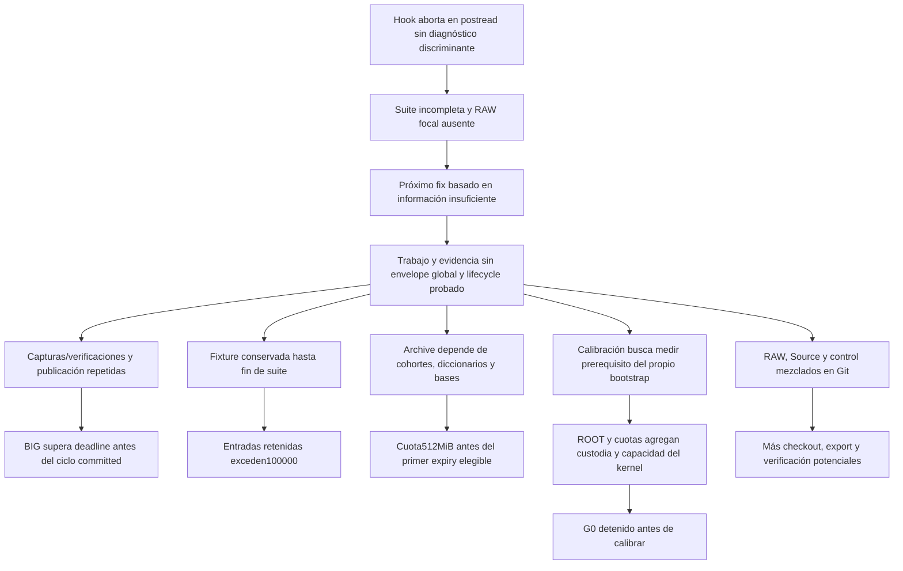

# POROTA RC6 — RCA sistémico y recuperación de convergencia

Fecha: 2026-10-08 UTC. Dictamen: **BLOQUEADO para GREEN y para pruebas materiales**.
Esta revisión entrega un diagnóstico verificable y decisiones finitas. No certifica
G0–G8, no modifica el motor financiero y no presenta pruebas locales como Actions.

## 1. Identidad, autoridad y alcance

GitHub confirmó el checkpoint, su tree y los HEAD actuales; no se asumió que un
run anterior correspondía a ese checkpoint:

| Objeto | SHA | Tree / estado |
|---|---|---|
| WIP `wip/rc6-architectural-rca-20261008-1606UTC` | `ecad18b6010e3b7e874a00edc72644b3dcc78790` | `7054a76efc0a22e56605af435f0b4502474783ad` |
| Padre WIP; Source del último probe | `7224ca0aff1f822032163435e7296456f2fe2334` | `8420b9feba4577fadf79a2d125125810af787618` |
| PR #475 | `3091e93c05cf89f9a0c16ca912d0af98f036ff17` | `00efec0f39f70f5a4ba1ba9c215647b92e05eeb7`; OPEN/DRAFT/UNMERGED |
| PR #476 | `dfc240a478cf08e0c6a9b0ba1b760307b09a9565` | `192ea26348c8fe10db55857cdd6029edd8344708`; OPEN/DRAFT/UNMERGED |
| PR #477 | `756d37b93aa26bb6395dac481bf3c2dda9d034d7` | OPEN/DRAFT/UNMERGED, base #476; cinco paths reconciliados en WIP |
| Productiva `deploy/rc6-pr69-isolated-20260915` | `da697c6e6c2274579f9e4a112fabc4327475dd35` | `96a112a55ed779df3f7056b1e30d81aac8d0b791` |
| Default `main` | `183a0be3f6c443d8fab48b1c0f52dcc80b1b88d1` | `c20f676ff8e22a65f8f02d65c86fd23d3ab41fae` |

Se recuperaron AGENTS, políticas de producto/tests/capacidad/supply chain, Issues
468/469/471/473, PRs475/476/477, RCA y registro RC6. Los comments iniciales
recuperados fueron 302 en #471 y 247 en #473; se incorporó la adenda posterior
[#471/6070346133](https://github.com/mbalbo2023/Porota-trading/issues/471#issuecomment-6070346133)
y su coordinación en #473. Los cuerpos y archivos consultados están hashados en
[evidence-index.json](evidence-index.json).

Inicio READ_ONLY. La pareja del owner previo 6069926329/6069926700 expiró a
22:23:10Z con RELEASED=false. **Expiración no equivale a liberación.** No se
heredó su scope de Source/finanzas/fixtures/archive/CI. El estado ops del6/10 es
histórico, automation_is_enabled=false/deploy_owner=null; no se editó.

WRITE_OWNER legítimo de esta revisión: `CODEX_RC6_SYSTEMIC_REVIEW_20261008`,
workstream `WS-RC6-SYSTEMIC-REVIEW-20261008`. Scope exclusivo:
`docs/governance/rc6-systemic-review-20261008/`. Adquisición remota relecta:
[#471/6070358893](https://github.com/mbalbo2023/Porota-trading/issues/471#issuecomment-6070358893),
[#473/6070359124](https://github.com/mbalbo2023/Porota-trading/issues/473#issuecomment-6070359124).
Renovación 6070536592/6070536794, válida hasta23:03:58Z; sólo este scope.
Branch sucesora aislada `review/rc6-systemic-rca-ecad18b6-20261008`, padre ecad.
INTEGRATION_OWNER/DEPLOY_OWNER no adquiridos. No es otro candidato de deploy.
La identidad del commit documental y el PR se autentican en el handoff GitHub;
no se introduce una referencia circular al SHA del propio informe.

## 2. Evidencia independiente y límites

Se descargaron **16 ZIP**, verificando digest/size de API, CRC, SHA256 de todos
los **2034 miembros**. Tres manifests sellados enlazan otras24 capturas exactas
con FIN exterior. Los originales voluminosos siguen en Actions; el índice
[artifact-members.csv](artifact-members.csv) permite reidentificarlos sin copiar
RAW masivo. Los artifacts expiran: este índice no reemplaza su custodia durable.

| Run / Source | Primera evidencia material | Conclusión causal |
|---|---|---|
| [37674493598](https://github.com/mbalbo2023/Porota-trading/actions/runs/37674493598), dfc | JUnit:2490 ejecutados,1failure BIG y1error `pytest.internal`;6215 colectados. `StressResourceLimit`/`SHADOW_CONSERVATIVE_CYCLE_DEADLINE`; después INTERNALERROR `READONLY_SOURCE10_CHANGED`. | Deadline del trabajo real y aborto del harness son defectos distintos. 2490≠6215 es consecuencia del aborto. No hubo imagen/artefacto desplegable. |
| [37674493603](https://github.com/mbalbo2023/Porota-trading/actions/runs/37674493603), dfc | `FOCAL_COLLECTION_JUNIT_IDENTITY_MISMATCH`, exit3,516.217s; FIN/ECHILD reales,269 reaps. | El guard detectó desacuerdo; RAW/JUnit primarios no fueron publicados porque RED vetó el payload. La causa concreta del desacuerdo es **NO_VERIFICADO**. FIN correcto no implica test correcto. |
| [37823993377](https://github.com/mbalbo2023/Porota-trading/actions/runs/37823993377),6c02649859d7f4fa3260c2d5910ff8e57e97307e | `CALIBRATION_RECURSIVE_PRIVATE_READONLY_REQUIRED`; loop propio configurado; wrapper perdió errno. | Failure real de setup. EBUSY/backing writable es hipótesis. Cuota y escape NONROOT no alcanzados; FIN/cleanup sí probados. No ENOSPC:91.70→86.33GB libres. |
| [37830339583](https://github.com/mbalbo2023/Porota-trading/actions/runs/37830339583),7c4abff319bdc9c3958141925967c0cb8def7149 | mount_setattr442 return0/errno0; mkfs0; mount ext4 prjquota exit32, texto “No such process”. | Se corrigió la primera barrera; apareció una segunda. Numeric errno del mount original ausente. No demuestra kernel incompatible ni inode de quota faltante. |
| [37845108215](https://github.com/mbalbo2023/Porota-trading/actions/runs/37845108215),7224 | `CALIBRATION_PRIVILEGED_SIGNAL_CUSTODY_UNVERIFIED`, generación NOT_STARTED, imagen/namespace/ROOT NOT_CALLED. | Es hold de seguridad explícito, no nuevo fallo físico ext4. FIN exterior auténtico10.612s/RSS289103872B; no FIN interior inventado. Este run no valida ecad. |
| [37633310327](https://github.com/mbalbo2023/Porota-trading/actions/runs/37633310327),af08c82ca211e74bb4e5c00d9010af21313814a9 | Horizon1049/1202; `RETENTION_ARCHIVE_CAPACITY_REACHED`; peak535810048B en archivo512MiB. | La retención impedía reclamación y el costo incremental excedió el presupuesto total. Son1049 cortes reales;361/841 reconstrucciones de factory no prueban crash/SIGKILL. |
| [37633249899](https://github.com/mbalbo2023/Porota-trading/actions/runs/37633249899),af08 | Inventario completo124358 entradas/124304 inodes,5976211456B asignados;82.20GB libres. | Violación del límite100000 por lifecycle acumulativo, independiente de capacidad de disco. La evidencia adversarial no autoriza borrarla como basura. |

La medición histórica local17.299GB/226749 entradas es un high-water retenido
documentado; no es peak temporal continuamente medido del runner objetivo. Sus
errores de origen/comparabilidad no se subsanan cambiando el nombre a “peak”.
Ni los comentarios de Codex ni sus GREEN locales constituyen evidencia material
positiva para ecad. Las causas sin RAW discriminante permanecen abiertas.

## 3. Árbol causal y RCA sistémico

La causa sistémica demostrada es **producir y certificar sin un lifecycle y un
modelo de costo total cerrados antes de lanzar el productor**. Tres acoplamientos
la concretan; no se atribuye todo a un único kernel, a SQLite o a un test.

**Error primario comprobado:** deadline BIG, overflow Horizon, exceso de entradas
Gov y errores nativos sucesivos de setup. **Derivados:** suite incompleta,
sucesores sin prerequisitos, build omitido, ausencia de RAW por RED, FIN exterior
mal interpretado. **Arquitectura:** costos repetidos, retención/dependencias sin
bound completo, bootstrap que necesita un peak cuya medición depende del mismo
bootstrap, control plane privilegiado mayor que el problema financiero.
**Implementación:** conexiones SQLite comprometidas pero sin close explícito;
API callback incorrecta; ABI ioctl/prctl32-bit; parser/recibos sin estado duradero.
**Harness:** postread puede abortar la suite; subTest/JUnit puede alterar conteo;
limpieza sólo al final retiene clones. **Entorno demostrado:** kernel/formatos y
archivos inspeccionados en el run concreto; no disponibilidad garantizada de
QFMT ni custodia ROOT. **Hipótesis:** errno histórico mount, campos Source10
alterados, causa focal exacta, soporte del kernel, costo temporal de Git en CI.

El primer defecto de producto no queda cerrado porque se arregla un recibo. La
secuencia setup→errno→mount→quota→signal muestra cómo la herramienta de
certificación introdujo nuevos obstáculos. Mantener holds ante datos desconocidos
es correcto; añadir otra herramienta para sortearlos sin equivalencia perpetúa
el ciclo. [ERROR_MATRIX.md](ERROR_MATRIX.md) cubre todas las entradas015–037 del
registro actual y distingue errores observados de hallazgos preventivos.

## 4. Source, SQLite/WAL y performance

`worker.py`/`source_reads.py` del WIP mantienen un Source_tick autenticado por
tick y lectores readonly internos; se conserva la separación Source/finanzas.
La repetición histórica de siete capturas está documentada, pero aquí no se
ejecutó el material anterior para medir su ahorro. `with sqlite3.connect(...)`
finaliza transacción: **no cierra conexión**. Un escritor fixture vivo puede
checkpoint WAL después de la captura. El close explícito y preparar el índice
temporal bajo el lock del padre antes de READY son correcciones mínimas
razonables ya desarrolladas. Contención real o escritura concurrente conserva
fail-closed; no se excluyen stat fields ni se oculta el WAL.

En BIG remoto dfc, publication45.090s contiene storage_prepare34.918s(4calls) y
encode6.819s(7calls); funnel8.991s y native_orchestrator13.481s son otra
instrumentación inclusiva. **No se suman padres a hijos.** JUnit BIG91.053s,
último evento CAPTURE child CPU88.803s, RSS1647304704B y evidencia36884145B.
RSS y evidencia cumplen sus límites; el ciclo financiero committed completo
no existe. El ahorro por traversals, captura única y reutilización acotada debe
llevar <=75s con margen; <=90s aislado sería sólo diagnóstico. Un runner más
rápido no demuestra cierre de la arquitectura ni reemplaza el runner canónico.

Source10_CHANGED nace del postread de `rc6_readonly_complete_archive_fixture.py`.
Los logs no conservan path/campo/stat antes/después suficiente para concluir
“late checkpoint” en ese run. Es necesario persistir esa discriminación pequeña
después de FIN y retornar un resultado test fallido utilizable por pytest, sin
convertir custodia desconocida en PASS ni seguir consumiendo Source alterado.
Esto es propuesta mínima de harness; no fue implementada en scope ajeno.

## 5. G0: capacidad, custodia y alternativas

**Dictamen actual: BLOQUEADO.** ext4/project quota/loop/namespaces/ROOT no son
requisitos intrínsecos de los datos financieros. Son una implementación de
confinamiento agregado frente a backends que pueden escribir sin límite.
Las cuotas físicas sí aportan un invariante que un polling o RLIMIT_FSIZE
por archivo no aporta. No se rebaja ni se elimina ese invariante.

El último runner fue6.17.0-1022-azure: CONFIG_QUOTA=y, QUOTACTL=y, EXT4=y,
QFMT_V2=m. quota_v2 no observado live y sin archivo en cuatro ubicaciones
inspeccionadas. No prueba ausencia global ni incompatibilidad. La disponibilidad
offline documentada del paquete Ubuntu exacto no prueba carga, firma aceptada ni
authority ROOT. El hold inmutable `PRIVILEGED_SIGNAL_CUSTODY` detiene aun con
metadata positiva. Un NONROOT puede no tener permiso para señalar ROOT antes
UIDdrop; no se observó EPERM y éxito killpg puede ser entrega parcial. No se
asume forwarding sudo, ni que señalizar sólo al wrapper retire el actor real.

El diseño actual exige imágenes5GiB/cap512MiB y26GiB/cap20GiB para obtener una
medición comparable de bootstrap(2Python/157distribuciones/19objetos/fullGit/
fullSource). Además exige4GiB de reserva. El piso oficial de storage canónico documentado
es14GiB: no garantiza26GiB de backing +4GiB de reserva +capturas/controles
(>30GiB). Los probes sí observaron~91.7GB libres; capacidad real de esa
instancia no garantiza toda instancia futura. Exigir admisión live o resolver
representatividad del runner, sin asumir el piso como espacio extra.
Requerir B+4GiB en statvfs del propio
proyecto limitado a B era una contradicción de implementación, corregida en
WIP separando backing filesystem y readback de cuota. No autoriza crédito por
cleanup anterior a FIN o temporales desconocidos. La medición correcta tampoco
otorga custodia de un actor privilegiado.

| Opción | Equivalencia / decisión |
|---|---|
| Free-space polling, timeout, RLIMIT_FSIZE, contenedor NONROOT sin cuota | No equivalentes a hard cap agregado; se rechazan como sustitutos de seguridad. |
| Modelo estático completo de bootstrap + inputs Git/wheelhouse autenticados | Puede cerrar admisión/sizing y eliminar calibración circular, conservando4GiB,10%inodes,157/19/fullGit/fullSource. No confina por sí solo un escritor adversarial; requiere límite físico externo si ese invariante aplica. |
| Reutilizar boundary de storage ya provisionada por runner, cuota/cgroup y supervisor con autoridad nativa probada antes del backend | Diseño viable sujeto a evidencia de hard cap real, escape negativo, TERM2/FIN5/ECHILD, UIDdrop, readback y propia cleanup. No introducir ROOT dentro de custodia NONROOT no probada. |
| Runner canónico estándar sin capacidad positiva comprobable | BLOQUEADO: no fabricar soporte ni lanzar calibraciones para descubrirlo repetidamente. |
| Imagen/runner dedicado preprovisionado con kernel/cuota/trust explícitos, controlado desde Actions | Alternativa operable para resolver garantía de plataforma. Si cambia la clase canónica o la custodia requerida, necesita resolución explícita del contrato; un diagnóstico allí no califica ubuntu-24.04. |

Resolución propuesta finita: primero cerrar por inspección el envelope compuesto
del bootstrap con bytes existentes, build inputs y cantidades/inodes/temporales
acotados. Para sdists conservar hash original+backend+ABI+provenance de wheel;
un wheel de misma versión no equivale al hash requerido. No introducir un build
previo ilimitado para obtener el wheelhouse. Después elegir y probar una sola
boundary nativa disponible. Si el kernel y el supervisor no pueden garantizarse
en el runner exigido, el contrato “runner canónico estándar + hard confinement
garantizado + manager byte exacto NONROOT sobre actor ROOT” queda sin solución
demostrada. Se resuelve la clase de runner o se demuestra custodia alternativa;
no se cambia el presupuesto ni se elimina el control unilateralmente.

## 6. G5: matemática, cohortes, diccionarios y retención

Medición recuperada: Source af08/tree71429a1c883df05120aff5411e556a26745320db,
1200catálogo/6000observaciones,1049 cortes, wall15468.766s/CPU15446.268s,
RSS402898944B. Peak archivo535810048B/3151entradas; último committed
535801856B/3149entradas. El overflow se rechazó antes de la siguiente escritura;
el guard funcionó. No es un failure por wall-clock ni RAM.

Geometría original: PRE13:20 +1201ticks desde13:35 cada30s hasta23:35:
**1PRE +770OPEN +431CLOSED =1202**. Retención9h+1hrecuperación=10h. A22:18:30,
cutoff12:18:30 precede al primer13:20: ningún corte expiró por edad. GC nativo
midió0expired/0deleted. Primer posible expiry23:20; bases transitivas, pins y
whole-pack GC pueden postergarlo. No se descuentan bytes por supuesto GC.

| Fase observada | Cortes | Incremento físico mínimo / mediana / máximo |
|---|---:|---:|
| PREOPEN |1|2375680 /2375680 /2375680B|
| OPEN |770|376832 /405504 /2723840B|
| CLOSED |278|503808 /507904 /4149248B|

Los 1049 registros originales están reducidos a un índice cuantitativo en
[horizon-measured-cuts.csv](horizon-measured-cuts.csv). A20:00 projection SQLite
1904640B, checkpoint891031B, report392222B. A20:00:30 son4136960B,
1799941B y977113B. A20:01 projection4050944B y report1027057B. Este cambio
de cohortes/sesiones no puede modelarse con muestras que omiten los dos bordes
y sólo4800cohortes. No se alteran datos financieros para comprimirlo.

`projection.row_dictionary` muestrea filas con campos variables; cada stream
zlib lleva FDICT/DICTID. Un cambio en el diccionario cambia BLOBs aunque su fila
decodificada sea idéntica. Esta revisión reprodujo **8/8 filas sintéticas**:
diccionario distinto, filas decodificadas iguales, headers diferentes, cuerpo
posterior al byte6 igual. No generó un tick financiero. La medición anterior
“8bytes/6000BLOB/5980cuerpos/513páginas” y el ahorro7cortes19.853% están en el
assessment WIP, pero su RAW local no fue recuperado desde Actions: se clasifican
como antecedentes documentados, no mediciones nuevas verificadas aquí.

Conservar raw original byte exacto, CRC/manifests, profundidad<=32 y rechazo
tamper. COPY/LITERAL/XOR exacto y CAS existentes permiten reutilización sin
re-serializar finanzas. No justificar un nuevo codec o búsqueda de stride por
una muestra. `_catalog` y `_maintain_archive` recorren historia/receipts: trabajo
O(N) por corte y potencial O(N²) en la ventana. Reutilización autenticada dentro
de la llamada y del frontier actual es preferible a una nueva base/protocolo
mutable; invalidación/custodia debe seguir demostrada.

La cuota536870912/1202 deja **446648B medios por corte antes de controles**.
La proyección WIP499376128+819200=500195328B deja36675584B. Es condicional:
442368B CLOSED ordinario y1777664B anchor,13anchors fijos por sequence%32.
El código también puede crear bases independientes por fallback, longitud,
profundidad, ausencia de base o costo desfavorable. **13 no es upper bound**.
28anchors adicionales con el premium reportado1335296B consumen ese margen.
431CLOSED al costo reportado de anchor darían766173184B sólo para esa fase.
Esto es contraejemplo al razonamiento de forecast, **no predicción** del WIP.

El bound requerido es, para todo prefijo k y branch posible del encoder:

`A(k) = A0 + CAS_nuevo_redondeado + recipes/directorios + controles + temporales_concurrentes − reclaim_autenticado(k) <=512MiB`.

Debe contar todos los1202,6000cohortes reales,20:00/20:00:30, anchors/fallback,
dependencias/base/pins, asignación ext4, pack-sharing y restauración original.
No sumar ahorro lógico como físico ni descontar GC antes de liberar todas las
referencias del pack. Mantener report/checkpoint originales y su wire financiero.
**Histórico af08 inviable con su costo observado; WIP ecad factibilidad global
NO_VERIFICADO, no imposibilidad matemática universal.** El hold actual detiene
G5 antes de event/API/Source/bootstrap/export. Sólo un fix causal y un bound
completo pueden retirarlo; un forecast o environment flag no lo habilita.

## 7. Evidencia en Git y separación integral

La adenda se verificó independientemente con `git diff --numstat` entre productiva
da697 y #476dfc: **3127/3127 paths,1400512adiciones,2158eliminaciones**, iguales
a metadata GitHub. [pr476-complete-inventory.csv](pr476-complete-inventory.csv)
contiene blobSHA1, bytes base/head y líneas. Clasificación de rol por path es
provisional; no determina unicidad ni autoriza eliminación. Retención/custodia
comunes, dependencias y estados desconocidos están en
[repository-footprint.json](repository-footprint.json).

WIP4084blobs/385742505B lógicos,326575805B de blobs únicos. Tres copias iguales
de whole-source.tar.gz tienen el mismo oid y21685383B cada una: Git deduplica
objeto; checkout materializa rutas múltiples. `docs/`365477187B/2819files está
excluido por `.dockerignore` y `NON_DEPLOY_ROOTS`. **notes/7files4668268B y
rc6_audit_evidence/29files1990099B siguen elegibles por ambas reglas actuales**.
Ese defecto de separación es demostrado estáticamente. No se construyó Docker;
no se afirma inflación de imagen productiva ni deploy de1.4millones de líneas.
El .git shallow observado224987086B no es fullGit ni peak Actions.

| Separación | Conservar | Corrección / simplificación mínima |
|---|---|---|
| Source y verificación | Captura inmutable, bytes/stat/FD/lease y queries readonly | Una captura por tick; cierre determinista de writers; budgets fingerprinted separados. |
| Motor financiero | Cinco salidas PAPER, rutas bloqueadas, resultados financieros | No reescribirlo para corregir infraestructura. |
| Publicación | Generación committed atómica, manifest/digest y lectores compatibles | Reutilizar traversals/encoders acotadamente; evidencia barata de bytes antes de material. |
| Archivo histórico | Retención9h+1h, restauración byte exacta, depth32, ACK/pins | Bound global de CAS/recipes/temporales y lifecycle de packs; evitar relectura de toda historia cuando sea autenticable reutilizar. |
| Fixture lifecycle | Escenarios negativos, roots propios, inventario completo | Retirar clone después del consumidor/finalizer real y FIN, evidencias selladas; nunca filesystem prune global. |
| Tests funcionales y stress | Corpus/identidades completas, runner y budgets originales | Baratos antes de productores; ningún hook debe perder el diagnóstico discriminante. |
| Evidencia/control/Git | Índices compactos y Source de test realmente requerido | RAW fuera de Git con custody durable; identificar copias `.source` que son prerequisitos legítimos antes de excluir o migrar. |
| Supply chain / artifact | Closure157, hashes/backend/ABI, build once y exactartifact | Alinear todos los roots de evidencia con bundle/contexto; no cambiar Source manifest a una lista financiera parcial. |
| Deploy/runtime | Actions plano de control, imagen exacta y PAPER invariants | Mantener fuera del RCA; Docker CLI FIN no acredita builder/daemon/container FIN. |

Propuesta prospectiva mínima: reportar bytes/paths generados nuevos usando Git
diff/tree, sin un framework ni bloqueo por mera cantidad. Bloquear sólo violación
de política explícita o inclusión/riesgo material demostrado. Antes de migrar
RAW, identificar generación y replay/fixture/import dependientes, hashes/destino,
retención y relectura byte exacta. No filter-repo/forcepush/borrado de evidencia.
Actions artifacts expiran14/21/22Oct: definir continuidad durable en GitHub sin
duplicar fullSource ni inventar custodia permanente. No se contrataron servicios,
modificaron retenciones remotas ni crearon costos. Origin/dependency graph completo,
fullGit/time/CI peak y huella exacta del artefacto/Droplet: **NO_VERIFICADO**.

## 8. Trabajo mínimo realizado y método de convergencia

Cambios nuevos: sólo este informe, matriz, plan, inventarios/índices y un script
stdlib de análisis. **Ninguna corrección de runtime/CI/harness ajeno implementada**;
la restricción de ownership se respetó. Las correcciones WIP preexistentes se
evalúan como DESARROLLADAS y pendientes de Actions, nunca como cierre material.

Ejecución permitida:141tests existentes de capacity_calibration/Horizon admission,
Python3.12.14/pytest9.0.2, venv propio, autoload/conftest del repo deshabilitados,
0fail/0error/0skip,0.53s.141nodeids colectados y141identidades JUnit únicas.
[cheap-validation.json](cheap-validation.json) y el pequeño JUnit nativo16947B
conservan evidencia local; no instalaron la closure157 ni calificaron G1.
Python3.11 ausente aquí; dual3.11/3.12 Actions pendiente. Una advertencia de cache
/dev por config /dev/null no alteró resultados ni justificó rerun. El primer
generador de índices buscó políticas en raíz equivocada: error local de esta
auditoría, corregido mediante rg al path ops/policy; no se ocultó como producto.
[reproduce_analysis.py](reproduce_analysis.py) pasó seis grupos de assertions
aritméticas/diccionario sobre datos sintéticos. No crea supervisor, cuotas o ticks.

Mecanismo obligatorio, aplicado a cada fila de la matriz:
**ERROR → RCA con dato discriminante → FIX mínimo → GUARD existente o pequeño
→ TEST barato → EVIDENCIA por SHA/tree → cierre objetivo**.

Controles permanentes que deben conservarse/utilizarse: holds inmutables G0/G5,
prerequisitos exactSHA/tree, dual collection/execution/JUnit, capacity live del
filesystem real, state builder que rechaza undefined, scope ownership explícito,
preservar RAW incluso en RED sólo tras FIN auténtico, y corpus original completo.
Antes de otro run completar una sola fila causal con cambio comprobable; conservar
primer RED y el errno/path/metric que distingue hipótesis. Si aparece otro nombre
para el mismo costo/custodia sin prueba positiva, permanece el incidente abierto.
No más parámetros/variants/guards nuevos hasta cerrar la primera incertidumbre.

## 9. Lo que impide GREEN y cierre de esta misión

1. G0 sin envelope compuesto completo y sin hard capability/custodia privilegiada
   positiva garantizada en runner canónico. No autorización de calibración.
2. G5 sin upper bound de todos1202, fases/cohortes/anchors/dependencies/temporales
   dentro512MiB. No autorización de Horizon.
3. BIG WIP sin medición canónica<=75s/ciclo committed; el último material falla.
4. Lifecycle intrafase sin prueba nativa positiva de census/tracker/último consumidor
   y<=100000entries; más disco no resuelve ese límite.
5. Primer path/stat Source10 y RAW focal históricos ausentes; no causa exacta
   acreditada. La publicación corregida debe probar preservación en RED.
6. Ownership de integración/core no liberado y no hay candidato final único
   reconciliado; leases largos/custodia histórica y continua aún no acreditados.
7. G1 dual Linux Actions, G2/G3, G4/G5/G6 y G7 build/daemon/artifact exacto pendientes;
   ecad y este commit documental no tienen G0–G8GREEN.
8. Alineación prospectiva de roots bundle/evidencia y custody durable pendiente;
   no se añade un veto universal por contar archivos ni se destruye evidencia.

[QUALIFICATION_PLAN.md](QUALIFICATION_PLAN.md) fija una preparación finita y luego
G0→G8 para **un solo SHA F**, aún no existente. No autoriza heavy ahora. Si la
plataforma requerida no puede satisfacer los invariantes, se entrega bloqueo y
resolución contractual explícita; no una sucesión indefinida de probes.

La misión termina con RCA respaldado, alternativas delimitadas, controles baratos
revalidados y handoff GitHub. PAPER/SHADOW ONLY; PRODUCTION_PAPER/SIMULATION;
real_orders_sent=0; rutas reales BLOCKED/NOT_CALLED; PPI Watch UNTOUCHED;
FIX-FORWARD ONLY; sin SSH, rollback, merge, deploy o escritura sobre productiva.
